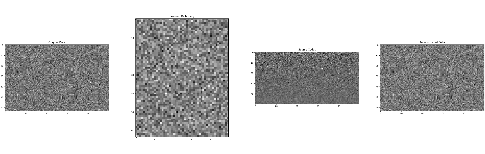
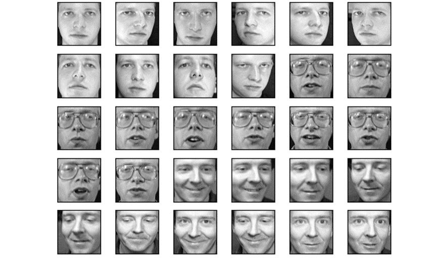
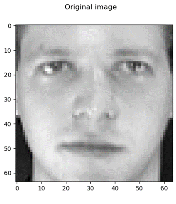
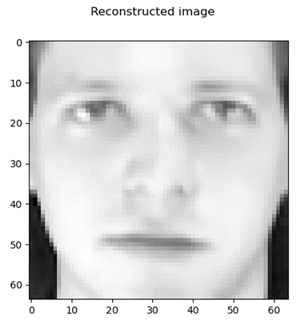
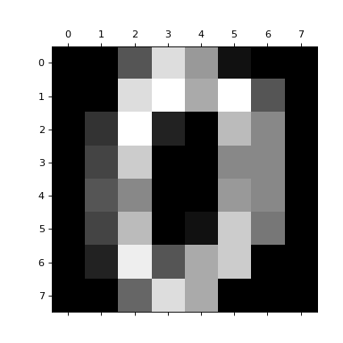
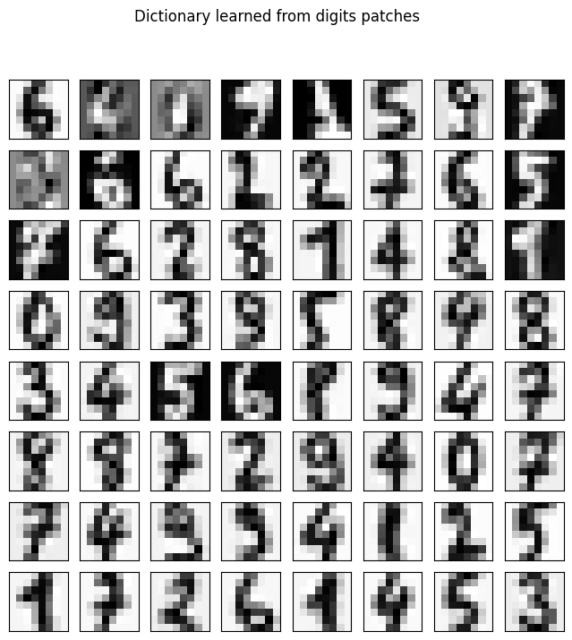
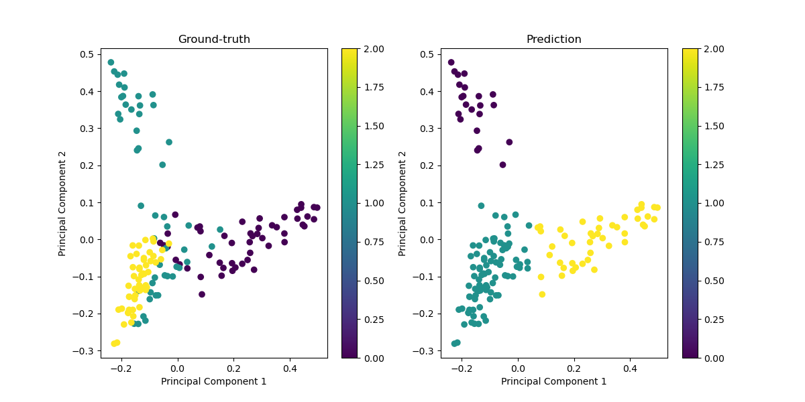

# Sparse Representation for Computer Vision and Pattern Recognition

## Overview

This document provides a comprehensive guide to Sparse Representation, a powerful tool in signal processing and machine learning. We delve into the Cross-and-bouquet Model, a unique approach to understanding sparse representation. We also explore the methodology behind sparse representation, including dictionary learning, a crucial component of this technique. Finally, we apply these concepts in three practical applications: image reconstruction, image classification, and $l_1$-graph for subspace clustering.

### Learning goals:

By the end of this guide, you should be able to:
1. Understand the concept of Sparse Representation and its significance in signal processing and machine learning.
2. Comprehend the Cross-and-bouquet Model and its role in sparse representation.
3. Understand the methodology of sparse representation, including dictionary learning.
4. Apply sparse representation techniques in practical applications, specifically image reconstruction and image classification.

## Background

Sparse Representation is a technique used in signal processing and machine learning where signals or data points are represented as a sparse linear combination of basis elements. These basis elements are typically part of a 'dictionary' of 'atoms' that are not physically present but provide a mathematical convenience for the representation. The Cross-and-bouquet Model provides a unique perspective on sparse representation, offering a geometric interpretation of the concept. Dictionary learning is a critical part of sparse representation, where the 'dictionary' of 'atoms' is learned from the data itself rather than being predefined.

## Problem Formulation

### Problem Formulation of Sparse Representation

In the domain of computer vision and pattern recognition, sparse representation posits a highly effective paradigm for signal reconstruction and feature extraction. The foundational concept revolves around representing a given signal as a sparse linear combination of dictionary atoms. The formal mathematical formulation is delineated as follows:

**Given**: A signal $\mathbf{x} \in \mathbb{R}^n$, which one desires to represent.

**Objective**: Identify a sparse coefficient vector $\mathbf{s} \in \mathbb{R}^m$ such that the signal $\mathbf{x}$ is closely approximated by a linear combination of a few columns from the dictionary matrix $\mathbf{D} \in \mathbb{R}^{n \times m}$. Mathematically, this relationship is expressed as:
$$
\mathbf{x} \approx \mathbf{D}\mathbf{s}
$$
where $\mathbf{D}$ is termed the dictionary, composed of $m$ basis vectors (or atoms), each residing in $\mathbb{R}^n$.

**Constraints and Objectives**:

1. **Sparsity Constraint**: The vector $\mathbf{s}$ should contain as few non-zero entries as possible, aiming for the maximal sparsity. The sparsity of $\mathbf{s}$ is typically enforced by minimizing the $l_0$ norm, which directly counts the number of non-zero elements. However, due to computational challenges associated with the $l_0$ norm, the $l_1$ norm is frequently employed as a convex surrogate in practical applications.

2. **Reconstruction Fidelity**: The approximation fidelity between $\mathbf{x}$ and $\mathbf{D}\mathbf{s}$ is generally quantified using the $l_2$ norm, which measures the Euclidean distance between the original signal and its approximation. The objective is to minimize this distance, enhancing the accuracy of the approximation.

**Additional Consideration**:

- **Overcompleteness**: It is typical for the dictionary $\mathbf{D}$ to be overcomplete, i.e., $m > n$. This overcompleteness allows the dictionary to offer a richer set of basis elements, facilitating a more versatile and robust representation of the signal across varied scenarios.

The selection or design of the dictionary $\mathbf{D}$ is pivotal and can significantly influence the effectiveness of sparse representation. Dictionaries can be predefined, such as using wavelets or discrete cosine transform bases, or learned directly from data to better capture inherent structures specific to the dataset.

The image you provided outlines a specific problem formulation for face recognition using sparse representation. Here’s how you can incorporate this into your text in a clear and structured way:

### The Cross-and-bouquet Model

The cross-and-bouquet model provides a sophisticated geometric representation crucial for understanding and implementing sparse representation in face recognition, particularly when addressing challenges such as occlusion and corruption in facial images. This model captures the essence of how face images are structured in a high-dimensional space and how this structure can be leveraged for effective recognition.

1. **Geometric Description**:
   
   - **Bouquet**: The set of all face images of a subject, under varying imaging conditions, forms a tightly clustered group in the high-dimensional image space, akin to a bouquet. This clustering occurs because these images generally lie on or near a low-dimensional subspace due to similarities in appearance and illumination.
   - **Cross**: The errors, such as occlusions and corruptions, are modeled separately and are typically orthogonal to the face subspace. These errors can be visualized as forming a cross structure in the image space, intersecting the bouquet at the point representing the unoccluded, uncorrupted face image.

2. **Dictionary and Signal Representation**:
   - Let $ \mathbf{D} = [\mathbf{D_1}, \mathbf{D_2}, \ldots, \mathbf{D_c}]$ represent the dictionary, where each $\mathbf{D_i} = [\mathbf{d_{i,1}}, \mathbf{d_{i,2}}, \ldots, \mathbf{d_{i,n}}]$ corresponds to the basis vectors for the $i$-th class, encapsulating variations within that class.
   
   - A test signal (face image) $\mathbf{x}$ can be expressed as a sparse linear combination of the columns of $\mathbf{D}$, denoted by:
     
     $$
     \mathbf{x} = \mathbf{D}\alpha_0
     $$
     
     where $\alpha_0$ is a sparse coefficient vector.

3. **Handling Occlusions and Corruptions**:
   
   - Real-world scenarios often involve occlusions (objects blocking part of the face) and corruptions (noise, variations in illumination). These can be modeled by:
     
     $$
     \mathbf{x} = \mathbf{x}_0 + \mathbf{e}_0 = \mathbf{D}\alpha + \mathbf{e}
     $$
     
     Here, $\mathbf{x}_0$ represents the occlusion-free part of the face, and $\mathbf{e}_0$ represents the occlusion or corruption noise.

4. **Optimization Problem**:
   
   - The task is to find the sparsest representation that can explain the test signal $\mathbf{x}$ under the influence of occlusions or corruptions. This is formulated as an optimization problem:

     $$
     \arg\min_{\alpha, \mathbf{e}} \|\alpha\|_0 + \|\mathbf{e}\|_0 \text{ subject to } \mathbf{x} = \mathbf{D}\alpha + \mathbf{e}
     $$
   
   - Alternatively, the problem can be formulated to minimize the combined $l_1$ norms of the coefficients $\alpha$ and the error $\mathbf{e}$, ensuring both sparsity and an accurate approximation of the test signal:
     
     $$
     \min_{\alpha, \mathbf{e}} \|\alpha\|_1 + \|\mathbf{e}\|_1 \text{ subject to } \mathbf{x} = \mathbf{D}\alpha + \mathbf{e}
     $$

This formulation enables robust face recognition even in the presence of significant visual obstructions and imperfections, demonstrating the adaptability of sparse representation techniques to complex, real-world problems in computer vision.

## Methodology

### Overview of $L_1$ Normalization

The application of $L_1$ normalization in sparse representation is central to addressing the problem of robust face recognition, especially under conditions of occlusion and corruption. $L_1$ normalization, also known as Lasso (Least Absolute Shrinkage and Selection Operator), promotes sparsity in the solution to the optimization problem, effectively distinguishing the facial identity from noise or obstructions.

### Sparse Representation Framework

The method involves representing a test face image as a sparse linear combination of a predefined dictionary of face images. The dictionary typically comprises a comprehensive set of face images covering various expressions, orientations, and lighting conditions, which aids in accurately capturing the underlying facial features.

1. **Dictionary Construction**:
   
   - Construct the dictionary $D$ by stacking training images as columns. Each column vector represents a different facial configuration or a different individual, normalized to have unit $L_2$ norm.

2. **Sparse Coding with $L_1$ Minimization**:
   
   - For a given test image $x$, represented as a vector in $\mathbb{R}^m$, the goal is to find a sparse coefficient vector $\alpha$ that minimizes the reconstruction error between $x$ and its approximation $D\alpha$, while also promoting sparsity in $\alpha$.
   
   - The optimization problem is formulated as:
     
     $$
     \min_{\alpha} \| x - D\alpha \|_2^2 + \lambda \|\alpha\|_1
     $$
     
     Here, $\|x - D\alpha\|_2^2$ is the reconstruction error, $\|\alpha\|_1$ promotes sparsity, and $\lambda$ is a regularization parameter that balances the two components.

### Algorithmic Implementation

To solve the $L_1$ minimization problem, various efficient algorithms can be utilized:

1. **Iterative Shrinkage-Thresholding Algorithm (ISTA)**:
   
   - ISTA is an iterative method that alternates between a gradient descent step to reduce the reconstruction error and a shrinkage step to enforce sparsity.
   - The shrinkage operator applies a soft thresholding, where small coefficients (below a threshold determined by $\lambda$ are set to zero, effectively removing them from the representation.

2. **Basis Pursuit**:
    regularized problems, typically implemented using linear programming techniques. Basis Pursuit directly targets the minimization of the $L_1$ norm under linear constraints.

### Handling Occlusions and Corruptions

- The method is particularly robust to occlusions and corruptions because the $L_1$ norm effectively isolates these anomalies as sparse errors in the representation.
- When occlusions or corruptions occur, they manifest as large, localized errors in the reconstruction. The sparsity enforced by the $L_1$ norm helps to localize these errors, separating them from the true facial features represented in the dictionary.

## Code Example

### Step-by-Step Explanation

#### 1. Importing Libraries

We start by importing necessary libraries: `numpy` for numerical operations and `matplotlib.pyplot` for visualization.

```python
import numpy as np
import matplotlib.pyplot as plt
```

#### 2. Loss Function

The `loss` function computes the loss of the current dictionary and sparse codes. The loss function combines the reconstruction error and the sparsity penalty.

```python
def loss(X, D, Z, alpha):
    '''
    X: input data matrix;
    D: dictionary matrix;
    Z: sparse code matrix;
    alpha: hyperparameter in the sparse coding process.
    '''
    return 0.5 * np.linalg.norm(X - D @ Z, ord='fro') ** 2 + alpha * np.linalg.norm(Z, 1)
```

- **Input**: 
  
  - `X`: Input data matrix.
  - `D`: Dictionary matrix.
  - `Z`: Sparse code matrix.
  - `alpha`: Sparsity hyperparameter.

- **Output**: 
  
  - Loss value combining the reconstruction error and the sparsity penalty.

#### 3. Dictionary Learning

The `dictionary_learning` function initializes the dictionary and iteratively refines it. It prints the loss at each iteration.

```python
def dictionary_learning(X, n_components, alpha, n_iter):
    '''
    X: input data matrix;
    n_components: number of components in the dictionary;
    alpha: hyperparameter in the sparse coding process;
    n_iter: the number of iterations.
    '''
    D = np.random.randn(X.shape[0], n_components)

    for _ in range(n_iter):
        Z = sparse_coding(X, D, alpha)
        Z = soft_thresholding(Z, alpha)
        D = dictionary_update(X, D, Z)
        print(f'\r iter: {_+1}, loss: {loss(X, D, Z, alpha)}')

    return D, Z
```

- **Input**:
  
  - `X`: Input data matrix.
  - `n_components`: Number of dictionary components.
  - `alpha`: Sparsity hyperparameter.
  - `n_iter`: Number of iterations.

- **Output**: 
  
  - Learned dictionary `D` and sparse codes `Z`.

#### 4. Sparse Coding

The `sparse_coding` function solves the sparse coding problem to obtain sparse representations `Z`.

```python
def sparse_coding(X, D, alpha):
    Z = (np.linalg.inv(D.T @ D + alpha * np.eye(D.shape[1]))) @ (D.T @ X)
    return Z
```

- **Input**:
  
  - `X`: Input data matrix.
  - `D`: Dictionary matrix.
  - `alpha`: Sparsity hyperparameter.

- **Output**:
  
  - Sparse codes `Z`.

#### 5. Soft Thresholding

The `soft_thresholding` function applies the soft thresholding operation to enforce sparsity in `Z`.

```python
def soft_thresholding(Z, alpha):
    return np.sign(Z) * np.maximum(np.abs(Z) - alpha, 0)
```

- **Input**:
  
  - `Z`: Sparse codes.
  - `alpha`: Threshold parameter.

- **Output**:
  
  - Thresholded sparse codes `Z`.

#### 6. Dictionary Update

The `dictionary_update` function updates the dictionary `D` using the current sparse codes `Z`.

```python
def dictionary_update(X, D, Z):
    for k in range(D.shape[1]):
        mask = np.ones(D.shape[1], dtype=bool)
        mask[k] = False
        E = X - D[:, mask] @ Z[mask, :]
        U, S, Vt = np.linalg.svd(E)
        D[:, k] = U[:, 0]
        Z[k, :] = S[0] * Vt[0, :]
    return D
```

- **Input**:
  
  - `X`: Input data matrix.
  - `D`: Dictionary matrix.
  - `Z`: Sparse codes.

- **Output**:
  
  - Updated dictionary `D`.

### Usage Example and Visualization

The main block demonstrates how to use the `dictionary_learning` function and visualize the results.

```python
## Test case
m = 64
p = 100
X = np.random.randn(m, p)
n_components = 50
alpha = 1
n_iter = 20

# This is modified data: linear combination with some noise
D = np.random.randn(m, n_components)
Z = np.random.randn(n_components, p)
X = np.dot(D, Z)
X = X + 0.1 * np.random.randn(m, p)

# Or use the completely random data
X = np.random.randn(m, p)

D, Z = dictionary_learning(X, n_components, alpha, n_iter)

# Plot the result and compare with the original dictionary
plt.figure(figsize=(40, 10))
plt.subplot(1, 4, 1)
plt.imshow(X, cmap='gray')
plt.title('Original Data')
plt.subplot(1, 4, 2)
plt.imshow(D, cmap='gray')
plt.title('Learned Dictionary')
plt.subplot(1, 4, 3)
plt.imshow(Z, cmap='gray')
plt.title('Sparse Codes')
plt.subplot(1, 4, 4)
plt.imshow(np.dot(D, Z), cmap='gray')
plt.title('Reconstructed Data')
# Save the figure
plt.savefig('dictionary_learning.png')
plt.show()
```

- **Input**:
  
  - Generate random data matrix `X` with 64 features and 100 samples.
  - Set the number of components (dictionary atoms) to 50.
  - Set the sparsity regularization parameter `alpha` to 1.
  - Set the number of iterations for the learning process to 20.

- **Process**:
  
  - Call the `dictionary_learning` function to learn the dictionary `D` and sparse codes `Z`.
  - Plot the original data, learned dictionary, sparse codes, and reconstructed data using `matplotlib`.

- **Output**:
  
  - Visualizes the original data, learned dictionary, sparse codes, and reconstructed data.

- **results:**
  
  

### Summary

This code demonstrates a dictionary learning algorithm for representation learning. The key steps involve:

1. **Initializing the dictionary**.
2. **Performing sparse coding** to find the sparse representations.
3. **Applying soft thresholding** to enforce sparsity.
4. **Updating the dictionary** atoms iteratively.
5. **Visualizing** the results to understand the learned representations.

This approach can be modified and extended based on specific requirements, such as different sparse coding techniques or dictionary update rules.

## Discussion

**When to Use Sparse Representation Learning**: Use this method for high-dimensional data with underlying sparse structure. It captures important features and ignores noise. Limitations include non-convexity due to sparsity constraint and the need for a good, often computationally expensive, dictionary.

**Practical Tips**: Normalize data to zero mean and unit variance. Choose a good dictionary, often overcomplete, to capture essential data structure.

**Relationship to Other Methods**: Unlike PCA and ICA that seek global linear transformations, sparse representation learning seeks local, non-linear transformations, making it more flexible.

**Derived Algorithms**: Sparse representation learning inspired algorithms like sparse autoencoders and sparse coding networks, combining sparse representation with convolutional structures for image data.

**Impactful Applications**: Used in image reconstruction for high-resolution recovery from low-resolution inputs, robust image classification, signal processing, neuroscience, and anomaly detection.


## Applications

### Image Reconstruction

**Data**: We use the **Olivetti faces dataset** in the following discussion. The dataset consists of 400 face images of 40 subjects, each with 10 different images. We aim to reconstruct an image from the dataset using sparse representation.



**Methodology**: We perform sparse representation on image patches extracted from the original image. The dictionary is learned from these patches, and the image is reconstructed using the sparse codes and the learned dictionary.

Let X be the original image, D be the learned dictionary, and Z be the sparse codes. The reconstruction is given by $X \approx DZ $. We perform the optimization by solving the penalty modeling problem:
$$
\min_{Z} \|X - DZ\|_F^2 + \lambda \|Z\|_p
$$

where $\lambda$ is a regularization parameter controlling the sparsity of the representation, and $p = 0$ or $p = 1$ for the $l_0$ or $l_1$ norm, respectively. The cost function to be minimized consists of a quadratic fitting term $\| \cdot \|_F $ and a sparsity term. The $l_1$ norm is often used as a surrogate for the $l_0$ norm due to its convexity [[1]](#1). While in image reconstruction, we have observed that the $l_0$ penalty often yields superior outcomes. Conversely, the $l_1$ penalty is preferred for classification tasks due to its more stable active sets, as will be discussed in the subsequent section. Moreover, these penalty functions can be substituted with a nonconvex Lorentzian penalty function, which is driven by the motivation to approximate the $l_0 $ norm more closely through the $l_1 $ norm [[3]](#3).

**Code**: The following code block demonstrates how to perform sparse representation in the Olivetti faces dataset.
```python
import matplotlib.pyplot as plt
import numpy as np
from sklearn.decomposition import MiniBatchDictionaryLearning
from sklearn.feature_extraction.image import extract_patches_2d
from sklearn.feature_extraction.image import reconstruct_from_patches_2d
from sklearn.datasets import fetch_olivetti_faces

# load data
data = fetch_olivetti_faces()
targets = data.target
data = data.images
image = data[0].astype('float32')

# normalization
image /= 255
plt.imshow(image, cmap='gray')
plt.suptitle('Original image', fontsize=12)
plt.show()

# get patch
patch_size = (5, 5)
data = extract_patches_2d(image, patch_size)
data = data.reshape(data.shape[0], -1)
intercept = np.mean(data, axis=0)
data -= np.mean(data, axis=0)
data /= np.std(data, axis=0)

# get dictionary
dico = MiniBatchDictionaryLearning(n_components=144, alpha=1, n_iter=10)
V = dico.fit(data).components_
print(V.shape)

plt.figure(figsize=(4.2, 4))
for i, comp in enumerate(V[:144]):
    plt.subplot(12, 12, i + 1)
    plt.imshow(comp.reshape(patch_size))
    plt.xticks(())
    plt.yticks(())
plt.suptitle('dictionary learned from patches', fontsize=12)
plt.show()

# reconstruction
reconstruction = image.copy()
dico.set_params(transform_algorithm='omp')
code = dico.transform(data)
patches = np.dot(code, V)

patches += intercept
patches = patches.reshape(len(data), *patch_size)
reconstruction = reconstruct_from_patches_2d(patches, (64, 64))

plt.imshow(reconstruction, cmap='Greys_r')
plt.suptitle('Reconstructed image', fontsize=12)
plt.show()
```
**Result**: The output should be:
<div style="display: flex; align-items: center;">
  
  
</div>
From which we can conclude that the learned dictionary can effectively reconstruct the original image from patches.

### Image Classification

Sparse modeling and dictionary learning have traditionally been focused on image representation and reconstruction, but this approach is now being expanded to tackle other crucial aspects of image science, particularly in the realms of classification and detection.

**Data**: We use the **digits dataset** in the following discussion. The dataset consists of 1797 8x8 images of handwritten digits. We aim to classify these digits using sparse representation.

<!--  -->
    <div style="text-align: center;">
        
        <figcaption>Figure 2. Battery dataset example.
    </div>

**Methodology**: We perform sparse representation on the digit images using a learned dictionary. The sparse codes are then used as features for classification using a logistic regression model [[2]](#2). 

Let X be the input data, D be the learned dictionary, and Z be the sparse codes. We first learn the dictionary from the training data:

$$
\min_{D} \|X - DZ\|_F^2 + \lambda \|Z\|_p
$$

Then we use the sparse codes Z as features to train a logistic regression classifier for digit classification:
$$
\min_{w} \sum_{i=1}^{n} \log(1 + \exp(-y_i(X_i^Tw))) + \lambda \|w\|_2^2
$$
where $w $ are the weights learned by the logistic regression model, $X_i$ is the sparse code for the $i $-th sample, and $y_i $ is the label of the $i$-th sample.

**Code**: The following code block demonstrates how to perform image classification using sparse representation.
```python
import numpy as np
import matplotlib.pyplot as plt
from sklearn.datasets import load_digits
from sklearn.decomposition import MiniBatchDictionaryLearning
from sklearn.linear_model import LogisticRegression
from sklearn.preprocessing import StandardScaler
from sklearn.model_selection import train_test_split
from sklearn.metrics import classification_report, accuracy_score
from sklearn.feature_extraction.image import extract_patches_2d, reconstruct_from_patches_2d

# Load digits dataset
digits = load_digits()
data, targets = digits.data, digits.target
images = digits.images

# Preprocess data
n_samples, n_features = data.shape
data = data / 16.0  # Normalize pixel values

# Split data into training and testing sets
X_train, X_test, y_train, y_test = train_test_split(data, targets, test_size=0.5, random_state=42)

# Dictionary Learning
patch_size = (4, 4)
n_components = 100
dico = MiniBatchDictionaryLearning(n_components=n_components, alpha=1, n_iter=500)
V = dico.fit(X_train).components_

# Transform data using the dictionary
X_train_transformed = dico.transform(X_train)
X_test_transformed = dico.transform(X_test)

# Train a classifier
classifier = LogisticRegression(max_iter=1000, solver='liblinear')
classifier.fit(X_train_transformed, y_train)

# Predict on the test set
y_pred = classifier.predict(X_test_transformed)

# Print classification report
print(f"Accuracy: {accuracy_score(y_test, y_pred):.4f}")
print(classification_report(y_test, y_pred))

# Visualization of dictionary components
plt.figure(figsize=(8, 8))
for i, comp in enumerate(V[:64]):
    plt.subplot(8, 8, i + 1)
    plt.imshow(comp.reshape((8, 8)), cmap=plt.cm.gray_r, interpolation='nearest')
    plt.xticks(())
    plt.yticks(())
plt.suptitle('Dictionary learned from digits patches')
plt.show()
```
**Result**: The overall prediction accuracy is 0.9633, with a detailed classification report provided. 

The learned dictrionary components are shown below:

We can observe that the learned dictionary components capture the essential features of the digit images, enabling effective classification using sparse representations.

### $l_1$-graph for Subspace Clustering

Sparse representation has been widely applied in subspace clustering, a fundamental task in computer vision and pattern recognition. Subspace clustering aims to group data points into multiple subspaces, where each subspace corresponds to a distinct underlying structure or class. Sparse representation provides a powerful framework for subspace clustering by modeling data points as sparse linear combinations of a set of basis vectors. The advantage of sparse representation lies in its ability to **adaptively** capture the intrinsic structure of data, particularly in high-dimensional spaces.

**Data**: We use the **Iris dataset** in the following discussion. The dataset consists of 150 samples of iris flowers, each with four features. We aim to cluster these samples into three subspace clusters using sparse representation.

**Methodology**: We construct a similarity graph based on the $l_1$-norm distance between data points. The graph is then used for spectral clustering to group the data points into subspaces. The $l_1$-graph captures the sparse relationships between data points, enabling the identification of subspace clusters:

$$
\min_{C} \|X - XC\|_F^2 + \lambda \|C\|_1
$$

where $X$ is the data matrix, $C$ is the coefficient matrix, and $\lambda$ is a regularization parameter. The coefficient matrix $C$ encodes the sparse relationships between data points, with non-zero entries indicating connections.

Then we apply spectral clustering to the affinity matrix constructed from the $l_1$-graph to group the data points into subspaces.

```python
import matplotlib.pyplot as plt
import numpy as np
from sklearn.decomposition import PCA
from sklearn.cluster import SpectralClustering
from sklearn.datasets import load_iris
from sklearn.metrics import silhouette_score
from sklearn.linear_model import Lasso

data = load_iris()
X = data.data
true_labels = data.target

def self_representation(X, alpha=0.1):
    n_samples = X.shape[0]
    C = np.zeros((n_samples, n_samples))
    for i in range(n_samples):
        X_i = np.delete(X, i, axis=0)
        lasso = Lasso(alpha=alpha, fit_intercept=False, max_iter=10000)
        lasso.fit(X_i.T, X[i])
        C[i, np.arange(n_samples) != i] = lasso.coef_
    return C

C = self_representation(X, alpha=0.01)

pca = PCA(n_components=2)
X_pca = pca.fit_transform(C)

spectral = SpectralClustering(n_clusters=3, affinity='nearest_neighbors', assign_labels='kmeans')
predicted_labels = spectral.fit_predict(X_pca)

silhouette_avg = silhouette_score(X_pca, predicted_labels)
print("Silhouette Coefficient: ", silhouette_avg)

plt.figure(figsize=(12, 6))

plt.subplot(1, 2, 1)
plt.scatter(X_pca[:, 0], X_pca[:, 1], c=true_labels, cmap='viridis')
plt.title('Ground-truth')
plt.xlabel('Principal Component 1')
plt.ylabel('Principal Component 2')
plt.colorbar()

plt.subplot(1, 2, 2)
plt.scatter(X_pca[:, 0], X_pca[:, 1], c=predicted_labels, cmap='viridis')
plt.title('Prediction')
plt.xlabel('Principal Component 1')
plt.ylabel('Principal Component 2')
plt.colorbar()

plt.show()
```

**Result**: The silhouette coefficient is 0.63, indicating a reasonable clustering quality. The scatter plots show the ground-truth labels and the predicted clusters based on the $l_1$-graph. We can observe that the spectral clustering effectively groups the data points into three subspace clusters.



## References

<a id="1">[1]</a> Aharon, Michal, Michael Elad, and Alfred Bruckstein. "K-SVD: An Algorithm for Designing Overcomplete Dictionaries for Sparse Representation." IEEE Transactions on Signal Processing, vol. 54, no. 11, 2006, pp. 4311-4322.

<a id="2">[2]</a> Chen, Shijie, David Donoho, and Michael Saunders. "Atomic Decomposition by Basis Pursuit." SIAM Journal on Scientific Computing, vol. 20, no. 1, 1998, pp. 33-61.

<a id="3">[3]</a> Elad, Michael, and Michal Aharon. "Image Denoising via Sparse and Redundant Representations over Learned Dictionaries." IEEE Transactions on Image Processing, vol. 15, no. 12, 2006, pp. 3736-3745.

<!-- <a id="4">[4]</a> Mairal, Julien, Francis Bach, Jean Ponce, and Guillermo Sapiro. "Online Learning for Matrix Factorization and Sparse Coding." Journal of Machine Learning Research, vol. 11, 2010, pp. 19-60.

<a id="5">[5]</a> Olshausen, Bruno A., and David J. Field. "Emergence of Simple-Cell Receptive Field Properties by Learning a Sparse Code for Natural Images." Nature, vol. 381, no. 6583, 1996, pp. 607-609.


<a id="6">[6]</a> Rubinstein, Ron, Thomas Peleg, and Michael Elad. "Analysis K-SVD: A Dictionary-Learning Algorithm for the Analysis Sparse Model." IEEE Transactions on Signal Processing, vol. 61, no. 3, 2013, pp. 661-677.


<a id="7">[7]</a> Wright, John, Allen Y. Yang, Arvind Ganesh, S. Shankar Sastry, and Yi Ma. "Robust Face Recognition via Sparse Representation." IEEE Transactions on Pattern Analysis and Machine Intelligence, vol. 31, no. 2, 2009, pp. 210-227.


<a id="8">[8]</a> Zhang, Qiang, and Bao-Liang Lu. "Sparse Representation for Applications in Computer Vision." Foundations and Trends in Computer Graphics and Vision, vol. 5, no. 1-2, 2012, pp. 1-175. -->


## Author Team

**Guanxing Lu**: Writing 3 applications, namely image reconstruction, image classification, and $l_1$-graph for subspace clustering, and providing code examples for all applications.

**Yifei Han**: Write the problem formulation and method, provide methmatical formulation and theroetical explanation.

**Jixuan Fan**: Write the step-by-step code example of dictionary learning and sparse representation, each with detailed explanation and output results.

**Yiqin Wang**: Team leader. Organize the structure of the document and do paper survey, write the background \& overview \& learning goals.

