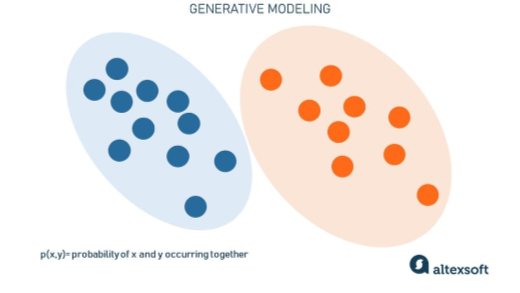
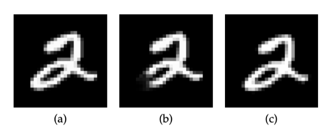
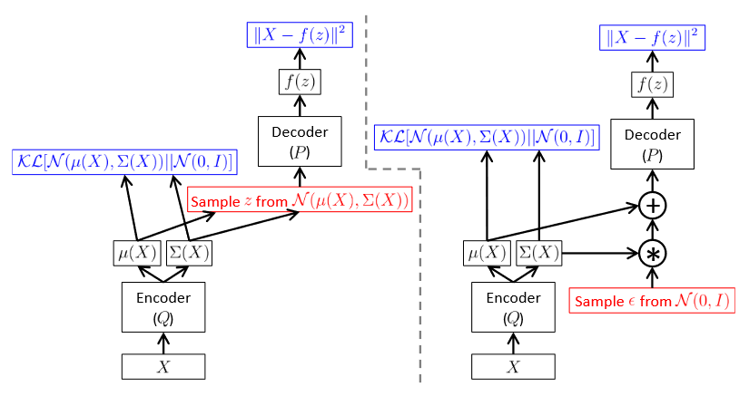
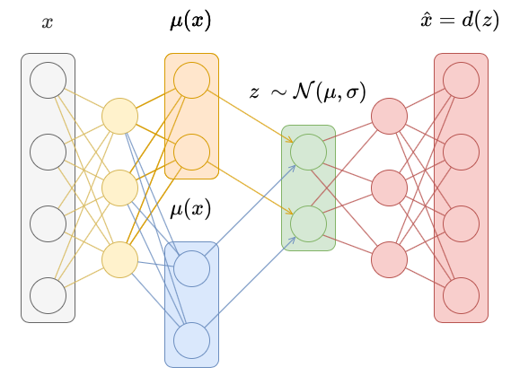
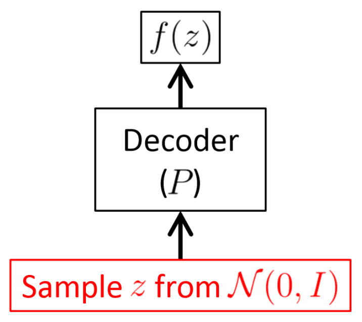
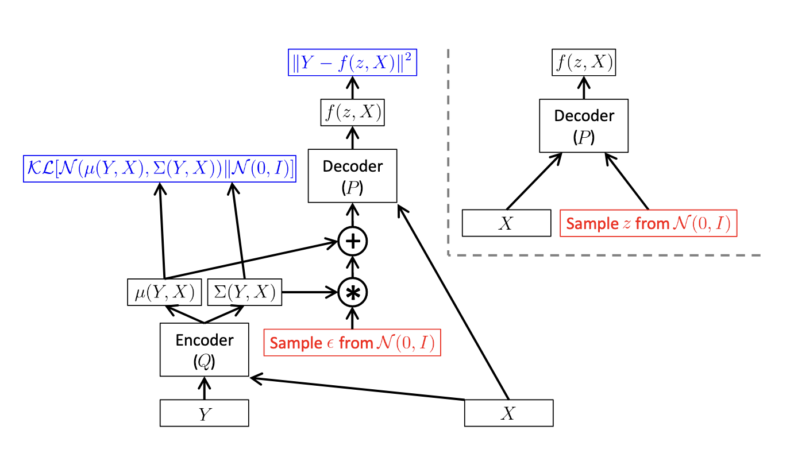
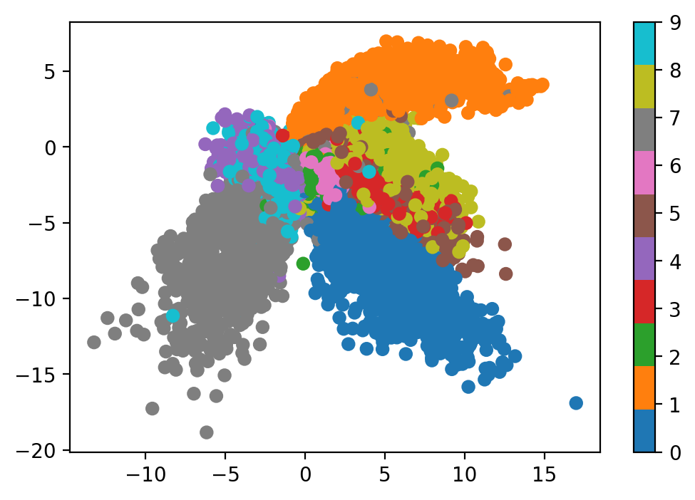
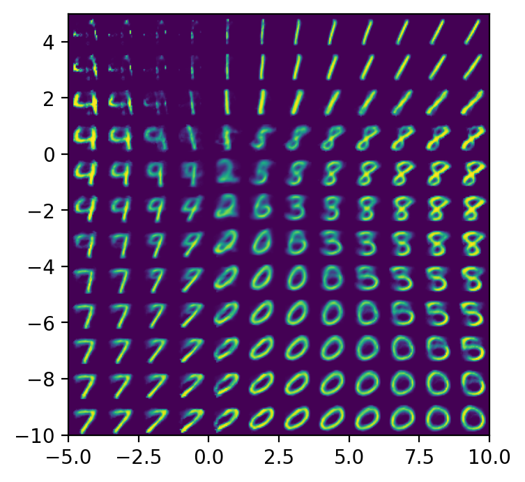
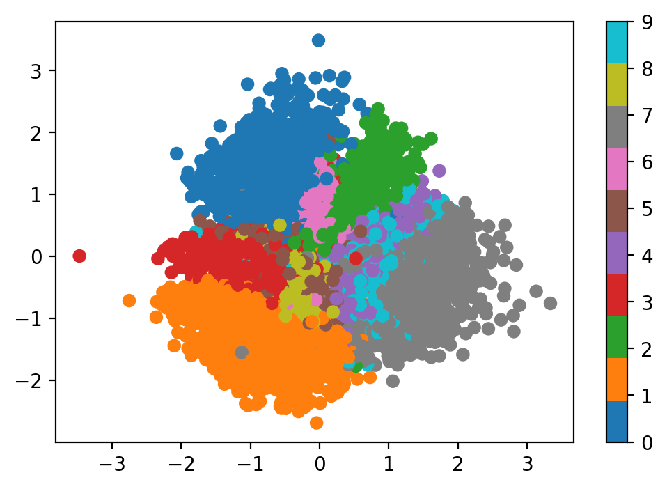
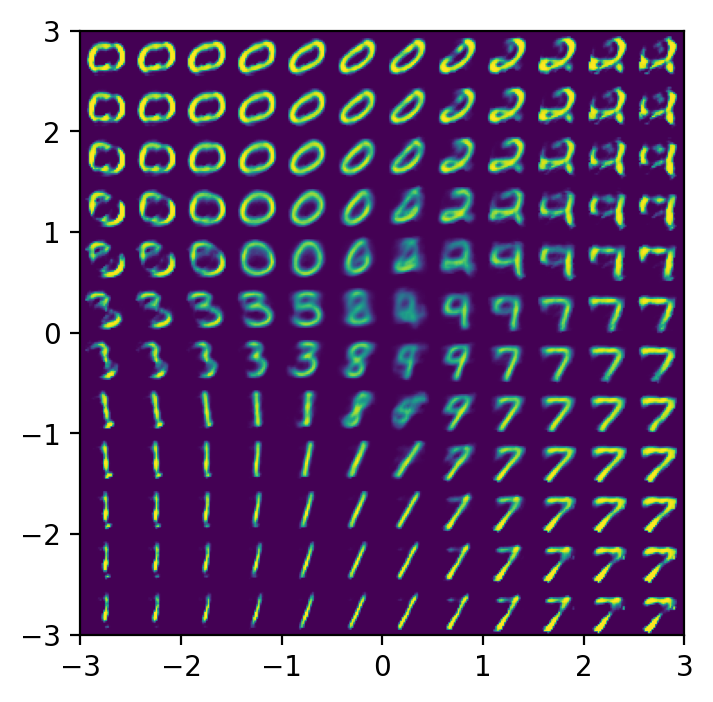

# Variational Autoencoders

## 1. Overview
The "Tutorial on Variational Autoencoders" [[1]](#refer-anchor-1) by Carl Doersch provides a detailed explanation of Variational Autoencoders (VAEs) [[2]](#refer-anchor-2), a type of generative model that can create new data similar to the input data. VAEs use neural networks to encode input data into a compressed, lower-dimensional latent space, then decode it back to reconstruct the original data. The tutorial covers the mathematical foundations, including variational inference and the reparameterization trick, which allows efficient training using gradient descent. VAEs are useful for tasks like dimensionality reduction, data generation, and understanding the underlying data structure.

## 2. Learning goals

1. Understanding VAEs: Learn what Variational Autoencoders are and how they work.
2. Mathematical Foundation: Gain knowledge about the mathematical principles behind VAEs.
3. Training Techniques: Understand how to train VAEs using neural networks and stochastic gradient descent.
4. Generative Modeling: Learn how VAEs can generate new data similar to the input data by modeling complex distributions.
5. Practical Application: Be able to apply VAEs to real-world problems in unsupervised learning.

## 3. Background
### 3.1 Generative models
A generative model [[3]](#refer-anchor-3) is a type of machine learning model that learns to generate new data samples similar to the training data. Unlike discriminative models, which predict labels given features, generative models capture the underlying distribution of the data. They can create new, synthetic data points that resemble the original data, such as images, text, or audio. This is useful in tasks like data augmentation, image generation, and unsupervised learning, where the goal is to understand the data structure and generate realistic variations.

<figure align=center>
    
    <figcaption style="text-align: left;">
        Figure 1: The generative model learns the data structure.
    </figcaption>
</figure>

### 3.2 Latent Variable Models
The latent variable model is a statistical model that includes variables that are not directly observed but are inferred from other observed variables. These hidden variables, or latent variables, help explain the underlying structure of the observed data. For example, in a movie recommendation system, the latent variables might represent a user's preferences and the movie's characteristics, which are not directly visible but can be deduced from the user's ratings and the movies they have watched. This helps in understanding and modeling complex relationships in the data.
In mathematical way, the goal of this model is to optimize the parameter vector θ to ensure that when sampling z from P(z), the function f(z; θ) produces outputs that closely resemble the real data points in the dataset, with a high probability. 

<figure align=center>
    
    <figcaption style="text-align: left;">
        Figure 2: This is the example of latent space. The latent space for the those handwritten number may be the stroke weight, angle etc.
    </figcaption>
</figure>

## 4. Problem Formulation & Method Explanation

According to the previous section, we know that our goal are the following two points:

1. Estimating the distribution p($x$) of observation data $x$.
2. Generating observation data $x$ through latent variable $z$.

In this section, we will delve into the core principles of the Variational Autoencoder (VAE) and carefully walk through the derivation of its loss function.

### 4.1 Setting up the objective

Let's begin by considering how we might use sampling to compute $P(X)=\int P(X \mid z ; \theta) P(z)dz$, remember that our objective is to maximize $P(X)$.  If we can derive a computable expression for $P(X)$ and calculate its gradient, we can optimize the model using Stochastic Gradient Descent (SGD).

However, we face a practical challenge:  for most values of $z, P(X|z)$ will be nearly zero, and hence contribute almost nothing to our estimate of $P(X)$.The key idea behind the variational autoencoder is to attempt to sample values of $z$ that are likely to have produced $X$, and estimate $P(X)$ based on these values. This requires a new function $Q(z|X)$, which is our encoder, given a value of $X$, provides a distribution over the $z$ values that are likely to generate $X$.

But how does this help us optimize $P(X)$? Our first step is to establish a relationship between $E_{z \sim Q} [P(X|z)]$ and $P(X)$. We’ll see where $Q$ comes from later.

#### 4.1.1 Derivation

We begin with the definition of Kullback-Leibler（KL） divergence[[4]](#refer-anchor-4) between $P(z|X)$ and $Q(z)$, for some arbitrary Q (which may or may not depend on X):
$$
\mathcal{D}[Q(z) \| P(z \mid X)]=E_{z \sim Q}[\log Q(z)-\log P(z \mid X)]\\$$

We can get both $P(X)$ and $P(X|z)$ into this equation by applying Bayes rule to $P(z|X)$:

$$
\mathcal{D}[Q(z) \| P(z \mid X)]=E_{z \sim Q}[\log Q(z)-\log P(X \mid z)-\log P(z)]+\log P(X)\\
$$

Here, log P(X) comes out of the expectation because it does not depend on z. Negating both sides, rearranging, and contracting part of Ez∼Q into a KL-divergence terms yields:

$$
\log P(X)-\mathcal{D}[Q(z) \| P(z \mid X)]=E_{z \sim Q}[\log P(X \mid z)]-\mathcal{D}[Q(z) \| P(z)]\\
$$

Note that $X$ is fixed, and $Q$ can be any distribution, not just a distribution which does a good job mapping $X$ to the $z$’s that can produce $X$. Since we’re interested in inferring $P(X)$, it makes sense to construct a $Q$ which does depend on $X$, and in particular, one which makes $\mathcal{D}[Q(z) \| P(z|X)]$ small:

$$\log P(X)-\mathcal{D}[Q(z \mid X) \| P(z \mid X)]=E_{z \sim Q}[\log P(X \mid z)]-\mathcal{D}[Q(z \mid X) \| P(z)]$$

**This equation serves as the core of the variational autoencoder, and it’s worth spending some time thinking about what it says.**

let's take a look at this formula, where $\log P(x)$ is the objective we aim to maximize. The second term represents the KL divergence, which is greater than or equal to 0, measuring the difference between $P(z|X)$ and $Q(z|X)$. the RHS is actually called ELBO, which is Evidence Lower Bound. Because it is actually the lower bound of $\log P(X)$.

$$
\max \ \log P\left( X \right) \Leftrightarrow \min \ D\left[ Q\left( z|X \right) ||P\left( z|X \right) \right] \Leftrightarrow \max \ \mathrm{ELBO}\\
\max \ \mathrm{ELBO}=\max \ E_{z\sim Q}\left[ \log P\left( X\mid z \right) \right] -\mathcal{D} \left[ Q\left( z\mid X \right) ||P\left( z \right) \right] 
$$

Therefore, if we want to maximize $\log P(X)$, we should minimize the error term and maximize the ELBO. So maximize $\log P(X)$ and are equivalent to maximize ELBO.

#### 4.1.2 Another Derivation Method

Here is another derivation method. Let's start from the log marginal likelihood and derive the variational lower bound (ELBO).

$$
\begin{aligned}
\log P(X) & = \log P(X) \int Q(z \mid X) \, dz \quad (\text{since } \int Q(z \mid X) \, dz = 1)\\
& = \int Q(z \mid X) \log P(X) \, dz  \\
& = E_{z \sim Q}[\log P(X)] \quad (\text{definition of expectation}) \\
& = E_{z \sim Q}\left[\log \frac{P(X, z)}{P(z \mid X)}\right] \quad (\text{using } P(X) = \frac{P(X, z)}{P(z \mid X)}) \\
& = E_{z \sim Q}\left[\log \frac{P(X, z) Q(z \mid X)}{P(z \mid X) Q(z \mid X)}\right] \quad (\text{multiplying and dividing by } Q(z \mid X)) \\
& = E_{z \sim Q}\left[\log \frac{P(X, z)}{Q(z \mid X)}\right] + E_{z \sim Q}\left[\log \frac{Q(z \mid X)}{P(z \mid X)}\right] \quad (\text{splitting the log term}) \\
& = E_{z \sim Q}\left[\log \frac{P(X, z)}{Q(z \mid X)}\right] + \mathcal{D}[Q(z \mid X) \| P(z \mid X)] \quad (\text{definition of KL divergence}) \\
& \geq E_{z \sim Q}\left[\log \frac{P(X, z)}{Q(z \mid X)}\right] \quad (\text{since KL divergence is always non-negative})
\end{aligned}
$$

We now have the variational lower bound (ELBO):

$$
\text{ELBO} = E_{z \sim Q}\left[\log \frac{P(X, z)}{Q(z \mid X)}\right]
$$

Next, let's rewrite this ELBO in a more interpretable form:

$$
\begin{aligned}
E_{z \sim Q}\left[\log \frac{P(X, z)}{Q(z \mid X)}\right] & = E_{z \sim Q}\left[\log \frac{P(X \mid z) P(z)}{Q(z \mid X)}\right] \quad (\text{using } P(X, z) = P(X \mid z) P(z)) \\
& = E_{z \sim Q}\left[\log P(X \mid z)\right] + E_{z \sim Q}\left[\log \frac{P(z)}{Q(z \mid X)}\right] \quad (\text{splitting the log term}) \\
& = E_{z \sim Q}\left[\log P(X \mid z)\right] - \mathcal{D}[Q(z \mid X) \| P(z)] \quad (\text{definition of KL divergence})
\end{aligned}
$$

Thus, the ELBO can be written as:

$$
\text{ELBO} = E_{z \sim Q}\left[\log P(X \mid z)\right] - \mathcal{D}[Q(z \mid X) \| P(z)]
$$

By maximizing the ELBO, we simultaneously minimize the reconstruction error and the KL divergence, enabling the model to generate samples similar to the original data distribution.

### 4.2 Optimizing the objective

So how can we perform stochastic gradient descent on the ELBO? To optimize the ELBO, we need to maximize both terms: the reconstruction term $ E_{z \sim Q}[\log P(X \mid z)] $ and minimize the KL divergence term $ \mathcal{D}[Q(z \mid X) \| P(z)] $.

#### 4.2.1 Optimizing the KL divergence term $\mathcal{D}[Q(z \mid X) \| P(z)]$
The last term $D[Q(z|X)‖P(z)]$ is now a KL-divergence between two multivariate Gaussian distributions[[5]](#refer-anchor-5), which can be computed in closed form as:

$$
\begin{aligned}
& D_{KL}(\mathcal{N}(\mu(X), \Sigma(X)) \| \mathcal{N}(0, I)) \\
&= \int \mathcal{N}(z; \mu(X), \Sigma(X)) \log \frac{\mathcal{N}(z; \mu(X), \Sigma(X))}{\mathcal{N}(z; 0, I)} \, dz \\
&= \int \mathcal{N}(z; \mu(X), \Sigma(X)) \log \frac{\frac{1}{(2\pi)^{k/2} |\Sigma(X)|^{1/2}} \exp \left( -\frac{1}{2} (z - \mu(X))^\top \Sigma(X)^{-1} (z - \mu(X)) \right)}{\frac{1}{(2\pi)^{k/2}} \exp \left( -\frac{1}{2} z^\top z \right)} \, dz \\
& \quad (\text{Substituting the probability density functions of the Gaussian distributions}) \\
&= \int \mathcal{N}(z; \mu(X), \Sigma(X)) \left( \log \frac{1}{(2\pi)^{k/2} |\Sigma(X)|^{1/2}} + \log \exp \left( -\frac{1}{2} (z - \mu(X))^\top \Sigma(X)^{-1} (z - \mu(X)) \right) \right. \\
& \quad \left. - \log \frac{1}{(2\pi)^{k/2}} - \log \exp \left( -\frac{1}{2} z^\top z \right) \right) \, dz \\
& \quad (\text{Separating the terms in the logarithm}) \\
&= \int \mathcal{N}(z; \mu(X), \Sigma(X)) \left( -\frac{1}{2} \log |\Sigma(X)| - \frac{1}{2} (z - \mu(X))^\top \Sigma(X)^{-1} (z - \mu(X)) + \frac{1}{2} z^\top z \right) \, dz \\
& \quad (\text{Simplifying the logarithm terms}) \\
&= \int \mathcal{N}(z; \mu(X), \Sigma(X)) \left( -\frac{1}{2} \log |\Sigma(X)| + \frac{1}{2} z^\top z - \frac{1}{2} (z - \mu(X))^\top \Sigma(X)^{-1} (z - \mu(X)) \right) \, dz \\
& \quad (\text{Further simplification}) \\
&= -\frac{1}{2} \log |\Sigma(X)| \int \mathcal{N}(z; \mu(X), \Sigma(X)) \, dz \\
& \quad - \frac{1}{2} \int \mathcal{N}(z; \mu(X), \Sigma(X)) (z - \mu(X))^\top \Sigma(X)^{-1} (z - \mu(X)) \, dz \\
& \quad + \frac{1}{2} \int \mathcal{N}(z; \mu(X), \Sigma(X)) z^\top z \, dz \\
& \quad (\text{Separating the integrals}) \\
&= -\frac{1}{2} \log |\Sigma(X)| + \frac{1}{2} \left( \text{tr}(\Sigma(X)) + \mu(X)^\top \mu(X) \right) - \frac{1}{2} k \\
& \quad (\text{Evaluating the expectations}) \\
&= \frac{1}{2} \left( \text{tr}(\Sigma(X)) + \mu(X)^\top \mu(X) - k - \log \det (\Sigma(X)) \right) \\
& \quad (\text{Combining all terms})
\end{aligned}
$$

where $k$ is the dimensionality of the distribution. Thus, the final result is:

$$
D_{KL}(\mathcal{N}(\mu(X), \Sigma(X)) \| \mathcal{N}(0, I)) = \frac{1}{2} \left( \text{tr}(\Sigma(X)) + \mu(X)^\top \mu(X) - k - \log \det (\Sigma(X)) \right)
$$

#### 4.2.1 Optimizing the reconstruction term $E_{z \sim Q}\left[\log P(X \mid z)\right]$

The first term on the right hand side of the ELBO equation is the reconstruction term $ E_{z \sim Q}[\log P(X \mid z)] $, it represents the expected log-likelihood of the data given the latent variables. This term is a bit more tricky to optimize because it requires estimating the expectation over the distribution $ Q(z \mid X) $. Directly computing this expectation would involve passing many samples of $ z $ through the decoder network $ P(X \mid z) $, which can be computationally expensive.

**Sampling to Estimate the Expectation**

To make this computation feasible, we use sampling to estimate the expectation. Instead of averaging over many samples, we can take a single sample of $z$ from $Q(z \mid X)$ and use it as an approximation of the expectation. This is standard practice in stochastic gradient descent (SGD). Specifically, we take one sample of $z$ and compute $\log P(X \mid z)$, treating it as an approximation of $ E_{z \sim Q}[\log P(X \mid z)] $.

**Gradient Computation** 

The equation we want to optimize is:

$$
E_{X \sim D}[\log P(X) - \mathcal{D}[Q(z \mid X) \| P(z \mid X)]] = E_{X \sim D}[ E_{z \sim Q}[\log P(X \mid z)] - \mathcal{D}[Q(z \mid X) \| P(z)]]
$$

If we take the gradient of this equation, we can move the gradient symbol inside the expectations. Therefore, we can sample a single value of $X$ and a single value of $z$ from the distribution $Q(z \mid X)$, and compute the gradient of:

$$
\log P(X \mid z) - \mathcal{D}[Q(z \mid X) \| P(z)]
$$

We can then average the gradient of this function over many samples of $X$ and $z$, and the result will converge to the gradient of the original equation.

However, one significant problem with the direct approach is that the expectation $ E_{z \sim Q}[\log P(X \mid z)] $ depends not only on the parameters of $P$, but also on the parameters of $Q$. This makes the optimization challenging because we need to backpropagate through the sampling process, which is non-differentiable. In the next section we will introduce the solution in detailed.

### 4.3 Reparameterization

The reparameterization trick is a significant contribution used to solve the differentiability problem in Variational Autoencoders (VAEs). It addresses the differentiability issue that arises from the random sampling process within the model, making it possible to train VAEs using gradient-based optimization methods like backpropagation. Essentially, this trick transforms the stochastic sampling operation into a deterministic one, enabling the gradients to flow through the sampling process during training. 

Next, we will understand why the reparameterization trick is needed and how to apply it.

<figure align=center>
    
    <figcaption style="text-align: left;">
        Figure 3: A training-time variational autoencoder implemented as a feedforward neural network. Left is without the “reparameterization trick”, and right is with it. Red shows sampling operations that are non-differentiable. Blue shows loss layers. The feedforward behavior of these networks is identical, but backpropagation can be applied only to the right network.
    </figcaption>
</figure>

**Why Reparameterization is Needed**

In VAEs, we need to sample the latent variable $ z $ from the approximate posterior $ Q(z \mid X) $. However, directly sampling $ z $ introduces non-differentiability, which prevents the use of gradient descent for optimization.

**How to Apply the Reparameterization Trick**

The reparameterization trick addresses this issue by transforming the random sampling process into a deterministic operation. Specifically, it decomposes the sampling process of the random variable $z$ into two steps:

1. Sample an auxiliary noise variable $\epsilon$ from a fixed distribution (usually a standard normal distribution).
2. Map $\epsilon$ to the latent variable $z$ through a differentiable transformation.

Mathematically, this is expressed as:

$$
z = \mu + \sigma \times \epsilon, \quad \epsilon \sim \mathcal{N}(0, 1)
$$

Here, $ \mu $ and $ \sigma $ are the mean and standard deviation parameters of the approximate posterior $ Q(z \mid x) $, which are outputs of the encoder network.

<figure align=center>
    
</figure>

**The Function of Reparameterization：**

1. **Enables Backpropagation**: By using the reparameterization trick, the training process of VAEs can utilize gradient-based optimization algorithms, such as SGD or Adam, because all operations are differentiable.
2. **Improves Training Stability**: By confining randomness to the input noise $\epsilon$ rather than the intermediate parts of the model, it helps enhance the stability and convergence speed of model training.
3. **Supports More Complex Probabilistic Models**: This trick allows the model to learn complex data distributions while maintaining the trainability of the model.

### 4.4 Testing the learned model
Imagine we're trying to make new examples or "samples" using a special kind of computer program when we're testing it. To do this, we use a simple trick: we pick random values (we'll call these 'z') from a standard kind of randomness (imagine picking balls numbered from a really well-mixed lottery machine). We feed these 'z' values into a part of our program called the "decoder."

Usually, there's another part called the "encoder" that tweaks 'z' before it goes to the decoder, but during testing, we skip that part. We just use the decoder with our random 'z' values as is. The picture in Figure 5 in the notes shows how this simpler setup looks.

Now, if we're curious about how likely it is for a particular example we're testing to occur under our program's workings, it's pretty hard to directly figure that out. But, we have a way to get an idea. We look at how different the program's behavior is from what we might expect, which can tell us there's a minimum chance (a "lower bound") for our test example's likelihood. 

Directly calculating this isn't straightforward because it involves a kind of averaging that requires a lot of random sampling. However, if we choose our 'z' values from the adjusted randomness provided by the encoder (the 'Q' in those complex symbols), we get a quicker and good enough guess for this averaging than if we just picked 'z' values from the standard randomness. This gives us a helpful way to see if our program is doing a good job at catching the essence of the data point we're examining.


<figure align=center>
    
</figure>


### 4.5 Interpreting the objective

#### 4.5.1 The error from $D[Q(z|X)‖P(z|X)]$

We're talking about a certain way to make computer models (imagine a recipe) that tries to copy and predict complex patterns (like predicting the weather or recommending movies). For this model to work well, we're making a guess (a bit like an educated guess in a game) about some hidden factors (we'll call these 'z') based on what we already know (let's call this 'X').

We think of our guess about 'z' as a kind of spread-out blob (a Gaussian) with a center and a spread, which change based on 'X'. Now, for our model to really nail it, the difference between our guess and the actual hidden pattern needs to shrink down to nothing. Getting there isn't easy because even if we're super flexible in adjusting our guess's center and spread, the true hidden pattern doesn't always fit into a nice, neat blob shape for any recipe ('f function') we use.

However, there's a ray of hope. If we use really powerful computer brainpower (high-capacity neural networks), we can find recipes that get us any pattern we want out from 'z'. We just need to find one special recipe that, when applied, makes the difference between our guess and the real hidden pattern disappear, making everything fit perfectly as blobs for all 'X'. 

There's a big question, though: Does this perfect recipe exist for every possible pattern we want to mimic? No one has proven it for every case yet. But, there's evidence that, at least in simpler scenarios, such a perfect recipe does exist if we're very precise in our guessing. This might be tricky in practice because being too precise could mess with the learning process. Still, it's encouraging because it shows our models can be really accurate in at least some situations. 

#### 4.5.2 The information-theoretic interpretation

First, think of Equation 5 as explaining how to describe or represent stuff with as few instructions (or "bits") as possible, according to something called the "minimum description length" idea. This idea isn't new; it was the backbone for several older AI models.

Now, imagine you have a puzzle (like a detailed picture or any complicated data we'll call 'X') that you want to explain to a friend using the least amount of words or codes but without losing any crucial details. Here’s how you'd do it in two steps, according to the equation:

1. **First step (picking the puzzle pieces):** You have many generic puzzle pieces (represented by 'z') in your box. To start, you use a few specific pieces to hint at what your final picture ('X') is about. This part is like whispering secrets or hints about the puzzle. The "KL-divergence" mentioned is a fancy term for measuring how much extra info you gain by choosing these specific pieces out of all the ones you could have picked. It tells you how many bits of hints you've given out.

2. **Second step (assembling the puzzle):** Now, using those chosen pieces, you try to complete the puzzle ('X'). This step calculates how many additional words or codes you need to explain those pieces so your friend can see the full picture.

The equation tells us that the total "words" (or bits) needed to describe the puzzle precisely is the sum of the bits from both steps — first for choosing the right puzzle pieces and then for explaining them to make the whole picture. However, there's a catch; if the way you picked your pieces (your guess about 'z') is not efficient (or "sub-optimal"), you'll need more bits than necessary, like paying a fine for being a bit wasteful in your explanation.

#### 4.5.3 VAEs and the regularization parameter

Let's break it down into simpler parts to understand it better.

1. **Regularization in AI models:** Imagine you're sculpting a statue. If you chip away too little, you might not get the details right. Chip away too much, and you could ruin the statue. In machine learning, "regularization" is like this careful chipping—it helps the model not to memorize the specifics (overfit) or ignore the details (underfit). The variational autoencoder (VAE), a type of AI model, also uses a form of regularization. 

2. **Regularization parameter:** In some models, like the sparse autoencoders, there's a knob (called a regularization parameter, λ) that controls how much of this "chipping away" you do. You have to adjust this knob manually to get the balance right. But in VAEs, there isn't a straightforward knob like this.

3. **Z and regularization:** The text suggests that playing with the randomness (z) that VAEs use could act like adjusting a regularization knob. However, changing this randomness in a straightforward way (like multiplying by a λ) doesn't really affect how the model works because the model simply adjusts itself to cancel out whatever you did. It's a bit like trying to balance a seesaw by adding the same weight to both sides.

4. **Introducing regularization through σ:** However, there's another way to sneak in a kind of regularization control. This is through σ (sigma), which affects how strictly the model tries to match its generated outputs to the actual data. For continuous data (think of things like temperatures or heights, which can have any value), choosing different σ values can indeed act like adjusting a knob on how the VAE balances its tasks. But when dealing with binary data (like flipping a coin), this knob doesn't quite work because the information is counted differently. 

So, in essence, while VAEs don't have a direct regularization knob like some other models, you can control it subtly by how you handle the distribution of the data. It shows that by tweaking how the model thinks about the data, you can influence how strictly it tries to learn and reproduce patterns, which is crucial for making the model work well without memorizing the data verbatim (overfitting) or being too loose (underfitting).


## 5. Conditional Variational Autoencoders

### 5.1 Introduction

A Conditional Variational Autoencoder (CVAE) extends the standard VAE by conditioning the generation process on additional information. This additional conditioning variable, often denoted as $X$, allows the model to learn a richer representation and generate more specific data samples by incorporating contextual information.

In essence, a CVAE is designed to model the conditional distribution $P(Y|X)$ where $Y$ is the target variable and $X$ is the conditioning variable. This approach can be particularly useful in applications where the generated output needs to be conditioned on some input context, such as generating images based on text descriptions or predicting future frames in a video sequence given previous frames.

<figure align=center>
    
</figure>

### 5.2 Optimization Objective

The optimization objective for CVAE is to maximize the conditional Evidence Lower Bound (ELBO), which is given by:


$$E_{z \sim Q(z|Y, X)}[\log P(Y|z, X)] - D_{KL}(Q(z|Y, X) \| P(z|X))$$


where $P(z|X) \sim \mathcal{N}(0, I)$ because $z$ is sampled independently of X.$$

With the same derivation process as in the standard VAE, the loss function for CVAE is defined as:

$$
\text{Loss} = ||Y - f(z, X)||^2 + \alpha D(N(\mu(Y, X), \Sigma(Y, X)) \| N(0, I))
$$

where $f(z, X)$ is the decoder network that generates the output $Y$ given the latent variable $z$ and the conditioning variable $X$. The term $D(N(\mu(Y, X), \Sigma(Y, X)) \| N(0, I))$ represents the KL divergence between the approximate posterior $Q(z|Y, X)$ and the prior $P(z|X)$, which is used to regularize the latent space.

## 6. Code Example
Here is the example code snippet for the autoencoder and apply it to the MNIST dataset using Pytorch.
You can download the MNIST dataset from the following resources:

* Yann LeCun's website: [MNIST Database](http://yann.lecun.com/exdb/mnist/)
* TensorFlow Datasets: [TensorFlow Datasets - MNIST](https://www.tensorflow.org/datasets/catalog/mnist)

We will compare the code and result of AE and VAE.
### For Autoencoders:

```Python
class Encoder(nn.Module):
    def __init__(self, latent_dims):
        super(Encoder, self).__init__()
        self.linear1 = nn.Linear(784, 512)
        self.linear2 = nn.Linear(512, latent_dims)

    def forward(self, x):
        x = torch.flatten(x, start_dim=1)
        x = F.relu(self.linear1(x))
        return self.linear2(x)

class Decoder(nn.Module):
    def __init__(self, latent_dims):
        super(Decoder, self).__init__()
        self.linear1 = nn.Linear(latent_dims, 512)
        self.linear2 = nn.Linear(512, 784)

    def forward(self, z):
        z = F.relu(self.linear1(z))
        z = torch.sigmoid(self.linear2(z))
        return z.reshape((-1, 1, 28, 28))

class Autoencoder(nn.Module):
    def __init__(self, latent_dims):
        super(Autoencoder, self).__init__()
        self.encoder = Encoder(latent_dims)
        self.decoder = Decoder(latent_dims)

    def forward(self, x):
        z = self.encoder(x)
        return self.decoder(z)
```

After running the code, you may obtain a latent space representation and an MNIST handwritten digit image similar to the one shown below:
<figure class="half" align=center>
    
    
</figure>

### Variational autoencoders:

```Python
class VariationalEncoder(nn.Module):
    def __init__(self, latent_dims):
        super(VariationalEncoder, self).__init__()
        self.linear1 = nn.Linear(784, 512)
        self.linear2 = nn.Linear(512, latent_dims)
        self.linear3 = nn.Linear(512, latent_dims)

        self.N = torch.distributions.Normal(0, 1)
        self.N.loc = self.N.loc.cuda() # hack to get sampling on the GPU
        self.N.scale = self.N.scale.cuda()
        self.kl = 0

    def forward(self, x):
        x = torch.flatten(x, start_dim=1)
        x = F.relu(self.linear1(x))
        mu =  self.linear2(x)
        sigma = torch.exp(self.linear3(x))
        z = mu + sigma*self.N.sample(mu.shape)
        self.kl = (sigma**2 + mu**2 - torch.log(sigma) - 1/2).sum()
        return z

class VariationalAutoencoder(nn.Module):
    def __init__(self, latent_dims):
        super(VariationalAutoencoder, self).__init__()
        self.encoder = VariationalEncoder(latent_dims)
        self.decoder = Decoder(latent_dims)

    def forward(self, x):
        z = self.encoder(x)
        return self.decoder(z)
```

**Training process:**

```Python
latent_dims = 2
autoencoder = Autoencoder(latent_dims).to(device) # GPU

data = torch.utils.data.DataLoader(
        torchvision.datasets.MNIST('./data',
               transform=torchvision.transforms.ToTensor(),
               download=True),
        batch_size=128,
        shuffle=True)

def train(autoencoder, data, epochs=20):
    opt = torch.optim.Adam(autoencoder.parameters())
    for epoch in range(epochs):
        for x, y in data:
            x = x.to(device) # GPU
            opt.zero_grad()
            x_hat = autoencoder(x)
            loss = ((x - x_hat)**2).sum() + autoencoder.encoder.kl
            loss.backward()
            opt.step()
    return autoencoder

vae = VariationalAutoencoder(latent_dims).to(device) # GPU
vae = train(vae, data)
```

After running the code, you may obtain a latent space representation and an MNIST handwritten digit image similar to the one shown below:
You can observe that the latent space generated by the VAE is closer to a Gaussian distribution, and the generated digits are clearer.
<figure class="half" align=center>
    
    
</figure>

## 7. Discussion

### 7.1 Auto-encoder
The auto-encoder used for unsupervised learning that aims to compress data into a lower-dimensional representation and then reconstruct it back to its original form[[6]](#refer-anchor-6). It has two main parts: an encoder, which transforms the input data into a compressed, encoded representation, and a decoder, which reconstructs the data from this encoded form. Autoencoders are useful for tasks like dimensionality reduction, noise reduction, and feature learning. They help discover efficient representations of the data without needing labeled examples.

### 7.2 Dimensionality Reduction
The dimension reduction process involves mapping the input data to a latent space through the encoder, where the latent variables capture the essential features of the data[[7]](#refer-anchor-7). Like we discussed above, the auto-encoder plays an important role in reducing the dimension. After encoder learns the features of latent space of features, the decoder then reconstructs the data from this compact representation, enabling effective data compression and reconstruction while preserving important information. This technique is valuable for simplifying data analysis and visualization.

## References

<div id="refer-anchor-1"></div>
[1] Doersch, Carl. "Tutorial on variational autoencoders." arxiv preprint arxiv:1606.05908 (2016).
<div id="refer-anchor-2"></div>
[2] Kingma, Diederik P., and Max Welling. "Auto-encoding variational bayes." arxiv preprint arxiv:1312.6114 (2013).
<div id="refer-anchor-3"></div>
[3] Van Erven T, Harremos P. Rényi divergence and Kullback-Leibler divergence[J]. IEEE Transactions on Information Theory, 2014, 60(7): 3797-3820.
<div id="refer-anchor-4"></div>
[4] Ruthotto L, Haber E. An introduction to deep generative modeling[J]. GAMM‐Mitteilungen, 2021, 44(2): e202100008.
<div id="refer-anchor-5"></div>
[5] Hershey J R, Olsen P A. Approximating the Kullback Leibler divergence between Gaussian mixture models[C]//2007 IEEE International Conference on Acoustics, Speech and Signal Processing-ICASSP'07. IEEE, 2007, 4: IV-317-IV-320.
<div id="refer-anchor-6"></div>
[6] Pascal Vincent, Hugo Larochelle, Yoshua Bengio, and Pierre-Antoine Manzagol. Extracting and composing robust features with denoising autoencoders. In ICML, 2008.
<div id="refer-anchor-7"></div>
[7] Van Der Maaten, L., Postma, E. O., & Van Den Herik, H. J. (2009). Dimensionality reduction: A comparative review. Journal of Machine Learning Research, 10(66-71), 13.


## Author Team

**Siqi Chen**: Writing sections 4.1-4.3 and part of section 7, including Problem Formulation. <br>
**Yutong Jiang**: Writing sections 1-3 and 6-7, including Overview, Background, Discussion and Code. <br>
**Rong Zhou**: Writing sections 4.4-4.5 and Reference, including Method Explanation.<br>
**Chenyu Tang**: Writing section 5, Conditional Variational Autoencoder.


## External Resources
[白板推导系列(三十二) ～ 变分自编码器(VAE)](https://www.bilibili.com/video/BV15E411w7Pz/?spm_id_from=333.1007.top_right_bar_window_custom_collection.content.click&vd_source=81f610a38606da8c2bdc7f6fd01eace9)
[Understanding Variational Autoencoders (VAEs)](https://towardsdatascience.com/understanding-variational-autoencoders-vaes-f70510919f73)
[Intuitively Understanding Variational Autoencoders](https://towardsdatascience.com/intuitively-understanding-variational-autoencoders-1bfe67eb5daf)
[Variational AutoEncoders](https://www.geeksforgeeks.org/variational-autoencoders/)
