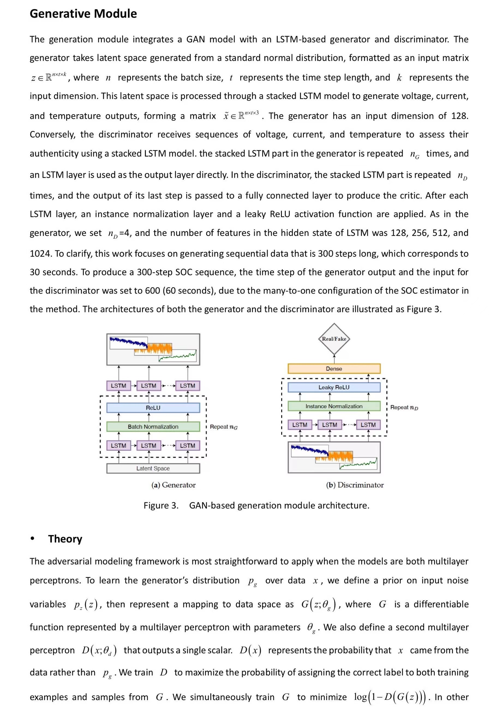
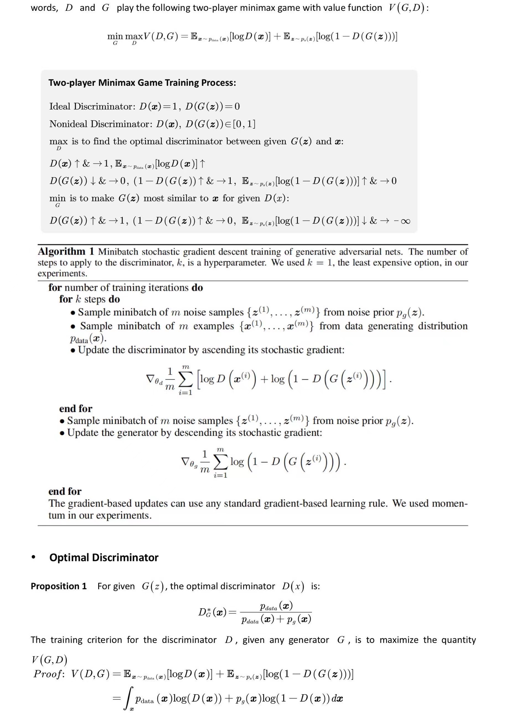
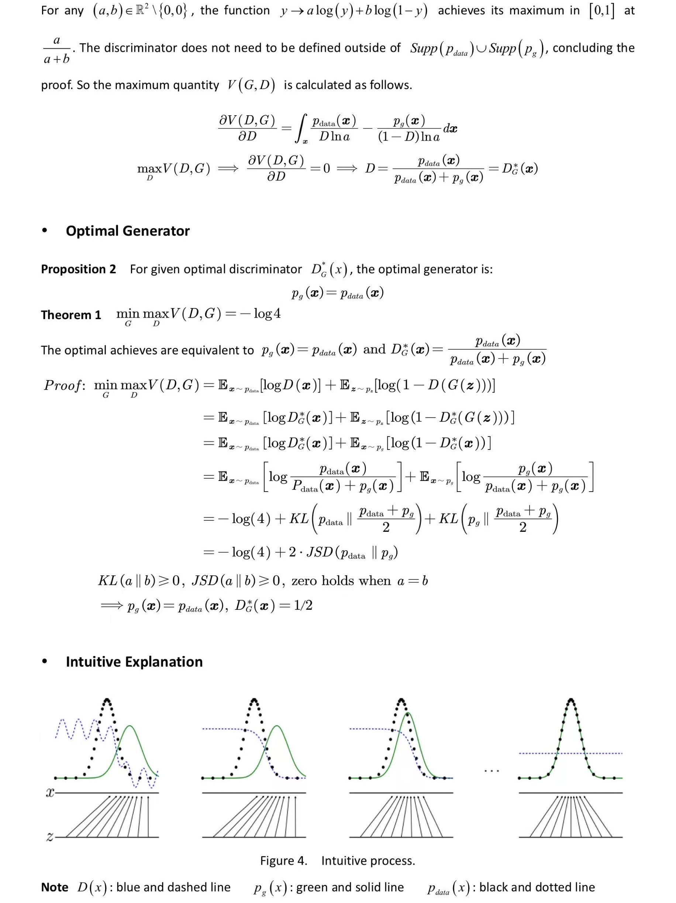
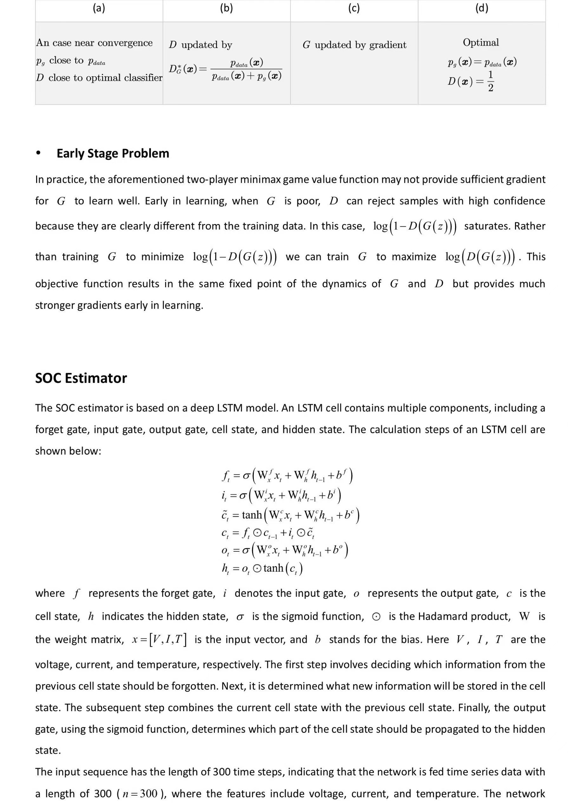
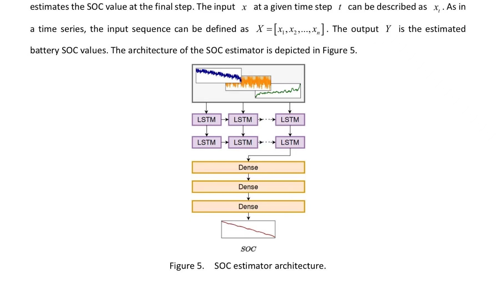
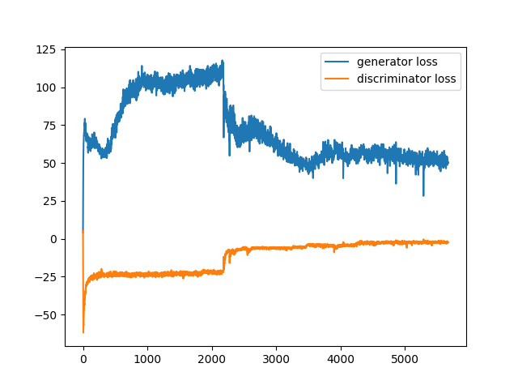
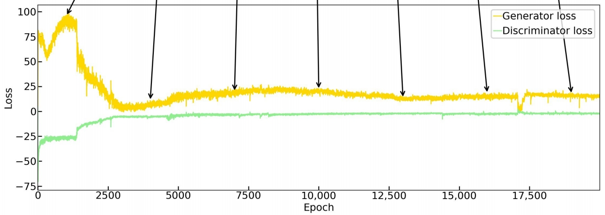
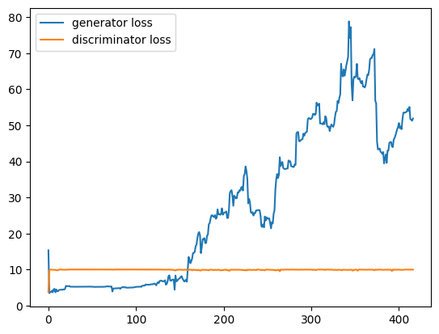
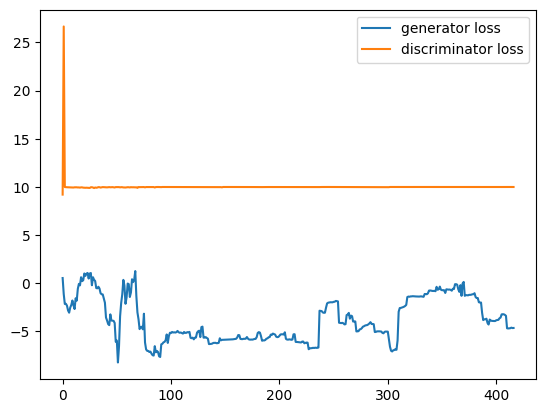
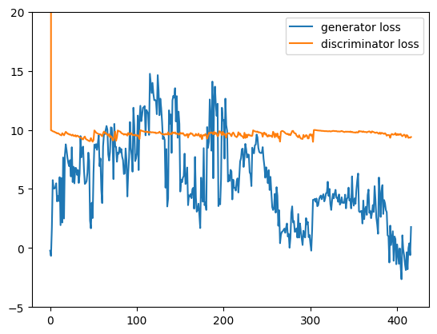

# Generative Adversarial Networks and Their Applications in Battery Technology


## 1 Overview
This tutorial introduces the principles and applications of [Generative Adversarial Networks (GANs)](https://en.wikipedia.org/wiki/Generative_adversarial_network). Focusing on battery management, it reproduces a method for estimating battery [State of Charge (SOC)](https://en.wikipedia.org/wiki/State_of_charge) based on GANs and provides guidance on implementing this method in code. The tutorial covers the advantages and disadvantages of GANs, usage tips, future prospects, and challenges, serving as a helpful resource for readers learning about GANs.

### 1.1 Original Research Paper
**Version 1:**  Goodfellow I, Pouget-Abadie J, Mirza M, et al.  [Generative adversarial nets[J]](https://proceedings.neurips.cc/paper_files/paper/2014/file/5ca3e9b122f61f8f06494c97b1afccf3-Paper.pdf). Advances in neural information processing systems, 2014, 27.

**Version 2:**  Goodfellow I, Pouget-Abadie J, Mirza M, et al. [Generative adversarial networks[J]](https://dl.acm.org/doi/pdf/10.1145/3422622). Communications of the ACM, 2020, 63(11): 139-144.

**Note:**  There is no substantial difference in principle between the two versions. We recommend using Version 2 because its expressed in a better way.


### 1.2 Learning Goals

1. Understand the fundamental concepts and working mechanisms of GANs.
2. Learn about the applications of GANs.
3. Gain practical tips in implementing GANs-based battery SOC estimator through guided code examples.
4. Discuss the future potential and challenges faced by GAN technology.
5. Explore the potential of integrating GANs with your research.


## 2 Background


### 2.1 Introduction
[**GANs**](https://en.wikipedia.org/wiki/Generative_adversarial_network) are a type of [unsupervised learning](https://en.wikipedia.org/wiki/Unsupervised_learning) method that has gained significant attention in the field of artificial intelligence and machine learning [[1]](#1)[[2]](#2). GANs consist of two key components: a **generator** $G$ and a **discriminator** $D$, which work together in a competitive process to generate new samples from real data and distinguish between real and fake sample [[3]](#3)[[4]](#4)[[5]](#5). The concept was initially developed by [Ian Goodfellow](https://en.wikipedia.org/wiki/Ian_Goodfellow) and his colleagues in June 2014 [[6]](#6). The generator creates new samples from the real data distribution, while the discriminator evaluates the authenticity of the generated samples. Based on the [zero-sum game](https://en.wikipedia.org/wiki/Zero-sum_game) theory, GANs generate and discriminate between real and fake samples, with the generator's goal being to produce samples that are identical to real data in order to fool the discriminator. The training process in GANs obeys the [minimax theorem](https://en.wikipedia.org/wiki/Minimax_theorem) where the generator tries to maximize the discriminator’s error rate, while the discriminator aims to minimize its classification error. This dynamic pushes the generator to create increasingly realistic data over time.


### 2.2 Comparison to Previous Work
- **Comparison to VAE:**
While both GANs and [**Variational Autoencoders (VAEs)**](https://en.wikipedia.org/wiki/Variational_autoencoder) are powerful generative models, their approaches to data generation and the underlying principles differ significantly. GANs rely on an adversarial process between the generator and discriminator to improve data generation quality, whereas VAEs use a probabilistic approach to encode and decode data through latent variables. Discriminative models and encoders both take the same input data. However, their outputs differ significantly. The output of a discriminative model is the probability of the input data being authentic, whereas the output of an encoder is a set of latent variables that represent the compressed representation of the input data. Similarly, generative models and recognition models (decoders) share the same output but differ in their inputs. The input to a generative model is random noise, which the model transforms into a realistic data sample. On the other hand, the input to a recognition model is latent variables, which the model decodes back into a representation of the original data.

- **Comparison to PM:**
Previous work on [**Predictability Minimization (PM)**](https://people.idsia.ch/~juergen/edgedetect/node2.html) highlights distinct differences in training criteria and the nature of competition when compared to GANs. In GANs, the competition between the generator and discriminator serves as the sole training criterion. The generator aims to produce data that the discriminator cannot distinguish from real data, while the discriminator strives to improve its ability to differentiate between real and generated data. This adversarial process is structured as a minimax game, where each network's performance directly influences the training of the other. In contrast, PM does not use competition as the primary training criterion. Instead, the competition between networks in PM functions more as a regularization technique to enhance the model's performance. PM's learning process is formulated as an optimization problem, where the goal is to minimize the predictability of the latent representations produced by the encoder.


### 2.3 Pros & Cons
The use of GANs has many benefits. One of their primary advantages is that they make learning easier by not requiring explicit inference during training. GANs train the generator and discriminator simultaneously in a minimax game without the need of [Markov chain](https://en.wikipedia.org/wiki/Markov_chain), in contrast to deep graphical models. This may result in improved generalization since it eliminates the need for explicit probability density estimate. Furthermore, GANs are more versatile and adaptive to a range of applications since they do not require an explicit representation of the generative distribution and enable efficient and parallel sampling.

GANs also have a few serious disadvantages. To get the best results during training, the discriminator $D$ and generator $G$ must be in perfect synchronization. The generator may map several alternative values of the random noise vector $z$ to the same output sample $x$ if it is trained too often without updating the discriminator. This problem leads to a lack of diversity in the generated samples, which prevents the model from effectively replicating the true data distribution. It is comparable to the ["Helvetica scenario"](https://blog.csdn.net/sdnuwjw/article/details/88691504?ops_request_misc=%257B%2522request%255Fid%2522%253A%2522171968301816800226533805%2522%252C%2522scm%2522%253A%252220140713.130102334..%2522%257D&request_id=171968301816800226533805&biz_id=0&utm_medium=distribute.pc_search_result.none-task-blog-2~all~sobaiduend~default-1-88691504-null-null.142^v100^pc_search_result_base3&utm_term=helvetica%20scenario&spm=1018.2226.3001.4187) in which all characters have very identical looks. For a varied set of samples to be produced that can accurately mimic real-world data, the discriminator and generator must work in perfect harmony.


## 3 GANs Applications
GANs have been widely used in various applications. Their notable progress in [computer vision](https://en.wikipedia.org/wiki/Computer_vision) has made possible applications like [super-resolution](https://en.wikipedia.org/wiki/Super-resolution_imaging), style transfer, picture synthesis, and semantic image manipulation [[7]](#7). By generating realistic high-resolution images, GANs have shown remarkable performance in various [computer graphics](https://en.wikipedia.org/wiki/Computer_graphics) applications, including face synthesis and image-to-image translation [[6]](#6). Nowozin et al. introduced the concept of training generative neural samplers using variational divergence minimization, highlighting the efficiency of GANs in computing samples and derivatives [[8]](#8). Mescheder et al. further unified VAEs and GANs through Adversarial Variational Bayes (AVB), demonstrating the connection between these two models [[9]](#9). Rosca et al. proposed a fusion of VAEs and GANs by leveraging the hierarchical structure of the generative model, combining the strengths of both approaches [[10]](#10).


### 3.1 GANs Applications in Battery Research
In the field of battery research, GANs have become a potent tool, providing innovative answers to a range of problems pertaining to battery management and diagnostics. By offering a technique for [data augmentation](https://en.wikipedia.org/wiki/Data_augmentation) and [synthetic data](https://en.wikipedia.org/wiki/Synthetic_data) generation, GANs aid in the production of battery data [[11]](#11). Compared to conventional machine learning methods, GANs perform better in [dimensionality reduction](https://en.wikipedia.org/wiki/Dimensionality_reduction), non-linear fitting, and feature extraction. From input label descriptions, they may produce corresponding battery data, which is especially helpful for battery management applications that forecast battery state and future behaviors [[12]](#12)[[13]](#13)[[14]](#14)[[15]](#15). Based on an examination of 30 recent Google Scholar articles, this background study investigates the various uses of GANs in battery technology.

- **SOC and SOH Estimation:**
For [lithium-ion batteries](https://en.wikipedia.org/wiki/Lithium-ion_battery) to be managed effectively, [**SOC**](https://en.wikipedia.org/wiki/State_of_charge) and [**State of Health (SOH)**](https://en.wikipedia.org/wiki/State_of_health) are essential metrics. The SOC of a battery refers to the current charge level of the battery expressed as a percentage of its total capacity. It is an important parameter that indicates how much energy is available in the battery at any given moment. The SOH of a battery indicates its overall condition and capacity relative to its original, new state. SOH is expressed as a percentage and provides insight into the battery's ability to store and deliver energy compared to when it was new. It is an essential parameter for understanding battery aging and degradation, also for the further prediction of the remaining useful life of batteries. Numerous studies have shown how to apply GANs to improve the estimation's accuracy and dependability. For instance, references [[16]](#16)[[17]](#17)[[18]](#18) leverage GANs for SOC estimation by generating high-fidelity synthetic data that augment the training datasets, thereby improving the robustness of the estimators.The generated synthetic data can accurately reflects the original feature distributions and temporal dynamics, assisting in developing reliable battery SOC estimators. Similarly, recent studies focus on SOH estimation using GANs to reconstruct voltage curves and predict battery degradation over time [[19]](#19).

- **Battery Degradation Forecast:**
Battery degradation refers to the process of a battery losing capacity and performance over time, impacting various applications from portable electronics to [electric vehicles](https://en.wikipedia.org/wiki/Electric_vehicle) and [renewable energy systems](https://en.wikipedia.org/wiki/Renewable_Energy_Systems) [[20]](#20)[[21]](#21). Forecasting battery aging and degradation is vital for maintenance and safety. Research by [[22]](#22) and [[23]](#23) employs GANs to address this challenge by generating synthetic battery [cycle life](https://en.wikipedia.org/wiki/Charge_cycle) data, which enhances the training of capacity estimation models. Reference [[24]](#24) introduces an electrochemical-theory-guided GAN to forecast calendar aging of batteries. These GAN-based models have shown improved performance in predicting battery future degradation behaviors under various operating conditions.

- **Time-Series Data Generation and Analysis:**
The generation of [time-series](https://en.wikipedia.org/wiki/Time_series) data using GANs has been explored for various battery applications. Research by [[25]](#25), [[26]](#26) and [[27]](#27) focuses on the use of convolutional recurrent GANs and [Wasserstein GANs](https://en.wikipedia.org/wiki/Wasserstein_GAN) to regenerate time-series data for SOC estimation, SOH estimation and remaining useful life prediction. These approaches have proven effective in capturing the complex temporal dynamics of battery behavior.

- **Thermal Runaway Prognostics:**
Ensuring battery safety involves predicting and preventing [thermal runaway](https://en.wikipedia.org/wiki/Thermal_runaway) events. [Adversarial learning](https://en.wikipedia.org/wiki/Adversarial_machine_learning) techniques have been applied to robustly predict thermal runaway, as demonstrated by [[28]](#28). This approach enhances the reliability of thermal runaway prognostics in electric vehicles.

- **Domain Adaptation and Transfer Learning:**
GANs also facilitate [domain adaptation](https://en.wikipedia.org/wiki/Domain_adaptation) and [transfer learning](https://en.wikipedia.org/wiki/Transfer_learning) in battery research. For instance, [[29]](#29) and [[30]](#30) employ domain adversarial transfer learning using GANs to improve SOH estimation across different battery datasets. This allows models trained on one type of battery to be effectively applied to another, enhancing their generalizability.


### 3.2 GANs Applications in Battery Research Summary
Overall, the application of GANs in battery research is diverse and growing. The literature review demonstrates how versatile GANs are in battery-related research, from synthesis and interpolation of energy-related datasets to data augmentation and estimate. The integration of GANs with various models and techniques has led to advancements in battery condition evaluation, capacity estimation, and data imputation, highlighting the significance of GANs in enhancing battery-related applications. GANs effectively lessen the necessity of time-consuming and costly spot tests for battery state estimation. As battery technology continues to advance, GANs are anticipated to become more crucial in data generation, thus enhancing the accuracy, reliability, and safety of battery management systems.


## 4 Problem Formulation
The code implementation part of tutorial is based on the paper ["A Novel Fusion Approach Consisting of GAN and State-of-Charge Estimator for Synthetic Battery Operation Data Generation"](https://www.mdpi.com/2079-9292/12/3/657) [[17]](#17). We reproduced the method of estimating battery SOC using [voltage](https://en.wikipedia.org/wiki/Voltage), [current](https://en.wikipedia.org/wiki/Current), and [temperature](https://en.wikipedia.org/wiki/Temperature) curves generated by a GAN. This method effectively addresses the issue of insufficient experimental data, reduces the manpower and cost associated with experimental testing, and allows for timely monitoring of battery usage, thereby effectively assisting in battery health management.

The fusion strategy integrates a GAN-based generation module with a deep [LSTM](https://en.wikipedia.org/wiki/Long_short-term_memory)-based SOC estimator to effectively estimate SOC drops during real-world battery operation. The generation module consists of a generator and discriminator trained together to produce high-fidelity synthetic data for voltage, current, and temperature during a discharge cycle. The SOC estimator is trained to predict SOC based on the input voltage, current, and temperature values. By merging synthetic battery operation data from the generator with the estimated SOC derived from this synthetic data, a synthetic Li-ion battery operation dataset can be created. Figure 1 illustrates an overview of the proposed framework.

<figure>
    <div style="text-align: center;">
        
        <figcaption>Figure 1. Framework overview.
    </div>
    </figcaption>
</figure>

In the framework, $V$ represents voltage, $I$ indicates current, $T$ stands for temperature, and $z$ is the [latent space](https://en.wikipedia.org/wiki/Latent_space) sampled from a standard [normal distribution](https://en.wikipedia.org/wiki/Normal_distribution). The orange dashed line denotes the SOC estimator training phase, the blue dashed line indicates the GAN training phase, and the red line represents the synthetic data generation phase. The arrows point to the input and output of the corresponding components during different phases. It is noteworthy that the latent space $z$ is used in both the GAN training phase and the synthetic data generation phase. The generator generates synthetic data from random [Gaussian noise](https://en.wikipedia.org/wiki/Gaussian_noise) during both training and production.


## 5 Data Description
The LG 18650HG2 Li-ion battery dataset, known as the LG dataset, was published by Kollmeyer et al. [[31]](#31) and is publicly available through [Mendeley Data](https://data.mendeley.com/datasets/cp3473x7xv/3). The data collection involved conducting charge and discharge tests at various temperatures. The discharge cycles were based on driving cycles such as UDDS, LA92, US06, among others, and combinations of these cycles. During the experiments, the batteries were operated at temperatures of 0 °C, 10 °C, and 25 °C. The dataset includes time series data of voltage, current, temperature, and SOC values, sampled at a rate of 10 Hz. Figure 2 presents an example of a discharge cycle from the dataset.

<figure>
    <div style="text-align: center;">
        
        <figcaption>Figure 2. Battery dataset example.
    </div>
    </figcaption>
</figure>


## 6 Method Explanation
<figure>
    <div style="text-align: center;">
    
    
    
    
    
    </div>
    </figcaption>
</figure>


## 7 Code Example
This example code here is modified from the publicly available code on [GitHub](https://github.com/KeiLongW/synthetic-battery-data) published by the author. However, the code on [GitHub](https://github.com/KeiLongW/synthetic-battery-data) has some bugs. Therefore, we recommend using the modified code we provide.


### 7.1 Code Project Sturcture
- synthetic-battery-data-main/
  - data/
    - lg_600_data.npy/
  - results/
  - soc_models/
  - gitignore
  - arg_parser.py
  - environment.yml
  - gan_trainer_base.py
  - generative_framework.png
  - lg_dataset.py
  - LICENSE
  - README.md
  - visualize_lstm_gan.ipynb
  - train_lstm_gan.py
#### Explaination
|Item|Functionality|
|:---|:------------|
|data/|contains the preprocessed data `lg_600_data.npy` of LG 18650HG2 Li-ion Battery Data. Please refer to the SOC estimator repository for detail handling of the reprocessing.|
|result/|training results will be output to this folder. Results will be saved in `xxxxxxxxxx_lstm_gan/` subfolder separately for each experiment.|
|soc_models/|contains the pre-trained model of the SOC estimator used in this work.|
|arg_parser.py|code to parse command line arguments.|
|lg_dataset.py|code to handle the LG dataset.|
|gan_trainer_base.py|code to handle the basic GAN training procedure.|
|visualize_lstm_gan.ipynb|jupyter notebook for evaluating the training result. It will be automatically copied into the `results/xxxxxxxxxx_lstm_gan/` directory and renamed as result.ipynb.|
|train_lstm_gan.py|main code for the proposed GAN model.|  
### 7.2 Reproduction Steps
#### 7.2.1 Download Pre-trained Models (Not Mandatory, but Recommended)
Download the `trained_model.zip` from [here](https://github.com/KeiLongW/battery-state-estimation/releases/tag/v1.0) and unzip files into the `soc_models` folder. If this step is skipped, you can only use the default pre-trained soc model.
#### 7.2.2 Environment Configuration
Run command `conda env create -f environment.yml` to configure a proprietary environment in anaconda. You may need to upgrade your Pytorch and Tensorflow to the newest version. The combination of Ubuntu 22.04, Python 3.8, Pytorch 2.3.1, Tensorflow 2.10.0 and CUDA 12.1 have been validated. You may also need to adjust the version of some packages such as numba.    
Then Run command `conda init` for initialization. Restart the terminal and Run `conda activate synthetic-battery-data` to enter the new created environment.
#### 7.2.3 Initialization
Run command `export NUMEXPR_MAX_THREADS=X`, where X equals to the threads number your CPU have.  
Run command `export CUDA_CACHE_MAXSIZE=X`, where X equals to Y * Z * 1024 * 1024 * 1024 . Y is the number of GPU you have. Z is the graphics memory of a single GPU.  
Run command `python train_lstm_gan.py`. The first run of tensorflow may take a long time.  
#### 7.2.4 Train with Default Parameters
Run command `python train_lstm_gan.py`.
#### 7.2.5 Visualization
Run `/results/xxxxxxxxxx_lstm_gan/result.ipynb` to visualize the result of this experiment. 
### 7.3 Arguments Options
Run command `python train_lstm_gan.py -h` to view the available arguments options. Many hyperparameters can be adjusted.  

| Short Option | Long Option                        | Help                                                                          | Default                                                                                            | Type   |  
|:-------------|:-----------------------------------|:------------------------------------------------------------------------------|:---------------------------------------------------------------------------------------------------|:-------|  
| -t           | --train-report-interval            | interval of logging epoch result during training                              | 1                                                                                                  | int    |  
| -b           | --batch-size                       | batch size                                                                    | 64                                                                                                 | int    |  
| -d           | --data-path                        | data path                                                                     | ./data/lg_600_data.npy                                                                             | string |  
| -p           | --show-progress-bar                | show progress bar                                                             | False                                                                                              | bool, store_true   |  
| -r           | --resume-model-name                | the result name under the results directory to resume training                | None                                                                                               | string |  
| -s           | --save-epoch-interval              | epoch interval of saving model. If you do not want to waste time on saving models (about 2h/once), set this item to be larger than the gan epochs item (-e).                                                | 1000                                                                                               | int    |  
| -n           | --result-notebook                  | result notebook name that will copy to result directory                       | visualize_lstm_gan.ipynb                                                                               | string |  
| -e           | --gan-epochs                       | number of epochs to train                                                     | 20000                                                                                              | int    |  
| -gid         | --generator-input-dim              | generator input dimension                                                     | 128                                                                                                | int    |  
| -dts         | --discriminator-train-steps        | discriminator train steps                                                     | 5                                                                                                  | int    |  
| -gp          | --gradient-penalty-lambda-term     | gradient penalty lambda term                                                  | 10.0                                                                                               | float  |  
| -gdr         | --generator-dropout                | generator dropout rate                                                        | 0.0                                                                                                | float  |  
| -glr         | --generator-learning-rate          | generator learning rate                                                       | 0.0001                                                                                             | float  |  
| -gwd         | --generator-weight-decay           | generator weight decay                                                        | 0.0                                                                                                | float  |  
| -gab1        | --generator-adam-beta1             | generator adam beta1                                                          | 0.5                                                                                                | float  |  
| -gab2        | --generator-adam-beta2             | generator adam beta2                                                          | 0.999                                                                                              | float  |  
| -ddr         | --discriminator-dropout            | discriminator dropout rate                                                    | 0.0                                                                                                | float  |  
| -dlr         | --discriminator-learning-rate      | discriminator learning rate                                                   | 0.0001                                                                                             | float  |  
| -dwd         | --discriminator-weight-decay       | discriminator weight decay                                                    | 0.0                                                                                                | float  |  
| -dab1        | --discriminator-adam-beta1         | discriminator adam beta1                                                      | 0.5                                                                                                | float  |  
| -dab2        | --discriminator-adam-beta2         | discriminator adam beta2                                                      | 0.999                                                                                              | float  |  
| -ess         | --evaluate-sample-size             | the generate data sample size on evaluation                                   | 4000                                                                                               | int    |  
| -socs        | --soc-estimator-step               | the soc estimator step size                                                   | 300                                                                                                | int    |  
| -socmp       | --soc-estimator-model-path         | the pre-trained soc estimator model path                                      | ./soc_models/                                                                                      | string |  
| -socm        | --soc-estimator-model              | the pre-trained soc estimator model name                                      | 2021-01-12-23-17-13_lstm_soc_percentage_lg_positive_temp_300_steps_mixed_cycle_test.h5             | string |  


### 7.4 Computation Resource Configuration
We reproduced this code with one 14 vCPU Intel(R) Xeon(R) Gold 6348 CPU @ 2.60GHz and several A800-80GB GPUs. We conducted short experiments with different numbers of GPUs and different batch_size setting to find the fastest and most cost-effective training configuration. The computation time for one D iteration (there are five D iteration in one epoch) normalized by batch_size is shown in the following table. 

|GPU Quantity\Batch Size (64 x)|1|2|3|4|5|6|7|8|9|10|20|30|35|36|37|38|40|47|48|49|50|
|:--|:--|:--|:--|:--|:--|:--|:--|:--|:--|:--|:--|:--|:--|:--|:--|:--|:--|:--|:--|:--|:--|
|1|3.44|2.1|1.67|1.45|1.32|**1.23**|1.46|Out of Memory|-|-|-|-|-|-|-|-|-|-|-|-|-|
|6|10.16|4.77|3.67|2.65|2.32|2.07|1.63|1.55|1.31|1.28|0.76|0.55|0.508|**0.48**|**0.48**|0.62|-|-|-|-|-|
|8|13.6|-|-|-|-|-|-|-|-|1.54|0.92|0.69|-|-|-|-|0.5|0.477|**0.475**|0.481|0.52|
|8, learning rate adjusted|12.8|-|-|-|-|-|-|-|-|1.52|0.99|0.75|-|-|-|-|0.52|**0.478**|0.479|0.453?|0.536|

Through this table, we find that:
  - When the batch_size is small, increasing GPU quantity will actually make the calculation time longer. Therefore, we suggest setting batch_size to be larger than the default value when you have high performance GPU. However, excessively large values may cause crashes in the early trainging stage.  
  - For A800 GPUs with 80GB graphical memory, the optimal batch_size is 64 × 6 × y, where y is the GPU quantity. For V100 GPUs with 16GB graphical memory, the optimal batch_size maybe 64 × 1 × y, consistent with the default batch_size. You can scale the batch_size value based on the size of the graphics memory as the initial guess value, fasting the process to find the optimal batch_size.

### 7.5 Core Code Parsing 
#### 7.5.1 Generator Definition in train_lstm_gan.py
```
class Generator(nn.Module):
  def __init__(self, input_dim, output_dim, seq_len, dropout):
    super(Generator, self).__init__()
    
    self.input_dim = input_dim
    self.output_dim = output_dim
    self.seq_len = seq_len
    self.dropout = dropout
    
    self.lstm_1 = nn.LSTM(input_dim, 1024, dropout=dropout, batch_first=True)
    self.batch_norm_1 = nn.BatchNorm2d(1024)
    self.relu_1 = nn.ReLU()
    self.lstm_2 = nn.LSTM(1024, 512, dropout=dropout, batch_first=True)
    self.batch_norm_2 = nn.BatchNorm2d(512)
    self.relu_2 = nn.ReLU()
    self.lstm_3 = nn.LSTM(512, 256, dropout=dropout, batch_first=True)
    self.batch_norm_3 = nn.BatchNorm2d(256)
    self.relu_3 = nn.ReLU()
    self.lstm_4 = nn.LSTM(256, 128, dropout=dropout, batch_first=True)
    self.batch_norm_4 = nn.BatchNorm2d(128)
    self.relu_4 = nn.ReLU()
    self.lstm_5 = nn.LSTM(128, output_dim, dropout=dropout, batch_first=True)
    
  def forward(self, x):
    self.lstm_1.flatten_parameters()
    self.lstm_2.flatten_parameters()
    self.lstm_3.flatten_parameters()
    self.lstm_4.flatten_parameters()
    self.lstm_5.flatten_parameters()
    
    x, (h_n, c_n) = self.lstm_1(x)
    x = self.batch_norm_1(x.reshape(x.shape[0], x.shape[2], 1, x.shape[1])).squeeze(2).permute(0,2,1)
    x = self.relu_1(x)
    x, (h_n, c_n) = self.lstm_2(x)
    x = self.batch_norm_2(x.reshape(x.shape[0], x.shape[2], 1, x.shape[1])).squeeze(2).permute(0,2,1)
    x = self.relu_2(x)
    x, (h_n, c_n) = self.lstm_3(x)
    x = self.batch_norm_3(x.reshape(x.shape[0], x.shape[2], 1, x.shape[1])).squeeze(2).permute(0,2,1)
    x = self.relu_3(x)
    x, (h_n, c_n) = self.lstm_4(x)
    x = self.batch_norm_4(x.reshape(x.shape[0], x.shape[2], 1, x.shape[1])).squeeze(2).permute(0,2,1)
    x = self.relu_4(x)
    x, (h_n, c_n) = self.lstm_5(x)
    return x
```
Consistent with Figure 3 (a), the generator model is composed of five LSTM layers, each followed by batch normalization and ReLU activation functions. These layers enable the generator to process the input data and produce the corresponding output sequences.

#### 7.5.2 Discriminator Definition in train_lstm_gan.py
```
class Discriminator(nn.Module):
  def __init__(self, input_dim, dropout):
    super(Discriminator, self).__init__()
    
    self.input_dim = input_dim
    self.dropout = dropout
    
    self.lstm_1 = nn.LSTM(input_dim, 128, dropout=dropout, batch_first=True)
    self.instance_norm_1 = nn.InstanceNorm2d(128)
    self.relu_1 = nn.LeakyReLU(0.2)
    self.lstm_2 = nn.LSTM(128, 256, dropout=dropout, batch_first=True)
    self.instance_norm_2 = nn.InstanceNorm2d(256)
    self.relu_2 = nn.LeakyReLU(0.2)
    self.lstm_3 = nn.LSTM(256, 512, dropout=dropout, batch_first=True)
    self.instance_norm_3 = nn.InstanceNorm2d(512)
    self.relu_3 = nn.LeakyReLU(0.2)
    self.lstm_4 = nn.LSTM(512, 1024, dropout=dropout, batch_first=True)
    self.instance_norm_4 = nn.InstanceNorm2d(1024)
    self.relu_4 = nn.LeakyReLU(0.2)
    self.linear = nn.Linear(1024, 1)

  def forward(self, x):
    self.lstm_1.flatten_parameters()
    self.lstm_2.flatten_parameters()
    self.lstm_3.flatten_parameters()
    self.lstm_4.flatten_parameters()
    
    x, (h_n, c_n) = self.lstm_1(x)
    x = self.instance_norm_1(x.reshape(x.shape[0], x.shape[2], 1, x.shape[1])).squeeze(2).permute(0,2,1)
    x = self.relu_1(x)
    x, (h_n, c_n) = self.lstm_2(x)
    x = self.instance_norm_2(x.reshape(x.shape[0], x.shape[2], 1, x.shape[1])).squeeze(2).permute(0,2,1)
    x = self.relu_2(x)
    x, (h_n, c_n) = self.lstm_3(x)
    x = self.instance_norm_3(x.reshape(x.shape[0], x.shape[2], 1, x.shape[1])).squeeze(2).permute(0,2,1)
    x = self.relu_3(x)
    x, (h_n, c_n) = self.lstm_4(x)
    x = self.instance_norm_4(x.reshape(x.shape[0], x.shape[2], 1, x.shape[1])).squeeze(2).permute(0,2,1)
    output = self.relu_4(x[:,-1,:])
    output = self.linear(output)
    return output
```
Consistent with Figure 3 (b), the discriminator model is also composed of five LSTM layers, but the number of hidden units varies for each layer. The output of the discriminator is one-dimensional, representing the probability that the input data is real.

#### 7.5.3 Trainer in train_lstm_gan.py
```
############################################
# Trainer
############################################
class TrainLSTMGAN(GANTrainerBase):
  def __init__(self, config) -> None:
    super().__init__(config, 'lstm_gan')
    
    ########## Config ##########
    self.generator_dropout = config.get('generator_dropout')
    self.generator_learning_rate = config.get('generator_learning_rate')
    self.generator_weight_decay = config.get('generator_weight_decay')
    self.generator_adam_beta1 = config.get('generator_adam_beta1')
    self.generator_adam_beta2 = config.get('generator_adam_beta2')
    self.discriminator_dropout = config.get('discriminator_dropout')
    self.discriminator_learning_rate = config.get('discriminator_learning_rate')
    self.discriminator_weight_decay = config.get('discriminator_weight_decay')
    self.discriminator_adam_beta1 = config.get('discriminator_adam_beta1')
    self.discriminator_adam_beta2 = config.get('discriminator_adam_beta2')
    
    ########## GAN ##########
    self.G = Generator(self.generator_input_dim, 
                       self.generator_output_dim,
                       self.train_set.seq_len,
                       self.generator_dropout)
    self.G = DataParallel(self.G, device_ids=self.device_ids).to(self.device)
    self.g_optim = Adam(self.G.parameters(), lr=self.generator_learning_rate, weight_decay=self.generator_weight_decay, betas=(self.generator_adam_beta1, self.generator_adam_beta2))
    self.D = Discriminator(self.discriminator_input_dim,
                           self.discriminator_dropout)
    self.D = DataParallel(self.D, device_ids=self.device_ids).to(self.device)
    self.d_optim = Adam(self.D.parameters(), lr=self.discriminator_learning_rate, weight_decay=self.discriminator_weight_decay, betas=(self.discriminator_adam_beta1, self.discriminator_adam_beta2))
```
The TrainLSTMGAN class inherits from GANTrainerBase class and is responsible for managing the training process of an LSTM-GAN. The TrainLSTMGAN class Utilizes the generic functionalities provided by the base class, focusing on the LSTM-GAN specific implementation.  
This part of code firstly reads various hyperparameters for the generator and discriminator from the configuration dictionary.Then it initializes the generator and discriminator models and parallelizes them using DataParallel. Lastly, it sets up Adam optimizers for both the generator and discriminator with specified hyperparameters.

#### 7.5.4 Training Process in gan_trainer_base.py
```
def _do_training(self):
  begin_time = datetime.now()    
  one = torch.tensor(1, dtype=torch.float)
  mone = one * -1    
```
Initialization.
```
  for epoch in range(self.start_epoch, self.gan_epochs):    
    self.D.train()
    self.G.train()      
```
Set both the discriminator (`self.D`) and generator (`self.G`) to training mode.  
#### Discriminator Training:
```
    ########## Train discriminator ##########
    for p in self.D.parameters():
      p.requires_grad = True
```
  Enable gradient computation for the discriminator's parameters.
```
    d_loss_real = 0
    d_loss_fake = 0
    total_d_loss = 0
    d_iterator = tqdm(range(self.discriminator_train_steps), desc=f'Epoch {epoch+1}/{self.gan_epochs}') if self.show_progress_bar else range(self.discriminator_train_steps)
```
  Initialization.
```
    for d_step in d_iterator:
      self.d_optim.zero_grad()
      real_data = next(iter(self.train_loader)).to(self.device) # randomly get one batch of real data
      d_loss_real = self.D(real_data)
      d_loss_real = d_loss_real.mean()
      d_loss_real.backward(mone)
```
  In each training step, first zero the gradients of the discriminator, randomly get a batch of real data, compute the discriminator's loss on the real data, and backpropagate the gradient.
```        
      z = torch.randn(self.batch_size, self.train_set.seq_len, self.generator_input_dim).to(self.device)
      fake_data = self.G(z)
      d_loss_fake = self.D(fake_data)
      d_loss_fake = d_loss_fake.mean()
      d_loss_fake.backward(one)
```
  Generate a batch of random noise `z`, pass it through the generator to create fake data, compute the discriminator's loss on the fake data, and backpropagate the gradient.
```
      with torch.backends.cudnn.flags(enabled=False):
        gradient_penalty = self._calculate_gradient_penalty(real_data.data, fake_data.data)
        gradient_penalty.backward()
```
  Calculate the gradient penalty and backpropagate the gradient.
```
      self.d_optim.step()
      total_d_loss += (d_loss_fake - d_loss_real + gradient_penalty).item()
      print(f'[D iter:{d_step+1}/{self.discriminator_train_steps}] d_loss_real:{d_loss_real}, d_loss_fake:{d_loss_fake}, gradient_penalty:{gradient_penalty}')
    d_loss = total_d_loss / self.discriminator_train_steps
```
  Update the discriminator's parameters and accumulate the total discriminator loss. Calculate the average discriminator loss.
#### Generator Training:
```
      ########## Train generator ##########
      for p in self.D.parameters():
        p.requires_grad = False
```
Freeze the discriminator's parameters to avoid calculating gradients for them.
```
      self.g_optim.zero_grad()
      z = torch.randn(self.batch_size, self.train_set.seq_len, self.generator_input_dim).to(self.device)
      fake_data = self.G(z)
      g_loss = self.D(fake_data)
      g_loss = g_loss.mean()
      g_loss.backward(mone)
      self.g_optim.step()
      g_loss = -g_loss.item() # reverse the sign of g_loss to have a more intuitive interpretation of loss
```
Zero the gradients of the generator, generate new noise, pass it through the generator to create fake data, compute the generator's loss, backpropagate the gradient, and update the generator's parameters. Note that the sign of `g_loss` is reversed for more intuitive interpretation of the loss value.
```
      self.g_loss_list.append(g_loss)
      self.d_loss_list.append(d_loss)   
      if (epoch + 1) % self.train_report_interval == 0:
        print(f'[Epoch:{epoch+1}/{self.gan_epochs}] Time passed:{(datetime.now() - begin_time).seconds}s, g_loss:{g_loss}, d_loss:{d_loss}')
    
      self._training_snapshot(epoch, g_loss, d_loss, begin_time)
```
Record the generator and discriminator losses. If the reporting interval is reached, print the losses and elapsed training time. Finally, call the _training_snapshot function to save the current training snapshot.
#### 7.6 Generation Effect
#### 7.6.1 Loss Function
We reproduced using default parameters and calculated the changes in the loss function obtained from the first 6000 epoches as follows. The trend of the loss function is consistent in the first 6000 epoches. We reprodeced the left figure, while the right figure comes from the article.  

<div style="display: flex; align-items: center; justify-content: space-around;">
  
  
</div>

#### 7.6.2 Data Generation
We also evaluation the data generation reality. Both real data and synthesized data are shown in the following figure.  The blue line, orange line, green line, and red line represent voltage, current, temperature, and SOC, respectively. The generated curve gradually tends towards reality during the first 6000 epoches.

<figure>
    <div style="text-align: center;">
    
    
    </div>
    </figcaption>
</figure>

#### 7.6.3 Data Distribution
The analysis results of PCA and t-SNE also indicate that the generative model is gradually better capturing the distribution characteristics of data during the first 6000 epoches.

<figure>
    <div style="text-align: center;">
    
    </div>
    </figcaption>
</figure>

#### 7.6.4 Hyperparamter Influence
We also explored the influence of hyperparamters on model training. We set the batch_size to be 64 * 48 = 372. Therefore, with same image utilization frequency, the epoch will be 20000 / 48 ≈ 417. To explore the influence of learning_rate to the training process, we perform experiemnts with learning_rate 0.012, 0.024, 0.048, where the normlized learning rate under batch_size = 64 condition will be 0.00025, 0.0005, 0.001. The training effect did not show a clear pattern. We want to obtain the trend of reality changes as shown in the above figure through PCA and t-SNE. However, the computation platform unexpectedly lost power during PCA analysis, so we were unable to obtain the desired results.

<div style="display: flex; align-items: center; justify-content: space-around;">
  
  
  
</div>

## 8 Discussion


### 8.1 When to Use
GANs are a powerful class of [machine learning](https://en.wikipedia.org/wiki/Machine_learning) frameworks designed for generating synthetic data. They are particularly advantageous in scenarios where labeled data is scarce or expensive to obtain, as GANs can generate high-quality data samples that closely resemble real data. GANs are not only widely used in fields such as image and video generation but also have significant potential for application in many interdisciplinary fields that require large amounts of data but face limitations in obtaining sufficient data due to experimental constraints.

- **Advantages:**
GANs excel in creating realistic data, which can be used to augment training datasets, thus improving the performance of [supervised learning](https://en.wikipedia.org/wiki/Supervised_learning) algorithms. They are a powerful tool for [unsupervised learning](https://en.wikipedia.org/wiki/Unsupervised_learning) tasks, helping to learn complex data distributions without requiring labeled data. This makes them invaluable in fields such as image synthesis, data augmentation, and super-resolution.

- **Limitations:**
Training GANs can be notoriously difficult, often requiring careful tuning of hyperparameters and network architectures to achieve [convergence](https://en.wikipedia.org/wiki/Convergence). A common issue where the generator produces a limited variety of outputs, failing to capture the full diversity of the data distribution. Besides, Training GANs is resource-intensive, often requiring significant computational power and time.


### 8.2 Practical Tips in Implementation and Usage

- **Balanced Training:**
It is essential to ensure that the generator and discriminator are balanced in terms of their capacity and training progress to prevent one from overpowering the other. It should be noted that the generator could not be trained too much without updating the discriminator to avoid the [“Helvetica scenario”](https://blog.csdn.net/sdnuwjw/article/details/88691504?ops_request_misc=%257B%2522request%255Fid%2522%253A%2522171968301816800226533805%2522%252C%2522scm%2522%253A%252220140713.130102334..%2522%257D&request_id=171968301816800226533805&biz_id=0&utm_medium=distribute.pc_search_result.none-task-blog-2~all~sobaiduend~default-1-88691504-null-null.142%5Ev100%5Epc_search_result_base3&utm_term=helvetica%20scenario&spm=1018.2226.3001.4187).

- **Computational Requirements:**
Using distributed training techniques to spread the computational load across multiple GPUs or even multiple machines can speed up training. But the number and type of GPUs need to be rationally designed to balance the cost and demand.

- **Architectural Choices:**
Trying different network architectures for both the generator and discriminator can help find the most effective configuration for the specific task.

- **Batch Size Optimization:**
The batch size can significantly impact the stability and convergence of GAN training. Larger batch sizes can leverage GPU parallelism but may require more memory. It is important to optimize the batch size to balance between memory consumption and training stability.


### 8.3 Relationship to Other Methods
GANs relate closely to other generative models like VAE, PM and [Autoregressive models (AR)](https://en.wikipedia.org/wiki/Autoregressive_model). The previous chapter have presented detailed comparison with VAE and PM. While VAEs use a probabilistic approach to generate data by learning the latent space distribution, GANs use an adversarial approach that typically yields higher-quality images but can be less stable. The learning process of PM is formulated as an optimization problem, with the objective of minimizing the predictability of the latent representations generated by the encoder. AR, on the other hand, generate data sequentially, making them suitable for tasks like text generation and time series prediction.


### 8.4 Important Subsequent Algorithms

- **Pix2Pix:**
It is a GAN framework for image-to-image translation tasks that require paired examples during training created by Isola et al. [[32]](#32). It is widely used for applications like translating sketches to photos or generating images from semantic layouts.

- **CycleGAN:**
Introduced by Zhu et al., CycleGAN enables image-to-image translation without requiring paired datasets [[33]](#33). It uses a cycle consistency loss to ensure that an image translated from one domain to another and back remains unchanged, facilitating tasks such as style transfer and domain adaptation.

- **Progressive GAN:**
Karras et al. proposed Progressive GAN, which improves training stability and reduces time by starting at low resolutions and progressively increasing the resolution of generated images [[34]](#34). This approach leads to the generation of high-resolution, high-quality images.

- **BigGAN:**
Developed by Brock et al., BigGAN scales up GANs to use very large batch sizes and deeper architectures, achieving state-of-the-art performance in image synthesis. BigGAN's ability to generate highly realistic and detailed images set new benchmarks in the field [[35]](#35).

- **StyleGAN:**
Also proposed by Karras et al., [StyleGAN](https://en.wikipedia.org/wiki/StyleGAN) incorporates style transfer techniques into the generator, providing control over different levels of detail in generated images [[36]](#36). This fine-grained control leads to high-quality, diverse outputs and has been used in various creative and practical applications.

- **StyleGAN2:**
It is an improvement over StyleGAN introduced by Karras et al., which further refines the generator architecture and normalization techniques [[37]](#37). It achieves even higher image quality and addresses artifacts present in the original StyleGAN, making it a powerful tool for generating photorealistic images.


### 8.5 Impactful Applications

- **Image Synthesis:**
GANs have made a significant impact in the field of image synthesis, generating highly realistic images from scratch [[36]](#36). One of the most notable applications is the creation of photorealistic human faces using StyleGAN2. These generated faces are indistinguishable from real photographs and have applications in video game design, movie production, and [virtual reality](https://en.wikipedia.org/wiki/Virtual_reality).

- **Image-to-Image Translation:**
Pix2Pix and CycleGAN are two prominent GAN-based models used for image-to-image translation [[32]](#32). Pix2Pix has been utilized in tasks like converting sketches to detailed images, while CycleGAN has been used for style transfer applications, such as transforming day-time images to night-time images without requiring paired datasets. These models have been crucial in creative industries and [autonomous driving](https://en.wikipedia.org/wiki/Vehicular_automation) applications.

- **Super-Resolution:**
GANs have also been applied to enhance image resolution. SRGAN (Super-Resolution GAN) is a notable example that can upscale low-resolution images to high-resolution versions with impressive detail and accuracy [[38]](#38). This technology is useful in [medical imaging](https://en.wikipedia.org/wiki/Medical_imaging), [satellite imagery](https://en.wikipedia.org/wiki/Satellite_imagery), and restoring old photographs.

- **Text-to-Image Synthesis:**
[Text-to-image synthesis](https://en.wikipedia.org/wiki/Text-to-image_model) is another innovative application of GANs. The AttnGAN model generates detailed images from textual descriptions, allowing for the creation of visual content based solely on written descriptions [[39]](#39). This has potential applications in creative content generation, advertising, and educational tools.

- **Drug Discovery:**
In the field of healthcare, GANs have been employed in [drug discovery](https://en.wikipedia.org/wiki/Drug_discovery) and [molecular design](https://en.wikipedia.org/wiki/Molecular_engineering) [[40]](#40). The GAN-based model ChemGAN can generate new chemical compounds with desired properties, accelerating the drug discovery process and reducing costs associated with experimental synthesis and testing.

- **Battery research:**
The integration of GANs with various models and techniques has led to advancements in battery condition evaluation, capacity estimation, and data imputation, highlighting the significance of GANs in enhancing battery-related applications [[16]](#16)[[22]](#22)[[25]](#25). Gans effectively lessen the necessity of time-consuming and costly spot tests for battery state estimation. As battery technology continues to advance, GANs are anticipated to become more crucial in data generation, thus enhancing the accuracy, reliability, and safety of battery management systems.


### 8.6 Outlook
The future of GANs holds immense promise across various domains, especially as their applications continue to expand and their underlying technology evolves. GANs are expected to play a critical role in augmenting data-limited scenarios. For example, in [medical research](https://en.wikipedia.org/wiki/Medical_research), GANs can generate synthetic data to augment small datasets, improving the training of machine learning models without compromising patient privacy. This application can be extended to other fields such as autonomous driving, where GANs can create diverse driving scenarios that are difficult to capture in real life.

This tutorial introduces an application of GAN used in battery state management. Inspired by the success of the time series GAN for synthetic data generation, it is prospective to utilize GAN for data generation in the field of engineering applications. A promising direction is the integration of GANs with other advanced technologies such as [reinforcement learning](https://en.wikipedia.org/wiki/Reinforcement_learning) and [self-supervised learning](https://en.wikipedia.org/wiki/Self-supervised_learning). This synergy could lead to the development of more sophisticated [Artificial intelligence (AI)](https://en.wikipedia.org/wiki/Artificial_intelligence) systems capable of learning from less labeled data, thereby reducing the need for extensive and costly data labeling processes.

Hardware and infrastructure improvements are projected to increase the influence of GANs, particularly in [Internet of things (IoT)](https://en.wikipedia.org/wiki/Internet_of_things) devices, making them more personalized, efficient, and productive by collecting and using data. GANs are expected to open up new research and development avenues for IoT devices, with potential advancements in hardware and infrastructure.


### 8.7 Challenges
Researchers have proposed many variants of GANs to overcome challenges by redesigning network architecture, changing objective functions, and altering optimization algorithms. Future challenges may include mode coverage, stability, convergence, and evaluating image quality using metrics. Besides, it should be noted that the ethical and societal implications of GANs will also be a key focus. As GAN-generated content becomes more realistic, ensuring the technology is used responsibly will be paramount. This includes developing robust mechanisms to detect and mitigate misuse, such as deepfake content, and establishing clear guidelines and regulations for the  deployment.
 


## References
<a id="1">[1]</a>  Durgadevi, M. "Generative Adversarial Network (GAN): A general review on different variants of GAN and applications." 2021 6th International Conference on Communication and Electronics Systems (ICCES). IEEE, 2021.

<a id="2">[2]</a> Alqahtani, Hamed, Manolya Kavakli-Thorne, and Gulshan Kumar. "Generative adversarial networks-an introduction." Image Recognition: Progress, Trends and Challenges. Nova Science Publishers Inc, 2020. 107-134.

<a id="3">[3]</a> Kang, Sanghoon, et al. "7.4 GANPU: A 135TFLOPS/W multi-DNN training processor for GANs with speculative dual-sparsity exploitation." 2020 IEEE International Solid-State Circuits Conference-(ISSCC). IEEE, 2020.

<a id="4">[4]</a> Creswell, Antonia, et al. "Generative adversarial networks: An overview." IEEE signal processing magazine 35.1 (2018): 53-65.

<a id="5">[5]</a> Prabakaran, N., et al. "Generating Complex Animated Characters of Various Art Styles With Optimal Beauty Scores Using Deep Generative Adversarial Networks." Handbook of Research on Deep Learning Techniques for Cloud-Based Industrial IoT. IGI Global, 2023. 236-254.

<a id="6">[6]</a> Goodfellow, Ian, et al. "Generative adversarial nets." Advances in neural information processing systems 27 (2014).

<a id="7">[7]</a> Alqahtani, Hamed, Manolya Kavakli-Thorne, and Gulshan Kumar. "Generative adversarial networks-application domains." Image Recognition: Progress, Trends and Challenges (2020): 227-272.

<a id="8">[8]</a> Nowozin, Sebastian, Botond Cseke, and Ryota Tomioka. "f-gan: Training generative neural samplers using variational divergence minimization." Advances in neural information processing systems 29 (2016).

<a id="9">[9]</a> Mescheder, Lars, Sebastian Nowozin, and Andreas Geiger. "Adversarial variational bayes: Unifying variational autoencoders and generative adversarial networks." International conference on machine learning. PMLR, 2017.

<a id="10">[10]</a> Rosca, Mihaela, et al. "Variational approaches for auto-encoding generative adversarial networks." arXiv preprint arXiv:1706.04987 (2017).

<a id="11">[11]</a> Shao, Z., et al. "A review on generative adversarial networks for power system applications." Proceedings of the CSEE 43.3 (2023): 987-1003.

<a id="12">[12]</a> Zhang, Haoliang, et al. "Implementation of generative adversarial network-CLS combined with bidirectional long short-term memory for lithium-ion battery state prediction." Journal of Energy Storage 31 (2020): 101489.

<a id="13">[13]</a> Hu, Tianyu, et al. "Electrochemical-theory-guided modeling of the conditional generative adversarial network for battery calendar aging forecast." IEEE Journal of emerging and selected topics in power electronics 11.1 (2022): 67-77.

<a id="14">[14]</a> Lakshminarayanan, Meenakshi, et al. "Devising High Fidelity Synthetic Data using Generative Adversarial Networks for Energy Storage Systems." 2021 IEEE Mysore Sub Section International Conference (MysuruCon). IEEE, 2021.

<a id="15">[15]</a> Naaz, Falak, et al. "Solving limited data challenges in battery parameter estimators by using generative adversarial networks." 2021 IEEE PES/IAS PowerAfrica. IEEE, 2021.

<a id="16">[16]</a> Hu, Chunsheng, et al. "State of charge estimation for lithium-ion batteries based on data augmentation with generative adversarial network." Journal of Energy Storage 80 (2024): 110004.

<a id="17">[17]</a> Wong, Kei Long, et al. "A novel fusion approach consisting of GAN and state-of-charge estimator for synthetic battery operation data generation." Electronics 12.3 (2023): 657.

<a id="18">[18]</a> Gu, Xinyu, et al. "A time-series Wasserstein GAN method for state-of-charge estimation of lithium-ion batteries." Journal of Power Sources 581 (2023): 233472.

<a id="19">[19]</a> Liu, Xinghua, et al. "State of Health Estimation for Lithium-ion Batteries Using Voltage Curves Reconstruction by Conditional Generative Adversarial Network." IEEE Transactions on Transportation Electrification (2024).

<a id="20">[20]</a> Islam, Shaik Aminul, et al. "Diagnosis of Battery Degradation using IoT." 2023 4th International Conference on Electronics and Sustainable Communication Systems (ICESC). IEEE, 2023.

<a id="21">[21]</a> Timilsina, Laxman, et al. "Battery degradation in electric and hybrid electric vehicles: A survey study." IEEE Access 11 (2023): 42431-42462.

<a id="22">[22]</a> Ardeshiri, Reza Rouhi, et al. "Gated recurrent unit least-squares generative adversarial network for battery cycle life prediction." Measurement 196 (2022): 111046.

<a id="23">[23]</a> Soo, Yin‐Yi, et al. "A Data Augmentation Method for Lithium‐Ion Battery Capacity Estimation Based on Wassertein Time Generative Adversarial Network." Energy Technology (2024): 2400488.

<a id="24">[24]</a> Hu, Tianyu, et al. "Electrochemical-theory-guided modeling of the conditional generative adversarial network for battery calendar aging forecast." IEEE Journal of emerging and selected topics in power electronics 11.1 (2022): 67-77.

<a id="25">[25]</a> Gu, Xinyu, et al. "A time-series Wasserstein GAN method for state-of-charge estimation of lithium-ion batteries." Journal of Power Sources 581 (2023): 233472.

<a id="26">[26]</a> Zhang, Xuewen, et al. "Time-series regeneration with convolutional recurrent generative adversarial network for remaining useful life estimation." IEEE Transactions on Industrial Informatics 17.10 (2020): 6820-6831.

<a id="27">[27]</a> Zhao, Jingyuan, et al. "Specialized deep neural networks for battery health prognostics: Opportunities and challenges." Journal of Energy Chemistry (2023).

<a id="28">[28]</a> Li, Heng, et al. "Adversarial learning for robust battery thermal runaway prognostic of electric vehicles." Journal of Energy Storage 82 (2024): 110381.

<a id="29">[29]</a> Ye, Zhuang, and Jianbo Yu. "State-of-health estimation for lithium-ion batteries using domain adversarial transfer learning." IEEE Transactions on Power Electronics 37.3 (2021): 3528-3543.

<a id="30">[30]</a> Su, Shaosen, et al. "A hybrid battery equivalent circuit model, deep learning, and transfer learning for battery state monitoring." IEEE Transactions on Transportation Electrification 9.1 (2022): 1113-1127.

<a id="31">[31]</a> Kollmeyer, Phillip, et al. "LG 18650HG2 Li-ion battery data and example deep neural network xEV SOC estimator script." Mendeley Data 3 (2020): 2020.

<a id="32">[32]</a> Isola, Phillip, et al. "Image-to-image translation with conditional adversarial networks." Proceedings of the IEEE conference on computer vision and pattern recognition. 2017.

<a id="33">[33]</a> Zhu, Jun-Yan, et al. "Unpaired image-to-image translation using cycle-consistent adversarial networks." Proceedings of the IEEE international conference on computer vision. 2017.

<a id="34">[34]</a> Karras, Tero, et al. "Progressive growing of gans for improved quality, stability, and variation." arXiv preprint arXiv:1710.10196 (2017).

<a id="35">[35]</a> Brock, Andrew, Jeff Donahue, and Karen Simonyan. "Large scale GAN training for high fidelity natural image synthesis." arXiv preprint arXiv:1809.11096 (2018).

<a id="36">[36]</a> Karras, Tero, Samuli Laine, and Timo Aila. "A style-based generator architecture for generative adversarial networks." Proceedings of the IEEE/CVF conference on computer vision and pattern recognition. 2019.

<a id="37">[37]</a> Karras, Tero, et al. "Analyzing and improving the image quality of stylegan." Proceedings of the IEEE/CVF conference on computer vision and pattern recognition. 2020.

<a id="38">[38]</a> Ledig, Christian, et al. "Photo-realistic single image super-resolution using a generative adversarial network." Proceedings of the IEEE conference on computer vision and pattern recognition. 2017.

<a id="39">[39]</a> Xu, Tao, et al. "Attngan: Fine-grained text to image generation with attentional generative adversarial networks." Proceedings of the IEEE conference on computer vision and pattern recognition. 2018.

<a id="40">[40]</a> Kadurin, Artur, et al. "druGAN: an advanced generative adversarial autoencoder model for de novo generation of new molecules with desired molecular properties in silico." Molecular pharmaceutics 14.9 (2017): 3098-3104.


## External Resources
We recommend this beginner level tutorial (guaranteed to understand after watching this video): [GAN论文逐段精读【论文精读】](https://www.bilibili.com/video/BV1rb4y187vD/?share_source=copy_web&vd_source=4cc56b6cdbf6784d83e42de8d1dded74)


## Author Team
**Yuou Chen:** Full text material organization. Part 1, Part 2 (Refine), Part 4, 6 & 5 (Summarize according to the GAN+LSTM research article), Part 5 Mathematical Theory Part (Refine), Part 8 (Literature review), Reference.   
**Guangyuan Ma:** Part 1 (Original Research Paper Part), Part 3 (Literature review), Part 6 Mathematical Theory Part (Analysis and Modeling), Part 7 (Code Reproduction & Analysis).  
**Yihan Zhang:** Contributed to the raw materials for Part 2.


## Acknowledgement
The example code here is modified from the publicly available code on [GitHub](https://github.com/KeiLongW/synthetic-battery-data) published by the author. We acknowledge Kei Long Wong for his contribution on GAN & Battery Tech.
