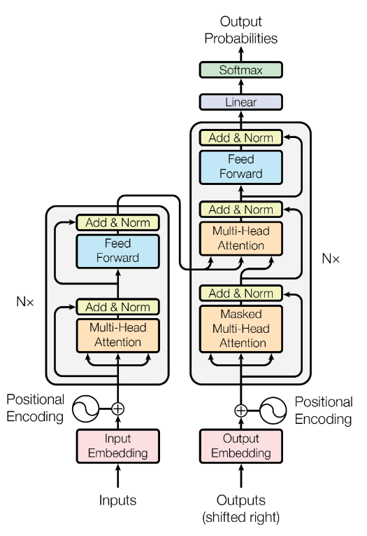
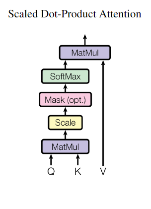
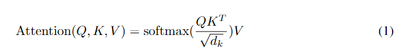
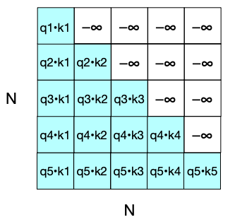
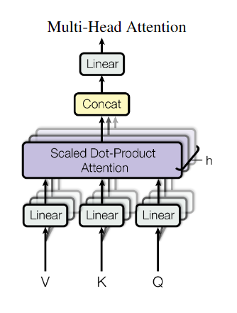
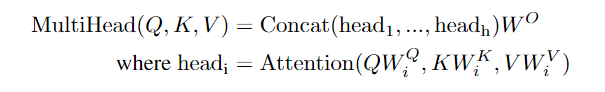
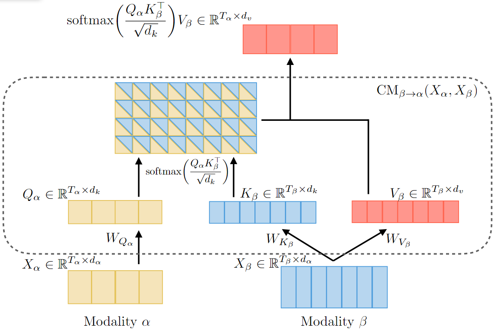
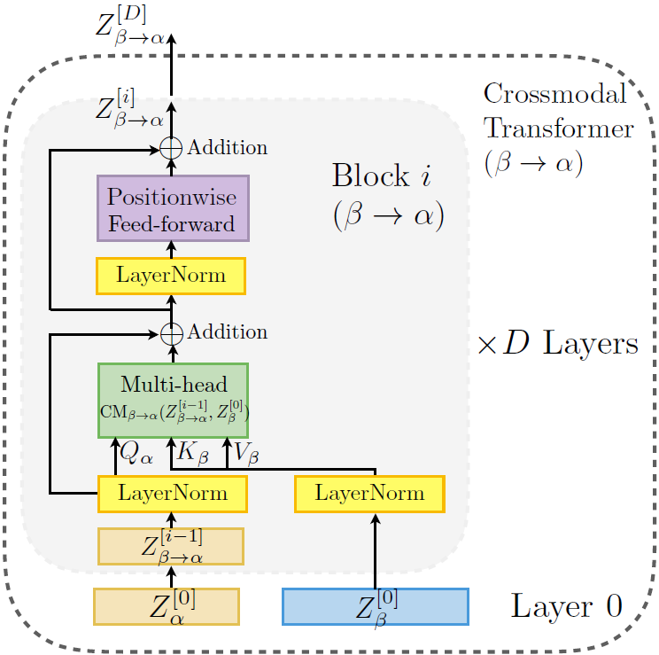
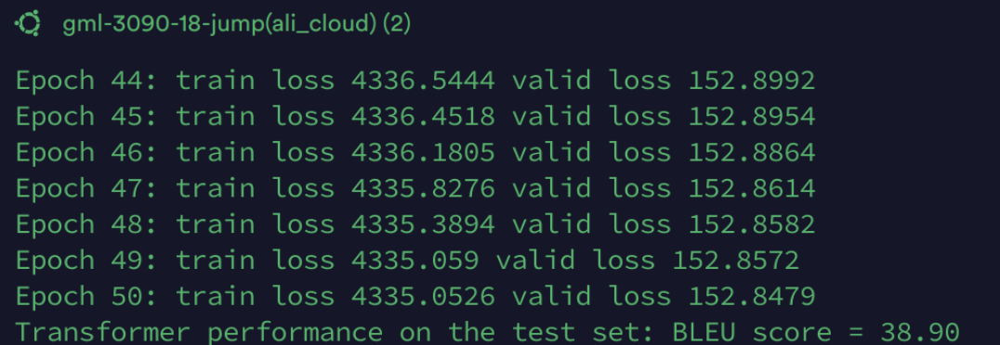
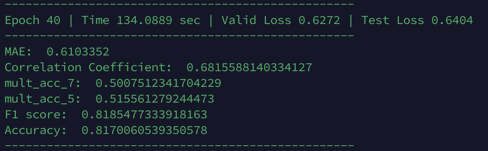

# Transformers
## Overview

The Transformer model, introduced by Vaswani et al. in 2017  [[1]](#1), represents a significant shift in the approach to sequence-to-sequence tasks, which are prevalent in natural language processing, such as machine translation and text summarization. This model's introduction was motivated by the limitations of previous sequence modeling approaches, particularly recurrent neural networks (RNNs)  [[2]](#2) and long short-term memory (LSTM) networks  [[3]](#3). These earlier models often struggled with long dependency lengths and were computationally intensive due to their inherent sequential nature, which made parallelization difficult.

The Transformer model addresses these challenges by relying entirely on self-attention mechanisms to compute representations of its input and output without using sequence-aligned RNNs or convolution. By eliminating the need for recurrent processing, Transformers allow for significantly greater parallelization during training, enabling faster computation over larger datasets. The self-attention mechanism also helps the model to handle long-range dependencies more effectively, capturing relationships in data regardless of the distance between elements in the input sequence.

Significantly, the Transformer model has also facilitated the development of subsequent models like BERT [[4]](#4), GPT [[5]](#5), and other variants that have pushed the boundaries of what is possible in NLP tasks. These models leverage the Transformer's architecture for handling various complex tasks across multiple domains, demonstrating the model's versatility and robustness.

The introduction of the Transformer model has therefore not only addressed significant computational and performance issues but has also expanded the potential applications of machine learning in processing complex sequence data. This has marked a pivotal moment in the evolution of machine learning techniques, influencing a wide array of applications and sparking further innovations in the field. 

### Learning goals:

In this chapter focusing on the Transformer model, we will explore several key aspects to provide a comprehensive understanding of its architecture, applications, and implications. The scope will be organized into the following goals:

1. Architecture: This section will delve into the architecture of the Transformer model, which underlies most modern NLP systems, including self-attention mechanisms, positional encodings, and the overall encoder-decoder structure. When used for causal language modeling, the input to a transformer is a sequence of words, and the output is a prediction for what word comes next, as well as a sequence of contextual embedding that represents the contextual meaning of each of the input words. 

2. Key Innovations: Unlike LSTMs, the Transformer is not based on recurrent connections, which means that transformers can be more efficient to implement at scale. Transformers are made up of stacks of transformer blocks, each of which is a multilayer network that maps sequences of input vectors (x1, ..., xn) to sequences of output vectors (z1, ..., zn) of the same length. These blocks are made by combining simple linear layers, feedforward networks, and self-attention layers, the key self-attention innovation of transformers. Self-attention allows a network to directly extract and use information from arbitrarily large contexts.

3. Practical Implementation: The chapter will provide insights into implementing Transformers from scratch and using popular libraries like TensorFlow and PyTorch. 

4. Impact on Subsequent Developments: We will discuss how the Transformer architecture has influenced the development of advanced models like BERT and GPT, focusing on their adaptations and the subsequent advancements they have brought to the field of machine learning. We'll explore the application of Transformer models in various NLP tasks and speculate on the future of Transformers in AI, considering ongoing research areas such as improving computational efficiency, addressing model bias, and expanding applications beyond NLP to fields like image processing and beyond.

Each section is designed to build upon the previous, ensuring a logical flow that brings the reader from foundational concepts to advanced applications and future possibilities.

## Background

The Transformer model integrates the advantages of Convolutional Neural Networks (CNNs) [[6]](#6) and advanced attention mechanisms, representing a major evolution in neural network architecture. Originally designed for image processing, CNNs have been adeptly adapted for sequence processing, bypassing the sequential computation limitations of traditional RNNs [[2]](#2). Unlike RNNs, which process data sequentially, CNNs compute representations for all input positions simultaneously, significantly accelerating both training and inference by reducing the dependency on sequential data flow.

The advent of attention mechanisms has further revolutionized the handling of sequence data by enabling models to dynamically focus on different parts of the data, akin to human selective focus. This method contrasts sharply with earlier models that compress all sequence information into a fixed-size representation, often at the cost of losing context-specific nuances. Self-attention, a variant of attention mechanism, enhances this capability by relating different positions within the same input to compute a comprehensive representation of the sequence. This technique has shown exceptional utility in complex tasks that require nuanced understanding of context, such as reading comprehension, abstractive summarization, and more  [[7]](#7) [[8]](#8) [[9]](#9) [[10]](#10).

Extending these concepts, the Transformer incorporates Multi-Head Attention [[1]](#1), which allows the model to attend to different segments of information from various representational subspaces simultaneously, capturing a richer contextual relationship. This model builds upon the foundation laid by prior models like the Extended Neural GPU [[11]](#11), ByteNet [[12]](#12), and ConvS2S [[13]](#13), which utilized CNNs to reduce computational complexity. These models, however, differ in how they manage the relationship between input positions—the number of required operations grows either linearly or logarithmically with the distance between positions [[14]](#14). The Transformer model addresses this by maintaining a constant number of operations across positions, significantly enhancing computational efficiency.

The innovation does not stop there. The Transformer uniquely relies entirely on self-attention for generating representations of its inputs and outputs, moving away from the sequence-aligned RNNs or convolution-based approaches. This shift has allowed for significant improvements in performance across a range of linguistic tasks, establishing the Transformer as a groundbreaking model in the field of machine learning for language processing and other sequence-dependent tasks.

## Problem Formulation & Method Explanation
### Transformers in Machine Translation
#### Problem Formulation
Machine translation (MT) involves translating text from one language to another using algorithms. The fundamental problem in MT is to develop models that understand and accurately translate both the semantics and syntactic details from the source language to the target language autonomously.

The introduction of the Transformer model has revolutionized MT by using a sequence-to-sequence framework that incorporates self-attention mechanisms. These mechanisms allow the model to handle sequences in parallel and capture long-range dependencies efficiently. Mathematically, the problem can be formulated using the Transformer architecture as follows:

Given a source sequence $ X = (x_1, x_2, ..., x_n) $ in the source language, the goal is to produce a target sequence $ Y = (y_1, y_2, ..., y_m) $ in the target language. The Transformer model achieves this through the relation:
$$
Y = \text{Transformer}(X)
$$
where the Transformer function encapsulates the processes of encoding the source language sequence into a context-rich representation and decoding it to the target language sequence, leveraging self-attention to dynamically weigh the influence of different parts of the input sequence irrespective of their positions.

#### Method Explanation
<figure align=center>
    
</figure>

In the Transformer model, the encoder comprises six identical layers, each consisting of two sub-layers: a multi-head self-attention mechanism and a position-wise, fully connected feed-forward network. Each sub-layer outputs a fixed dimension of d_model = 512, ensuring uniformity across the network. These layers are enhanced with residual connections and layer normalization to promote effective gradient flow and maintain stable training dynamics.

The decoder, also structured with six identical layers, uniquely includes an additional third sub-layer that performs multi-head attention over the encoder's output, thus incorporating information from the entire input sequence. Besides, the decoder uses its own previous outputs as input, processed through shifted right embedding layers to ensure that predictions for a given position are based only on the known outputs up to that position. This setup prevents future information leakage and is crucial for maintaining the autoregressive property of the decoder. Each sub-layer in the decoder is followed by residual connections and layer normalization, similar to the encoder, ensuring consistency and stability in the transformation process.

##### Attention
Scaled Dot-Product Attention is an attention mechanism used to calculate the relevance between queries and keys and assign weights to values. It involves taking the dot product between queries and keys, scaling the results, and applying a softmax function to obtain the weights. This attention mechanism is efficient and widely used in neural networks for its simplicity and effectiveness in capturing relationships between inputs.
<figure align=center>
    
</figure>

<figure align=center>
    
</figure>

In decoder, to prevent leftward information flow in the decoder to preserve the auto-regressive property, we need to mask out the upper-triangle portion of $QK^{T}$ (setting to $-\infty$ ).
<figure align=center>
    
</figure>

Multi-Head Attention enables models to process information from multiple perspectives simultaneously by dividing the input into several smaller segments. Each segment, or "head," applies attention independently, allowing the model to capture a broader range of information. The outputs from all heads are then combined to produce a comprehensive result. This approach not only enriches the model's understanding of the data but also maintains computational efficiency.
<figure align=center>
    
</figure>
<figure align=center>
    
</figure>

##### Positional Encoding
Positional Encoding adds information about the position of each token in the sequence to the model. It allows the model to use the order of the tokens, essential for understanding sequence data. Positional encodings are added directly to the embeddings, combining the content and position information in one representation. It uses sine and cosine functions of different frequencies to encode the positions as follows:
   $$ \text{PositionalEncoding}(\text{pos}, 2i) = \sin(\text{pos} / 10000^{2i / d_{\text{model}}}) $$
   $$ \text{PositionalEncoding}(\text{pos}, 2i+1) = \cos(\text{pos} / 10000^{2i / d_{\text{model}}}) $$

where pos is the position and $i$ is the dimension.

### Multimodal transformer for unaligned multimodal language sequences
#### Problem Formulation

The Multimodal Transformer (MulT) addresses the challenge of integrating multimodal data—such as language, vision, and audio—which often do not align in time. Traditional models struggle with this misalignment, making effective integration difficult.

Mathematically, the problem MulT solves is defined as:

Given unaligned inputs $X^v$ (vision), $X^a$ (audio), and $X^t$ (text), the goal is to produce a unified output $Y$. This output is achieved using the function:

$$
Y = f_{\text{MulT}}(X^v, X^a, X^t)
$$

Here, $f_{\text{MulT}}$ represents the MulT's function that utilizes crossmodal attention to dynamically integrate features from each input stream, focusing on those that are most relevant across the modalities.

#### Method Explanation
Multimodal Transformer (MulT) is a new method for modeling unaligned multimodal language sequences. At a high level, MulT integrates multimodal time series through a feed-forward fusion process using multiple directional pairwise crossmodal transformers. Each crossmodal transformer repeatedly enhances a target modality with low-level features from another source modality by learning attention across the features of the two modalities. The MulT architecture models all pairs of modalities using these crossmodal transformers, followed by sequence models (e.g., self-attention transformer) to make predictions using the fused features. 

##### Crossmodal Attention
<figure align=center>
    
</figure>

The crossmodal attention mechanism is central to the Multimodal Transformer (MulT), designed to handle the integration of two different modalities, $\alpha$ and $\beta$, which may have unaligned sequences $ X_\alpha \in \mathbb{R}^{T_\alpha \times d_\alpha} $ and $ X_\beta \in \mathbb{R}^{T_\beta \times d_\beta} $. Queries, Keys, and Values are defined as $ Q_\alpha = X_\alpha W_{Q_\alpha} $, $ K_\beta = X_\beta W_{K_\beta} $, and $ V_\beta = X_\beta W_{V_\beta} $, where $ W_{Q_\alpha} \in \mathbb{R}^{d_\alpha \times d_k} $, $ W_{K_\beta} \in \mathbb{R}^{d_\beta \times d_k} $, and $ W_{V_\beta} \in \mathbb{R}^{d_\beta \times d_v} $ are weight matrices. The attention from modality β to α is computed using the scaled dot-product attention formula:

$$
Y_\alpha = \text{softmax} \left( \frac{Q_\alpha K_\beta^T}{\sqrt{d_k}} \right) V_\beta
$$

Expanding this, we get:

$$
Y_\alpha = \text{softmax} \left( \frac{X_\alpha W_{Q_\alpha} W_{K_\beta}^T X_\beta^T}{\sqrt{d_k}} \right) X_\beta W_{V_\beta}
$$

This results in $ Y_\alpha $, which has the same length as $ Q_\alpha $ (i.e., $ T_\alpha $), but is represented in the feature space of $ V_\beta $. To capture more complex interactions between the modalities, the crossmodal attention can be extended to multi-head attention, involving multiple sets of Queries, Keys, and Values, allowing the model to learn various types of interactions. Each crossmodal attention block includes a residual connection and a positionwise feed-forward sublayer:

$$
Z_\alpha^{[i]} = \text{LayerNorm}(Z_\alpha^{[i-1]} + \text{CrossmodalAttention}(Q_\alpha, K_\beta, V_\beta))
$$

$$
Z_\alpha^{[i]} = \text{LayerNorm}(Z_\alpha^{[i]} + \text{FeedForward}(Z_\alpha^{[i]}))
$$

This block adapts directly from the low-level feature sequence and does not rely on self-attention, preserving low-level information for each modality. This approach is crucial for handling unaligned multimodal data, enhancing the model's ability to capture intricate dependencies and interactions between different modalities.
##### Temporal Convolutions
To ensure awareness of neighboring elements within the input sequences, a 1D temporal convolutional layer is applied:

$$ 
\hat{X}_{L,V,A} = \text{Conv1D}(X_{L,V,A}, k_{L,V,A}) \in \mathbb{R}^{T_{L,V,A} \times d} 
$$

where $ k_{L,V,A} $ are the convolutional kernel sizes for each modality and $ d $ is a common dimension. This convolutional process captures the local structure and projects features to the same dimension, facilitating dot-products in the crossmodal attention module.

##### Positional Embedding
Positional embeddings are added to the convolved sequences to retain temporal information:

$$ 
Z^{[0]}_{L,V,A} = \hat{X}_{L,V,A} + \text{PE}(T_{L,V,A}, d) 
$$

where $\text{PE}(T_{L,V,A}, d) \in \mathbb{R}^{T_{L,V,A} \times d}$ computes fixed positional embeddings, ensuring the sequences are position-aware.

##### Crossmodal Transformers
<figure align=center>
    
</figure>

The core component, crossmodal transformers, enables information flow from one modality to another. Each crossmodal transformer comprises $D$ layers of crossmodal attention blocks. Formally, for a modality $V \rightarrow L$, the layers are computed as:

$$ 
Z^{[0]}_{V \rightarrow L} = Z^{[0]}_{L} 
$$

Each layer $i$ of the crossmodal transformer is computed using the crossmodal attention:

$$ 
Z^{[i]}_{V \rightarrow L} = \text{CM}_{V \rightarrow L}(Z^{[i-1]}_{V \rightarrow L}, Z^{[0]}_{V}) 
$$

where $\text{CM}$ represents the crossmodal attention function. This mechanism ensures that low-level features are preserved while enabling rich multimodal fusion through attention across different modalities.

## Model implementation and results
We implemented the sample codes of the above two projects respectively, and the results are presented as follows. The source code comes from  [[16]](#16) and  [[17]](#17).

### Transformers in Machine Translation

In developing the machine translation system, a robust framework was crafted using PyTorch and the Transformer architecture, aimed at translating English to German efficiently. Here is a consolidated overview of the implemented functionalities:

1. **Initialization and System Architecture**: The `MachineTranslation` class orchestrates the setup, initializing parameters like batch size, training epochs, and Transformer configurations such as the number of encoder and decoder layers, model dimensions, and dropout rates.
2. **Tokenizer and Data Processing**: BERT's pretrained tokenizers for English and German were utilized to construct the vocabulary, using the 'multi30k' dataset. The system further processes the data by encoding texts, padding sequences, and batching them for optimal training and evaluation, facilitated by PyTorch's `DataLoader`.
3. **Model Loading and Training**: A custom Transformer model was configured to the specific needs of the source and target language vocabularies. Training involves adjusting performance via an Adam optimizer, with learning rates fine-tuned based on validation outcomes. A specialized cross-entropy loss function ignores padding indices to ensure precise loss measurements.
4. **Evaluation and CLI Integration**: Post-training, the model's effectiveness is quantified using the BLEU score, providing a standard metric for translation quality. The `OptionParser` allows for flexible command-line adjustments to model parameters, enhancing the system's usability without script modifications.
5. **Execution and Output**: When executed as the main program, the system follows a streamlined process from initialization through training to final evaluation, culminating in a performance report that details the translation quality.

#### **Result**

When executing the script `python MachineTranslation.py` with the specified parameters (`--num_heads 8`, `--num_encoder_layers 4`, `--num_decoder_layers 4`, `--model_dim 512`, `--hidden_dim 2048`), the model performance over the final epochs and its evaluation on the test dataset were recorded as follows:

- **Epoch 44-50 Training and Validation Losses**: The training loss showed a gradual decrease from 4336.5444 to 4335.0526 across epochs 44 to 50, indicating progressive learning. Similarly, the validation loss remained relatively stable, fluctuating slightly around 152.8. This stability in validation loss suggests that the model was well-tuned to generalize on unseen data without overfitting.
- **Final Model Evaluation**: Upon completion of the training cycles, the Transformer model achieved a BLEU score of 38.90 on the test set. This score reflects the quality of the model's machine translation capabilities, demonstrating its effectiveness in translating from English to German with a reasonable level of linguistic accuracy and fluency.

<!--  -->
<figure align=center>
    
</figure>

### Multimodal transformer for unaligned multimodal language sequences

Here is a consolidated overview of the implemented functionalities:

1. **Model Initialization**: The `MULTModel` constructor initializes parameters for dimensions of text, audio, and visual input features (`orig_d_l`, `orig_d_a`, `orig_d_v`). The model supports selective processing by focusing on only text (`lonly`), audio (`aonly`), or visual (`vonly`) data streams if specified. It configures multiple hyperparameters for the transformer layers, including the number of attention heads (`num_heads`), number of layers (`layers`), dropout rates, and an optional attention mask (`attn_mask`).
2. **Temporal Convolutional Layers**: These layers project original high-dimensional input features (text, audio, visual) into lower-dimensional spaces, enhancing processing efficiency and reducing computational complexity.
3. **Crossmodal Attentions**: Depending on the configuration (whether focusing on text, audio, or visual), the model sets up crossmodal attention networks. These networks allow each modality to attend to information from the others, fostering richer contextual understanding across modalities.
4. **Self Attentions**: Following the initial crossmodal attentions, self-attention networks (which could alternatively be LSTMs or GRUs) process the sequences further to capture temporal dependencies within each modality. These are particularly useful in maintaining the integrity of sequence data over time.
5. **Forward Pass**: The forward method processes batches of text, audio, and visual inputs through their respective projection layers and attention networks. Depending on the model configuration:
   - **Individual modalities** (if operating in `lonly`, `aonly`, or `vonly` mode) are processed through their respective crossmodal attention networks and the resulting representations are further refined by dedicated memory networks (self-attention layers).
   - **Combined modal processing** occurs if all modalities are active. The outputs from each modality-specific network are concatenated and further processed to integrate information across all input types.

The outputs from these networks are then passed through additional linear projection layers and a residual block to stabilize learning and prevent gradient vanishing. Finally, the model produces its output through a final linear layer, which maps the deeply integrated multimodal features to desired output dimensions.

#### **Result**

Operational configurations include batch size, learning rates, gradient clipping, and optional CUDA usage, with robust data handling for training, validation, and testing phases. Here’s a concise overview of the training results and key metrics observed:

- **Training and Validation Dynamics**: The training process showcases progressive improvement in minimizing the training loss over batches, with a typical duration for each epoch around 135 to 140 seconds. During this period, batches are processed with varying losses, indicating fluctuating difficulty levels in training samples.
- **Stable Validation and Test Losses**: Across Epochs 38 to 40, validation and test losses remained relatively stable, indicating a consistent model performance on unseen data. Specifically, validation loss hovered around 0.6224 to 0.6288, while test loss was between 0.6366 and 0.6433.
- **Metrics Recorded at Epoch 40's End**: After the training, the model achieved:
  - **MAE (Mean Absolute Error)**: 0.6103352, suggesting the average deviation of the predictions from actual values.
  - **Correlation Coefficient**: 0.6815588140334127, indicating a moderate positive correlation between predicted and actual values.
  - **Accuracy across different criteria**: Multiclass accuracy for 7 and 5 classes stood at approximately 50.07% and 51.55%, respectively.
  - **F1 Score and Accuracy**: The model demonstrated a high F1 score of 0.8185477333918163 and a similar accuracy level of 81.70%, indicating effective precision and recall balance.

<!--  -->
<figure align=center>
    
</figure>

These results underscore the model's capacity to handle multimodal data effectively, balancing between different types of input to achieve a robust performance in terms of standard metrics like MAE, accuracy, and F1 score. The consistent losses across epochs suggest that the model could be nearing its optimal performance, though the slight increase in test losses could also hint at the onset of overfitting or the need for further tuning of the model parameters or training regimen.

## Discussions

The Transformer model is a significant advancement in machine learning, especially suited for tasks where parallel processing can be effectively utilized. This architecture is particularly adept at handling long-range dependencies within data, outperforming RNNs that suffer from vanishing gradients over long sequences. Despite its strengths, the Transformer requires substantial computational resources and data, which may limit its use in resource-constrained environments. The architecture is also complex, making it challenging to implement and understand.

When implementing Transformers, it's crucial to ensure proper initialization to prevent very small gradients in the softmax function at the start of training. Regularization techniques like dropout, label smoothing, and attention dropout are essential to mitigate overfitting given the model's large capacity. Moreover, learning rate scheduling, particularly with a warmup phase, is critical to enhance training stability.

Transformers mark a departure from the sequential nature of RNNs, offering improved efficiency and scalability. They build on the parallel processing capabilities of CNNs, adapting these for sequential data to manage temporal dynamics more effectively. The Transformer has given rise to several key models in representation learning, such as BERT [[4]](#4) for creating pre-trained representations that can be fine-tuned for diverse tasks, GPT [[5]](#5) for text generation, and T5 [[15]](#15), which transforms all NLP problems into a text-to-text format, simplifying transfer learning applications.

This model has profoundly impacted various fields, particularly in natural language processing where it has redefined state-of-the-art performance in understanding and generating language. It has also been adapted for image processing in Vision Transformers (ViT) and integrated into multimodal applications that combine text, image, and voice data, such as automated video captioning. Despite its complexity and resource demands, the Transformer's flexibility and effectiveness make it a versatile tool in the machine learning toolkit, suitable for a wide array of applications.

## References
<a id="1">[1]</a>  Vaswani, Ashish, et al. "Attention is all you need." *Advances in neural information processing systems* 30 (2017).

<a id="2">[2]</a> Schuster M, Paliwal K K. Bidirectional recurrent neural networks[J]. Signal Processing, IEEE Transactions on, 1997, 45(11): 2673-2681.

<a id="3">[3]</a> Hochreiter S, Schmidhuber J. Long short-term memory[J]. Neural computation, 1997, 9(8): 1735-1780.

<a id="4">[4]</a> Devlin, Jacob, et al. "Bert: Pre-training of deep bidirectional transformers for language understanding." *arXiv preprint arXiv:1810.04805* (2018).

<a id="5">[5]</a> Brown, Tom, et al. "Language models are few-shot learners." *Advances in neural information processing systems* 33 (2020): 1877-1901.

<a id="6">[6]</a> O'shea K, Nash R. An introduction to convolutional neural networks[J]. arxiv preprint arxiv:1511.08458, 2015.

<a id="7">[7]</a> Jianpeng Cheng, Li Dong, and Mirella Lapata. Long short-term memory-networks for machine reading. arXiv preprint arXiv:1601.06733, 2016.

<a id="8">[8]</a> Zhouhan Lin, Minwei Feng, Cicero Nogueira dos Santos, Mo Yu, Bing Xiang, Bowen Zhou, and Yoshua Bengio. A structured self-attentive sentence embedding. arXiv preprint arXiv:1703.03130, 2017.

<a id="9">[9]</a> Ankur Parikh, Oscar Täckström, Dipanjan Das, and Jakob Uszkoreit. A decomposable attention model. In Empirical Methods in Natural Language Processing, 2016.

<a id="10">[10]</a> Romain Paulus, Caiming Xiong, and Richard Socher. A deep reinforced model for abstractive summarization. arXiv preprint arXiv:1705.04304, 2017.

<a id="11">[11]</a> Samy Bengio Łukasz Kaiser. Can active memory replace attention? In Advances in Neural Information Processing Systems, (NIPS), 2016.

<a id="12">[12]</a> Nal Kalchbrenner, Lasse Espeholt, Karen Simonyan, Aaron van den Oord, Alex Graves, and Koray Kavukcuoglu. Neural machine translation in linear time. arXiv preprint arXiv:1610.10099v2, 2017.

<a id="13">[13]</a> Jonas Gehring, Michael Auli, David Grangier, Denis Yarats, and Yann N. Dauphin. Convolutional sequence to sequence learning. arXiv preprint arXiv:1705.03122v2, 2017.

<a id="14">[14]</a> Sepp Hochreiter, Yoshua Bengio, Paolo Frasconi, and Jürgen Schmidhuber. Gradient flow in recurrent nets: the difficulty of learning long-term dependencies, 2001.

<a id="15">[15]</a> Raffel, Colin, et al. "Exploring the limits of transfer learning with a unified text-to-text transformer." *Journal of machine learning research* 21.140 (2020): 1-67.

<a id="16">[16]</a> PA5

<a id="17">[17]</a> https://github.com/yaohungt/Multimodal-Transformer?tab=readme-ov-file 

## External Resources
<https://github.com/yaohungt/Multimodal-Transformer?tab=readme-ov-file>

## Author Team

**Qi Hu**: Writing the Overview, Learning goals, Background and Discussion sections.

**Zhejia Cai**: Writing the method of Multimodal transformer for unaligned multimodal language sequences.

**Xiaoyu Hu**: Writing the method of vanilla Transformer.

**Tao Feng**: Doing experiment and Writing the Model implementation and results.

 
