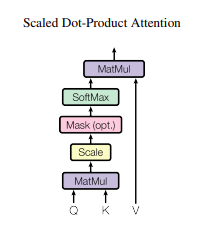
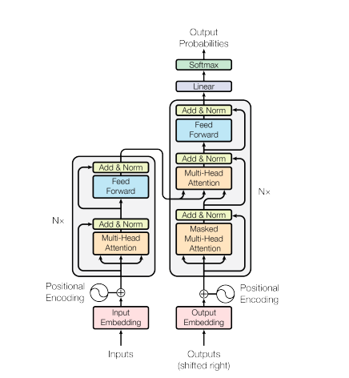

# White-Box Transformers

## Overview

In this chapter, we will introduce a novel representation learning method called White-Box Transformers. This method is based on the principle of sparse rate reduction and aims to optimize data representation. Traditional deep learning architectures face challenges in terms of interpretability and verifiability. This approach mathematically and modularly decomposes the operations of deep transformer networks, making the function and purpose of each step clearer, thereby enhancing the model's transparency and interpretability. This method is particularly important in fields that require high precision and interpretable models, such as medical diagnostics and autonomous vehicle systems.

### Learning goals:

1. Basic knowledge and related materials to better understand the White-Box Transformers
2. White-Box Transformers theory explanation
3. Code demo that can be used for practice

## Background
 

White-Box Transformers is based on the Sparse Rate Reduction objective function, achieving compressed and sparse data representations through alternating optimization of multi-head self-attention and multi-layer perceptrons, providing a mathematically interpretable white-box deep network architecture[[1]](#1). In this section, we will briefly review some of the prior knowledge to better understand the derivation of the white-box transformer.

First, let’s briefly introduce the self-attention and the traditional transformer.

**Self-attention**: Self-attention is a mechanism that enables neural networks to focus on the most pertinent parts of the data during processing. It operates by generating a "query" $(Q)$, "keys" $(K)$, and "values" $(V)$ . The network calculates relevance scores by comparing the query with each key to determine the importance of each value, and then uses these scores to perform a weighted sum of the values, producing the final output[[2]](#2). 

Mathematically, the self-attention mechanism can be expressed as:

$$
\text{Attention}(Q, K, V) = \text{softmax}\left(\frac{QK^T}{\sqrt{d_k}}\right) V
$$

where $(Q)$ represents the query, $(K)$ represents the keys, $(V)$ represents the values, and $d_k$ is the dimension of the keys.

The structure of attention is as follows:
<figure style="text-align: center;">
    
    <figcaption>Figure 1: Attention <a href="#2">[2]</a></figcaption>
</figure>

For instance, in sentence processing, the query might be a word, the keys are other words in the sentence, and the values are their vector representations. The model calculates the relevance of other words based on the query and adjusts the attention weights accordingly, resulting in a context-aware representation of the word.

 If you’re interested in the above, here’s more to help you learn.

[Self-attention Tutorial](https://uvadlc-notebooks.readthedocs.io/en/latest/tutorial_notebooks/tutorial6/Transformers_and_MHAttention.html)

**Transformer**: Transformer model includes positional encoding, multi-head attention mechanism, addition & normalization, and position-wise feed-forward networks. Positional encoding provides sequence position information to the model's inputs, enabling it to understand the relationships between inputs even within the stateless self-attention mechanism. The multi-head attention mechanism allows the model to process information in parallel across different representational subspaces, capturing complex dependencies between inputs and establishing a comprehensive understanding of the overall data distribution. These mechanisms work together, helping the Transformer to precisely learn and represent data by adjusting internal weights and optimizing prediction performance.

The structure of transformer is as follows:
<figure style="text-align: center;">
    
    <figcaption>Figure 2: Transformer <a href="#2">[2]</a></figcaption>
</figure>

 If you’re interested in the above, here’s more to help you learn.

[Transformer Tutorial](https://uvadlc-notebooks.readthedocs.io/en/latest/tutorial_notebooks/tutorial6/Transformers_and_MHAttention.html)

In traditional Transformer architecture[[2]](#2), representation learning is primarily accomplished through the construction of deep neural networks, which are often referred to as "black boxes."

However,there are some strategies that explicitly learn representations of data distributions. These strategies mainly involve identifying and representing low-dimensional structures in the input data. Traditionally, these methods are model-based, but recently, several model-free approaches have emerged. Below, we briefly introduce these representation learning methods[[1]](#1).

**Model-based approaches**:Structure-seeking models  use techniques such as sparse coding[[3]](#3) and dictionary learning[[4]](#4) to map data into lower-dimensional spaces, capturing the essential features of the data. This approach not only improves the compactness and effectiveness of data representations but also enhances the interpretability and flexibility of the model[[5]](#5) . 

If you’re interested in the above, here’s more to help you learn.

[SparseCoding Tutorial](http://ufldl.stanford.edu/tutorial/unsupervised/SparseCoding/ )、[Dictionary Learning Tutorial](https://yao-lab.github.io/2015.fall.pku/Lecture13.pdf)

**Model-free approaches**: There are several model-free approaches available for learning. One method involves learning data representations through an informative pretext task, such as compressing similar data and separating dissimilar data in contrastive learning. Another method focuses on increasing information gain using the maximal coding rate reduction technique[[1]](#1).

Contrastive learning is an unsupervised learning method that aims to learn effective data representations by pulling similar data samples closer and pushing dissimilar data samples apart[[6]](#6). 

Maximizing information gain to explicitly learn a representation of the data distribution is achieved by enhancing the information density of the data representation while reducing its redundancy. This approach involves selecting data representations that maintain or increase mutual information with the original data while minimizing their entropy, thus better capturing the essential structures and features of the data. Specifically, this is implemented through the following optimization formula:

$$
\max_z \Delta R(Z; U_{[K]}) = R(Z) - R^c(Z; U_{[K]})
$$

Here, $R(Z) $ represents the self-information rate of the data representation $ Z $, and $ R^c(Z; U_{[K]}) $ is the conditional information rate of $ Z $ given the conditions $ U_{[K]} $. The goal of this formula is to keep the information content of $ Z $ as high as possible while reducing the redundant information under the condition $ U_{[K]} $.

If you’re interested in the above, here’s more to help you learn.

[Contrastive learning Tutorial](https://guides.lib.purdue.edu/c.php?g=706710&p=10289836 )

## Problem Formulation & Method Explanation

## Problem Formulation

The core of the white-box transformer approach introduced in this paper lies in designing a transformer-like network architecture based on a mathematically interpretable objective called sparse rate reduction. The goal is to learn representations that are both compact and sparse, improving interpretability and performance on downstream tasks.

### Formal Problem Formulation
The objective is to learn a feature mapping $ f: X \to Z $ that transforms the input data $ X $ into a compact and structured representation $ Z $. The optimization objective, termed sparse rate reduction, is defined as:

$$
\max_{f \in \mathcal{F}} \mathbb{E}_Z \left[ \Delta R(Z; U[K]) - \lambda \|Z\|_0 \right]
$$
subject to $ Z = f(X) $, where:
- $ \Delta R(Z; U[K]) = R(Z) - R_c(Z; U[K]) $
- $ R(Z) $ is the lossy coding rate.
- $ R_c(Z; U[K]) $ is the compact coding rate with respect to subspaces $ U[K] $.
- $ \|Z\|_0 $ promotes sparsity in the representation.

### Derivation of the Solution

#### Incremental Optimization
To solve the above optimization problem, an incremental approach is adopted, breaking down the global transformation $ f $ into multiple local operations $ f^\ell $ that incrementally optimize the representation:

$$
f: X \xrightarrow{f^0} Z^0 \rightarrow \cdots \rightarrow Z^\ell \xrightarrow{f^\ell} Z^{\ell+1} \rightarrow \cdots \rightarrow Z^L = Z
$$

Each $ f^\ell $ represents a layer in the deep network, transforming $ Z^\ell $ to $ Z^{\ell+1} $.

#### Alternating Minimization
The optimization is achieved through an alternating minimization process:
1. **Compression Step:**
   - The multi-head self-attention mechanism is interpreted as a gradient descent step to minimize the lossy coding rate $ R(Z) $.
   - The self-attention layer compresses the token representation by leveraging the correlations among tokens.

2. **Sparsification Step:**
   - The multi-layer perceptron (MLP) following the self-attention layer is seen as a step to sparsify the token representation.
   - This step is achieved via a proximal gradient method on the difference between the sparsity penalty and the expansion term $ \lambda \|Z\|_0 - R(Z) $.

### Formulas

#### Lossy Coding Rate $ R(Z) $
The lossy coding rate measures the compactness of a set of tokens, and for a zero-mean Gaussian distribution, it is defined as:

$$
R(Z) = \frac{1}{2} \log \det \left( I + \frac{d}{N\epsilon^2} Z^* Z \right)
$$

#### Compact Coding Rate $ R_c(Z; U[K]) $
The compact coding rate for a mixture of $ K $ subspaces with bases $ U[K] $ is:

$$
R_c(Z; U[K]) = \frac{1}{2} \sum_{k=1}^K \log \det \left( I + \frac{p}{N\epsilon^2} (U_k^* Z)^* (U_k^* Z) \right)
$$

#### Gradient of the Compact Coding Rate
The gradient of the compact coding rate with respect to $ Z $ is given by:

$$
\nabla_Z R_c(Z; U[K]) = \frac{p}{N\epsilon^2} \sum_{k=1}^K U_k U_k^* Z \left( I + \frac{p}{N\epsilon^2} (U_k^* Z)^* (U_k^* Z) \right)^{-1}
$$

#### Sparse Rate Reduction Objective
Combining the lossy and compact coding rates, the sparse rate reduction objective is:

$$
\Delta R(Z; U[K]) = R(Z) - R_c(Z; U[K])
$$

#### Proximal Gradient Step
To sparsify the representation, a proximal gradient step is applied:

$$
Z^{\ell+1} = \text{prox}_{\frac{\lambda}{L} \| \cdot \|_1 + \chi_{\{ Z \ge 0 \}}} \left( Z^\ell + \frac{1}{L} \nabla R(Z^\ell) \right)
$$

where $ \text{prox}_{\gamma} $ is the proximal operator, defined for the $ \ell_1 $-norm as:

$$
\text{prox}_{\gamma \| \cdot \|_1}(v) = \text{sign}(v) \cdot \max(|v| - \gamma, 0)
$$

## Method Explanation

### CRATE Architecture
The proposed architecture, CRATE (Coding RAte reduction TransformEr), is constructed by iterating the compression and sparsification steps:

1. **Multi-Head Subspace Self-Attention (MSSA):**
   - This block compresses the token representations by projecting them onto subspaces and refining the representation through attention mechanisms.

2. **Iterative Shrinkage-Thresholding Algorithm (ISTA):**
   - This block sparsifies the representations by applying a proximal gradient step.

The layers are trained end-to-end using backpropagation, optimizing the sparse rate reduction objective.

### Training and Learning Strategy

### Iterative Steps in CRATE

1. **Denoising via Self-Attention:**
   - The self-attention mechanism can be understood as denoising tokens towards multiple subspaces.
   - Given an initial noisy token $ x $, the optimal denoised token $ z $ is obtained by:

$$
z = x + \sigma^2 \nabla_x \log q(x)
$$

2. **Self-Attention Update:**
   - The multi-head subspace self-attention (MSSA) update can be approximated as:

$$
Z^{\ell+1/2} = \left(1 - \kappa \cdot \frac{p}{N\epsilon^2}\right) Z^\ell + \kappa \cdot \frac{p}{N\epsilon^2} \cdot \text{MSSA}(Z^\ell | U[K])
$$

3. **Sparsification via ISTA:**
   - The iterative shrinkage-thresholding algorithm (ISTA) step is applied to sparsify the tokens:

$$
Z^{\ell+1} = \text{ReLU}(Z^{\ell+1/2} + \eta D^* (Z^{\ell+1/2} - DZ^{\ell+1/2}) - \eta \lambda \mathbf{1})
$$

By iteratively applying these steps, CRATE learns a structured and sparse representation of the input data, achieving high performance on tasks like classification and transfer learning while maintaining interpretability.

White-Box Transformers design leverages the principle of sparse rate reduction to create a mathematically interpretable deep network architecture. By iteratively compressing and sparsifying the representations, the proposed CRATE architecture achieves competitive performance on real-world datasets while providing clear insights into the role and function of each layer in the network.

## Code Demo
For the code demo, our demo is placed in the [crate_demo.ipynb](./chapter_6_crate_demo.ipynb) file. You can read the [Readme.md](./chapter_6_code_readme.md) file to understand how the code runs.

## Discussion

1.Traditional Transformer models are often seen as 'black boxes' due to their complex internal structure. To address this, researchers have introduced the White-Box Transformers, based on a new theoretical framework. This model makes each part of the network easy to understand by clearly explaining its optimization processes, greatly improving transparency and interpretability.

2.White-Box Transformers's key strength is its understandable math principles. It goes into detail about the purpose and function of each layer, which makes the model's structure clearer. But, getting the best performance for specific tasks might require significant tweaks to the model. Also, because it deals with data compression and simplification at every step, it could be less efficient in terms of computation compared to traditional black-box models.

3.White-Box Transformers proves particularly beneficial in applications demanding high levels of model interpretability and transparency, such as in medical image analysis and financial risk assessment.

## References

<a id="1">[1]</a>  Yu, Yaodong, et al. "White-box transformers via sparse rate reduction." Advances in Neural Information Processing Systems 36 (2024).

<a id="2">[2]</a> Vaswani, Ashish, et al. "Attention is all you need." Advances in neural information processing systems 30 (2017).

<a id="3">[3]</a> Olshausen, Bruno A., and David J. Field. "Sparse coding with an overcomplete basis set: A strategy employed by V1?." Vision research 37.23 (1997): 3311-3325.

<a id="4">[4]</a> Zhai, Yuexiang, et al. "Complete dictionary learning via l4-norm maximization over the orthogonal group." Journal of Machine Learning Research 21.165 (2020): 1-68.

<a id="5">[5]</a> Papyan, Vardan, et al. "Theoretical foundations of deep learning via sparse representations: A multilayer sparse model and its connection to convolutional neural networks." IEEE Signal Processing Magazine 35.4 (2018): 72-89.

<a id="6">[6]</a> Tian, Yonglong, et al. "What makes for good views for contrastive learning?." Advances in neural information processing systems 33 (2020): 6827-6839.

<a id="7">[7]</a> Chan, Kwan Ho Ryan, et al. "Redunet: A white-box deep network from the principle of maximizing rate reduction." Journal of machine learning research 23.114 (2022): 1-103.

## External Resources
1.http://ufldl.stanford.edu/tutorial/unsupervised/SparseCoding/ 

2.https://yao-lab.github.io/2015.fall.pku/Lecture13.pdf

3.https://uvadlc-notebooks.readthedocs.io/en/latest/tutorial_notebooks/tutorial6/Transformers_and_MHAttention.html

4.https://guides.lib.purdue.edu/c.php?g=706710&p=10289836

## Author Team

**Zehao Zhao**: Writing the Overview, Background, External Resources and References sections.

**Yingxin Li**: Writing the Learning goals, Discussion sections; Derivation of theoretical formula.

**Yuzhe Xie**: Writing the Problem Formulation & Method Explanation section.

**Shujie Yang**: Writing the Demo section; Programming the demo.

 
