# Parameter Efficient Fine-Tuning

## Overview

- **Motivation of Parameter Efficient Fine-Tuning (PEFT)**: Large models represent a groundbreaking advancement in multiple application fields, enabling remarkable achievements across various tasks. However, their unprecedented scale comes with significant computational costs. These models, often consisting of billions of parameters, require vast amounts of computational resources for execution. Especially, the expansive scale and computational demands pose considerable challenges when customizing them for particular downstream tasks, particularly over the hardware platforms constrained by computational capabilities.

- **Significance of PEFT**: Parameter-Efficient-Fine-Tuning (PEFT) provides a practical solution by efficiently adapt the large models over the various downstream tasks. In particular, PEFT refers to the process of adjusting the parameters of a pre-trained large models to adapt it to a specific task or domain while minimizing the number of additional parameters introduced or computational resources required. This approach is particularly important when dealing with large-scale language models with high parameter counts, as fine-tuning these models from scratch can be computationally expensive and resource-intensive, posing considerable challenges in the supporting system platform design. 

## Learning Goals

In this chapter, we present comprehensive studies of various PEFT algorithms, examining their performance and computational overhead. Moreover, we provide an overview of applications developed using different PEFT algorithms and discuss common techniques employed to mitigate computation costs for PEFT. In addition to the algorithmic perspective, we overview various real-world system designs to investigate the implementation costs associated with different PEFT algorithms. This it serves as an indispensable resource for researchers aiming to understand both the PEFT algorithm and its system implementation, offering detailed insights into recent advancements and practical applications. 

The expected learning outcomes of this chapter would be:

1. Get familiar with LLM computation flow.
2. Grasp the basic idea of parameter-efficient fine-tuning.
3. Understand the differences among additive, selective, reparameterized, and hybrid fine-tuning methods.
4. Name the characteristics of additive, selective, reparameterized, and hybrid fine-tuning methods and explain them using at least one algorithm as examples.
5. Understand the design idea of at least one real-world system.
6. Try to link the PEFT methods with your own research: which algorithm would you choose to fine-tune certain LLM in your research area? Why?

## Background

We then provide a brief overview of different PEFT algorithms and Downstream Tasks in this nackground section.

Fine-tuning remains essential to enhance LLM performance on unseen user datasets and tasks. With the size of the model growing (e.g. 1.5B in GPT-2 to 175B in GPT-3), standard full fine-tuning paradigm requires thousands of GPU work in parallel, which is highly inefficient and unsustainable. A type of algorithm has been raised namely Parameter-efficient fine-tuning (PEFT) which aims to tune minimal parameters to achieve better performance over full tuning on downstream tasks.

In parallel developments, large-scale pre-trained models in vision and multimodal domains have also demonstrated their effective representational learning capabilities, enabling adaptation from large datasets to smaller ones or across various data modalities through fine-tuning. Consequently, this capability has made PEFT increasingly attractive to the wider research community.

<!--  -->
<figure>
    

        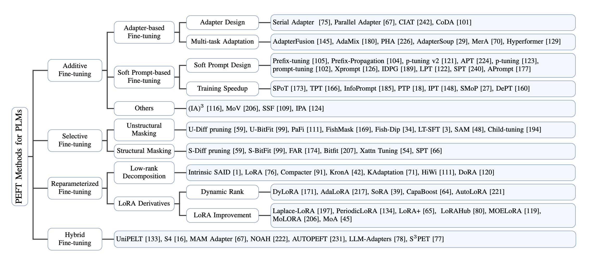
        <figcaption>Figure 1. Taxonomy of Parameter-Efficient Fine-Tuning Methods for Large Models
    

    </figcaption>
</figure>

<!-- Fig 1. Taxonomy of Parameter-Efficient Fine-Tuning Methods for Large Models -->

We categorized the PEFT algorithms into additive, selective, reparameterized, and hybrid fine-tuning based on their operations. As this figure depicts, three major additive fine-tuning algorithms are normally used: (1) Adapter; (2) Soft Prompt; (3) Others. They differ from each other in terms of the different additional tunable modules or parameters. Selective fine-tuning, on the other hand, doesn’t require any additional parameters, it selects a small subset of parameters from the backbone model and only makes them tunable while keeping the majority of parameters untouched during fine-tuning on downstream tasks. We categorized selective fine-tuning based on the grouping of chosen parameters: (1) Unstructural Masking; (2) Structural Masking. Reparametrization represents transforming model parameters between two equivalent forms. Specifically, reparametrized fine-tuning introduces additional low-rank trainable parameters during training, which are then integrated with the original model for inference. This approach is categorized into two main strategies: (1) Lowrank Decomposition, and (2) LoRA Derivatives. Hybrid fine-tuning explores the design spaces of different PEFT methods and combines their advantages.

Then we introduce some common downstream tasks of LLM evaluation.

Two types of tasks have been widely used for LLM evaluation, the first type is the General Language Understanding Evaluation (GLUE) [[1]](#1)benchmark, which integrates nine sentence or sentence-pair language understanding tasks (CoLA, SST-2, MRPC, STS-B, QQP, MNLI, QNLI, RTE, and WNLI), chosen for their diversity in dataset sizes, text genres, and difficulty levels, and is based on established existing datasets. It also includes a diagnostic dataset specifically designed to evaluate and analyze model performance across various linguistic phenomena inherent in natural language. Additionally, it features a public leaderboard to track performance on the benchmark and a dashboard to visualize model performance on the diagnostic set.

The other type of dataset that has been used in recent LLM papers is common sense reasoning which integrated into our study caters to a variety of research facets: (1) OpenBookQA [[2]](#2) is curated to foster research in advanced question-answering, delving into a profound understanding of both the subject matter and the language in which it is articulated. (2) PIQA [[3]](#3) primarily emphasizes everyday scenarios, demonstrating a predilection for unconventional solutions. (3) Social IQA [[4]](#4) emerges as a novel questionanswering benchmark tailored for gauging social commonsense intelligence. (4) HellaSwag [[5]](#5) serves as a dataset, the essence of which is to ascertain the capability of machines in aptly concluding sentences. (5) BoolQ [[6]](#6) is a dataset dedicated to question-answering, particularly for binary responses (yes/no queries). (6) WinoGrande [[7]](#7) is introduced as a fresh compilation, encompassing a substantial 44,000 problems. (7) ARC-easy presents itself as a novel dataset constituting genuine grade-school level multiple-choice science questions, designed to invigorate research in intricate question-answering. (8) ARC-challenges, distinctively, encompasses solely those questions that were inaccurately addressed by both a retrieval-based algorithm and a word co-occurrence algorithm.

 

## Problem Formulation & Method Explanation

We will introduce the REFT algorithm. We will introduce it in the order of different types of algorithms. According to the figure below, we divide the PEFT algorithm into four types according to the operation: additive, selective, reparameterized, and hybrid.

<!--  -->
<figure>
    

        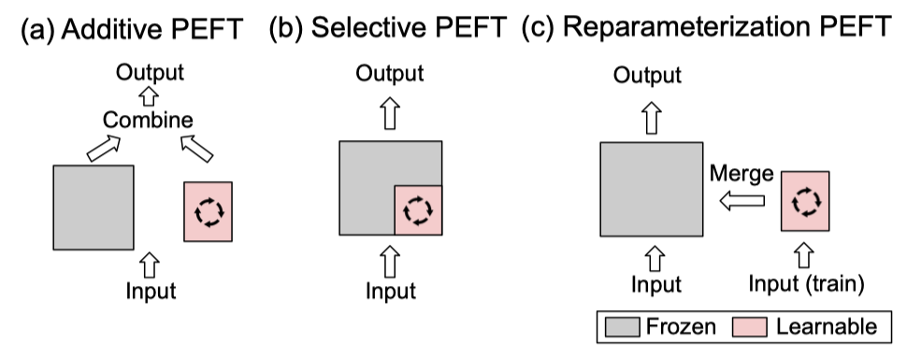
        <figcaption>Figure 2. Different types of PEFT algorithms
    

    </figcaption>
</figure>

<!-- Fig 2. Different types of PEFT algorithms -->

### Additive PEFT

Such methods usually either introduce additional weight parameters or modify the activation. The different additional tunable modules or parameters differ from each other.

Full fine-tuning of the standards is computationally expensive and may also compromise the generalisation power of the model. To alleviate this problem, a generalised approach is to keep the pre-training nickel-hydride intact and only introduce a minimum number of trainable parameters that are strategically located in the model architecture. Only the weights of these additional modules or parameters are updated when fine-tuned for specific downstream tasks, which results in a significant reduction in storage, memory, and computational resource requirements. Due to the nature of the parameters they add, these techniques can be referred to as additive tuning.

They can be broadly categorised into three types:

Adapter inserts a small adapter layer inside the Transformer block. Typically, an adapter layer consists of a descending projection matrix, a nonlinear activation function and an ascending projection matrix, and a residual frame. The adapter is configured with the internal dimension change configuration set as a hyperparameter.
<!--  -->
<figure>
    

        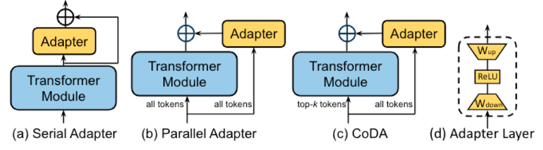
        <figcaption>Figure 3. Illustration of three representative adapter-based fine-tuning algorithms. Blue represents frozen, while yellow represents trainable
    

    </figcaption>
</figure>

<!-- Fig 3. Illustration of three representative adapter-based fine-tuning algorithms. Blue represents frozen, while yellow represents trainable -->

The first is the sequential form:

[[8]](#8) The NLP domain adapter concept was originally introduced in Serial Adapter. Each Transformer block was augmented by adding two adapter modules, one after the Power of Attention layer and one after the FFN layer. Subsequent research aimed to address the additional computational cost associated with the adapter layer.

[[9]](#9) A modified framework is presented in AdapterFusion, where the adapter layer is inserted only after the "Add & Norm" step after the FFN layer to increase computational efficiency.

Secondly, a parallel form: This avoids the aforementioned sequential form, which may reduce the parallelism of the model and require a trade-off between inference efficiency and accuracy.

[[10]](#10) Parallel Adapter (PA) reorganises the traditional sequential adapter layer into a parallel grid with each Transformer sublayer. 

[[11]](#11) CIAT, CoDA, and KronA also use the parallel adapter design.

Finally, sparse activation is used:

[[12]](#12) CoDA also uses sparse activation to improve inference efficiency. It uses a soft top-k selection process to identify the k important tokens in each layer, which are supported by the frozen pre-trained Transformer layer and adapters to maintain model accuracy. The less important tokens are supported only by the adapter, skipping the heavy pre-training layer, thus optimising inference efficiency without affecting overall performance.

To improve the performance and generalisation power of adapters, various studies have implemented multi-task learning strategies.

AdapterFusion keeps all pre-trained adapters in the model and employs a fusion module to merge multi-task information. 

[[13]](#13) MerA merges the pre-trained adapters into one adapter through optimal transfer based on weights and activations. This approach avoids the need to introduce any additional trainable parameters, thereby increasing computational efficiency.

[[14]](#14) Hyperformer stores multitasking information in a shared hypergrid, which is embedded to create task- and layer-specific adapter parameters based on task and layer IDs. Given a new task, only one additional task embedding needs to be learnt, thus reducing the number of training parameters.

### Soft Prompt

There is a general consensus that the continuous embedding space of soft prompts inherently contains more information than the discrete token representation optimised by context learning [When do prompting and prefix-tuning work? a theory of capabilities and limitations]. Inspired by this concept, the researcher appends tunable vectors (called soft prompts) directly to the beginning of the input sequence. This can be expressed as follows:

[[15]](#15) Prefix-tuning adds learnable vectors before the k and v sequences in all Transformer layers. To ensure stability during the optimisation process, Prefix-tuning uses a reparameterisation strategy to create these prefix vectors using the MLP layer, rather than optimising them directly. After fine-tuning, only the prefix vectors are saved for inference. This technique has been adapted and improved in several studies.

[[16]](#16) P-tuning v2 removes reparameterisation and extends its use to a wider range of model sizes and NLP tasks. 

[[17]](#17) APT (Adaptive Prefix Tuning) enhances prefix tuning by introducing an adaptive prefix architecture to control the prefix importance in each layer. Concurrently, P-tuning and Prompt-tuning apply learnable vectors only in the initial word embedding layer, but not in all layers, in order to improve training and inference efficiency. It should be emphasised that the latter has proven its effectiveness mainly in large models, especially those with more than 11 billion parameters.

Complementarily, Xprompt eliminates negative prompt markers through hierarchical structural pruning to narrow the performance gap for smaller model sizes. A theoretical analysis of prompt tuning is provided in Universality and limitations of prompt tuning, demonstrating its universality and limitations in finite-depth transformers.

[[18]](#18) IDPG (InstanceDependent Prompt Generation) improves prompt tuning by using a lightweight prompt creator to create prompts based on each input sub-sentence. 

[[19]](#19) LPT (Late Prompt Tuning) also utilises a prompt creator to obtain instance-aware prompts. Unlike previous work, LPT adds these prompts only after the intermediate layers, not at the initial layer or all layers. This strategic layout eliminates gradient computation below the middle layer, thereby significantly speeding up training. At the same time, LPT improves overall performance because the shorter backpropagation path retains more task-relevant information.

[[20]](#20) SPT (Selective Prompt Tuning), inspired by LPT, takes a deeper look at the importance of cue insertion strategies. It introduces a learnable probabilistic pattern at each level that determines whether to use cues propagated from the previous level or to inject new cues that have been created.

[[21]](#21) APrompt employs another cue insertion strategy. In addition to inserting cues at the beginning of the input sequence for each Transformer layer, APrompt adds additional learnable prompts to the corresponding Q, K, and V matrices in the Self-Attention Power Module in order to learn the new attentional power pattern. In addition, APrompt incorporates task-specific header learning.

<!--  -->
<figure>
    

        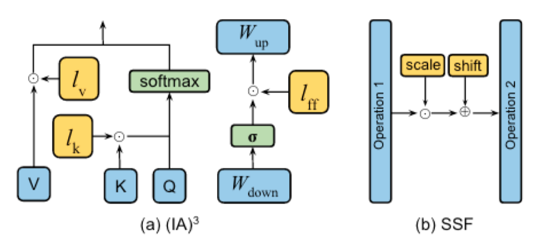
        <figcaption>Figure 4. Illustration of (IA)^3 and SSF. Blue represents frozen, while yellow represents trainable
    

    </figcaption>
</figure>

<!-- Fig 4. Illustration of $(IA)^3$ and SSF. Blue represents frozen, while yellow represents trainable -->

The concept of soft cues has been used for a variety of downstream tasks, although their training can be prone to instability and slow convergence.

[[22]](#22) SPoT addresses this problem by using source cues learned from one or more tasks to initialise cues for new tasks. TPT (transferable prompt tuning) proposes to migrate Soft Prompt from one task to another, showing that better prompt initialisation leads to a significant acceleration of training convergence. InfoPrompt developed two loss functions based on mutual information, head loss and representation loss, to find better cue initialisation and learn enough task-relevant information to accelerate convergence as well.

[[23]](#23) PTP delves into the root causes of training instability. It identified the steep nature of the loss profile in traditional on-the-fly tuning, where small changes in the input data can lead to significant loss fluctuations. To mitigate this problem, PTP introduces a perturbation-based regulariser to smooth the loss profile and stabilise the training process.

[[24]](#24) DePT decomposes the soft cues into shorter soft cues with a pair of low-rank matrices and optimises them using two different learning rates. This strategy not only improves performance, but also increases training and inference efficiency.

[[25]](#25) SMoP (Sparse Mixture-of-Prompts) reduces training and inference costs by using short soft prompts. During training, multiple short soft cues are trained, each of which is customised for a specific subset of the dataset. During inference, SMoP integrates a mechanism to route each input instance to the appropriate short cue. This technique not only improves the efficiency of the training and inference phases, but also maintains performance comparable to that achieved with the shorter soft prompts.

[[26]](#26) IPT (Intrinsic Prompt Tuning) In order to further reduce the number of soft prompt parameters, the intrinsic task subspace is recognised by training the autoencoder on multiple tasks. Then, tuning a new task only requires tuning a few parameters in that sub-space, thus significantly reducing the number of training parameters.

### Selective PEFT

<!--  -->
<figure>
    

        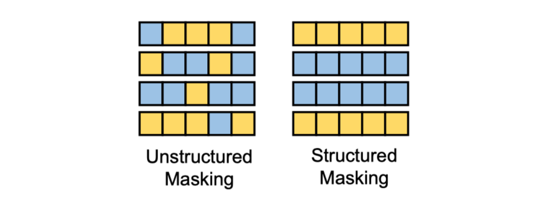
        <figcaption>Figure 5. Illustration of how two parameter masking methods. Blue represents frozen, while yellow represents trainable
    

    </figcaption>
</figure>

<!-- Fig 5.Illustration of how two parameter masking methods.
Blue represents frozen, while yellow represents trainable. -->

An algorithm for fine-tuning existing parameters. Instead of requiring any additional parameters, it selects a small number of parameters from the main nickel-hydride model (as if multiplying them by a two-valued mask) and simply makes them learnable while keeping most of the parameters unchanged during the fine-tuning process of the downstream task. Depending on the grouping of the selected parameters, they can be categorised into unstructured and structured masks.

 

## Code Example

### LoRA Fine-Tuning Example 

This example code demonstrates how to use LoRA (Low-Rank Adaptation) technology to perform parameter-efficient fine-tuning on a pre-trained BERT model. The code uses the Hugging Face `transformers` library to load the pre-trained model and tokenizer, the `datasets` library to load the MRPC subtask from the GLUE benchmark dataset, and PyTorch for model definition and training. 

### Python Code Analysis: Enhancing a BERT Model with LoRA

This part provides a detailed analysis of a Python script that implements a deep learning model using the Transformers library by Hugging Face. Here are the key parts of the code.

### Key Imports

`torch` and `nn`: Used for tensor operations and building neural network modules.

`transformers`: Provides pre-trained models and tools for natural language processing tasks.

`datasets`: Facilitates easy handling and manipulation of datasets.

 

### LoRALayer and LoRA Classes

**LoRALayer**: A PyTorch module that implements a Low-Rank Adaptation (LoRA) layer, adjusting the weight matrices of the network model by adding a low-rank transformation.

**LoRA**: Applies LoRA layers on an existing model, replacing specific weight parameters and using adjusted weights during forward propagation.

 

### Data Loading and Preprocessing

**load_mrpc** function: Loads the MRPC dataset, adjusts its format, and converts it into a format compatible with the Hugging Face `datasets` library.

 

### Main Function

**Model Initialization**: Loads a pre-trained BERT model for sequence classification and applies LoRA layers.

**Data Preparation**: Loads and processes the MRPC data, including sentence pairing and tokenization.

**Training Setup**: Defines training parameters such as learning rate, batch sizes, number of training epochs, and evaluation strategy.

**Training and Evaluation**: Trains and evaluates the model according to the defined training parameters.

 

### Execution Flow

The script starts execution from the `main` function, initializing the model, preparing the dataset, defining training parameters, and starting the training and evaluation process.

 

This overview provides a succinct yet comprehensive description of the key parts of the script, showcasing how to fine-tune a BERT model using LoRA for a specific NLP task (sentence paraphrase identification), while enhancing parameter efficiency and potentially quicker adaptation to new tasks.

### Project Link 

You can find the project at the following link: https://github.com/ValentinoWang/THU_SDS_24Spring/blob/main/LoRA_Demo/fine_tune_lora.py

### Results

<!--  -->
<figure>
    

        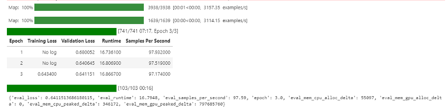
    

    </figcaption>
</figure>

## Discussions

### When to use this method (advantages and limitations) 

- When we want to apply a pretrained LLM to specific downstream tasks, based on a LLM that has already been pre-trained, finetuning is performed using a specific downstream dataset to adapt the model to a specific task or domain. The finetuning method can be devided into full finetuning, and PEFT.

- Advantage: (1) PEFT is parameter efficient compared to full finetuning. As LLM has a large amount of parameters (e.g. 1.76 trillion for GPT-4, and 7 billion for Mistral-7B), full finetuning need to retrained them all based on pretrained values, but PEFT methods frozen most of them, and only retrain a small amount of parameters. PEFT methods saves computing resources and training time, and the need on the number of downstream data is small. (2) The generalization ability of LLM is retained because most or all of the original model weights are retained when adapting the model to new tasks.

- For example when applying LoRA on Llama2, the trainable parameter reduced to 12.7% compared with full finetuning.

- When applying LoRA on Mistral, the trainable parameter reduced to 2.4% compared with full finetuning.

- Limitation: PEFT depends on the ability of pretrained LLM, if pretrained LLM is bad, the PEFT result will not perform well with high probability.

### Practical tips in implementation and usage

- The implementation is pretty complete by web resources. Here are some tips for usage. When you have a downstream task, you can first go to (website: PEFT (huggingface.co)) to check the recommanded LLM and corresponding PEFT methods. It can save the time of going through all the models and PEFT methods.

<!-- 
 -->
<figure>
    

        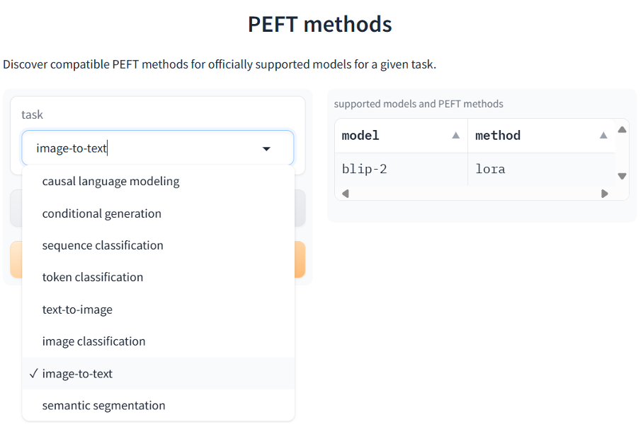
        <!-- <figcaption>Figure 5. Illustration of how two parameter masking methods. Blue represents frozen, while yellow represents trainable -->
    

    </figcaption>
</figure>
<figure>
    

        
        <figcaption>Figure 6. Example of select model and PEFT methods
    

    </figcaption>
</figure>

<!-- Fig 6. Example of select model and PEFT methods -->

### Relationship to other methods

Most of the PEFT methods are plug-and-play, therefore, it can be applied to most of the methods covered in class. 

(1) Such as T2I-Adapter [[27]](#27) introduces a lightweight adapter model on original text to image diffusion model. ***(introduced in Week 5: Generative Rpresentation - Diffusion Models.\***) T2I-Adapter is designed to align external control signals with the internal knowledge of text-to-image diffusion models. This adapter enables precise manipulation through structural control (e.g., sketch, depth map, semantic segmentation map, and keypose), color control (e.g., hue and color distribution), and integrating various controls by composing multiple adapters. So that various adapters can be trained according to different conditions to achieve rich control and editing effects in the color and structure of the generated results.

<!--  -->
<figure>
    

        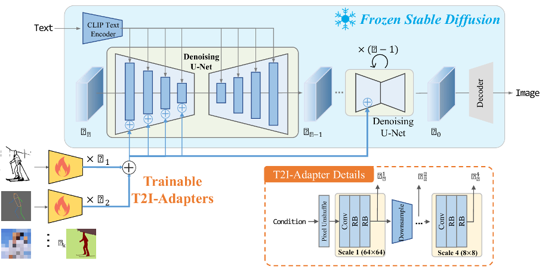
        <figcaption>Figure 7. Overview of T2I-Adapter
    

    </figcaption>
</figure>

<!-- Fig 7. Overview of T2I-Adapter -->

(2) Such as VPT (Visual Prompt Tuning) [efgh] prepends a small amount of task-specific parameters into the input sequence of each Transformer layer. (introduced in Week 6 & 7: Transformer.) When applying ViT to downstream tasks, only these added parameters and the clas sification head are set to trainable.

<!--  -->
<figure>
    

        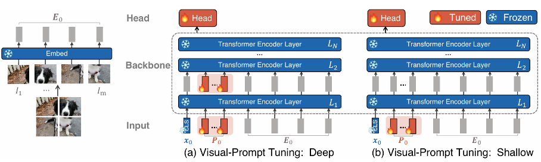
        <figcaption>Figure 8. Overview of VPT
    

    </figcaption>
</figure>

<!-- Fig 8. Overview of VPT -->

### Important subsequent representation learning algorithms derived from PEFT

l After the introduction of PEFT, a lot of subsequent representation learning algorithms applied PEFT as a transfer learning method to retrain the original model on a downstream dataset. The subsequent representation learning algorithms for LoRA is introduced in the previous question, and here will introduce the subsequent representation learning algorithms for Adapter and prompt.

(1) Adapter: For example VL-Adapter [[28]](#28) directly applies several PEFT methods (Adapter, Hyperformer and Compacter) on VL-BART [[29]](#29) then benchmarks them on several image-text and video-text tasks. Results show that vanilla adapters are the best among them, which can achieve performance on par with full fine-tuning. 
<!-- 
 -->
<figure>
    

        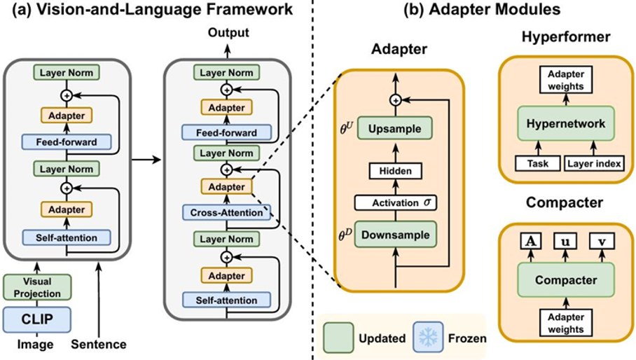
    

    </figcaption>
</figure>
<figure>
    

        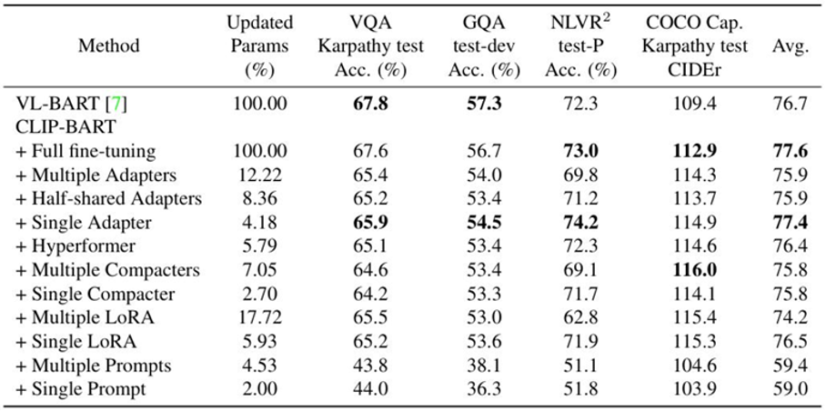
        <figcaption>Figure 9. VL-Adapter model overview and results
    

    </figcaption>
</figure>

<!-- Fig 9. VL-Adapter model overview and results -->

l However, considering the functionality gap between the encoders and decoders in VL-BART, directly assign identical modular modifications will lead to suboptimal performance. Therefore, VL-PET [[30]](#30) selectively integrates PEFT modules into different components of the encoder and decoder. They also introduces a granularity controlled mech anism for finer-grained control.

<!--  -->
<figure>
    

        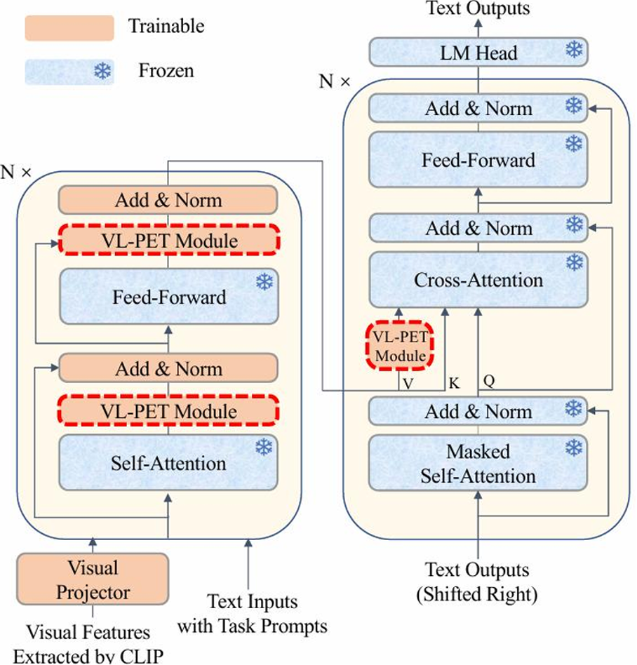
        <figcaption>Figure 10. VL-PET model overview 
    

    </figcaption>
</figure>
<!-- 
Fig 10. VL-PET model overview  -->

(2) Prompt: In open vocabulary image classification, earlier works design class-specific prompts, e.g., a photo of a [CLASS], for each category, and ranks images based on their similarity to these textual descriptions. CoOp (Context Optimization) [31] replaces the handcrafted text prompt with learnable vectors, while keep the entire VLA fixes during training.
<!-- 
 -->

<figure>
    

        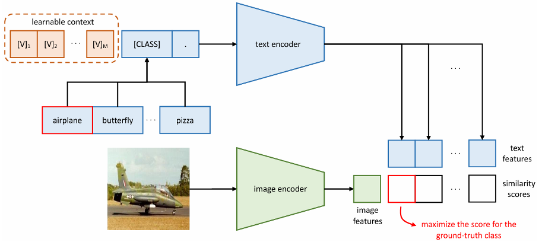
    

    </figcaption>
</figure>
<figure>
    

        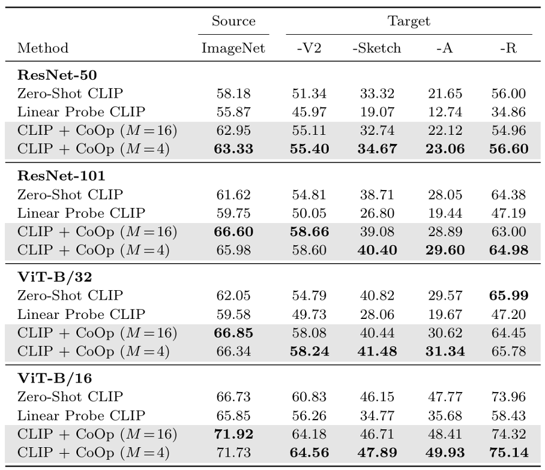
        <figcaption>Figure 11. CoOp model overview and results
    

    </figcaption>
</figure>

<!-- Fig 11. CoOp model overview and results -->

### Impactful application works using PEFT

Most of LLMs, such as Qwen, GPT-3.5-turbo allow finetuning and apply the finetuning interface to users. But this application is only for personal use. There is an application using LoRA, build a open website or more like a community called CIVITAI, which allows all users to share their LoRA finetuing result based on stable diffusion and follow and thumb up function is also exist. In this way, all LoRA result and finetuned SD model is shared. Persons with same interest can share and communicate their finetuned SD model to generate their favorite role, such as Malenia, Blade of Miquella and Malenia ([elden ring introduction](https://eldenring.wiki.fextralife.com/Malenia+Blade+of+Miquella)), and can even gerate typical style pictures, such as "Rick and Morty" style.

<!-- 
 -->
<figure>
    

        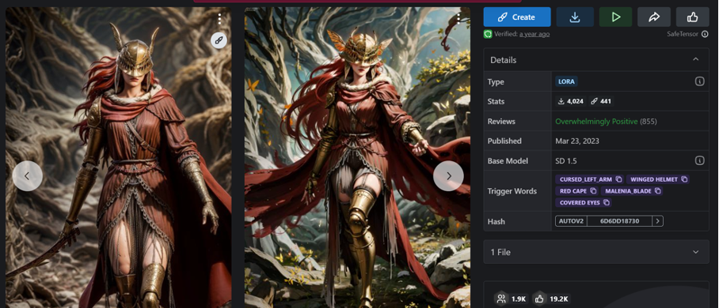
    

    </figcaption>
</figure>
<figure>
    

        
        <figcaption>Figure 12. Examples of LoRA community
    

    </figcaption>
</figure>
<!-- 
Fig 12. Examples of LoRA community -->

## References
<a id="1">[1]</a> WANG , A., S INGH , A., M ICHAEL , J., H ILL , F., L EVY, O., AND B OWMAN , S. R. Glue: A multi-task benchmark and analysis platform for natural language understanding. arXiv preprint arXiv:1804.07461 (2018).

<a id="2">[2]</a> M IHAYLOV, T., C LARK , P., K HOT, T., AND S ABHARWAL , A. Can a suit of armor conduct electricity? a new dataset for open book question answering. In EMNLP (2018).

<a id="3">[3]</a> B ISK , Y., Z ELLERS , R., B RAS , R. L., G AO , J., AND C HOI , Y. Piqa:Reasoning about physical commonsense in natural language. In ThirtyFourth AAAI Conference on Artificial Intelligence (2020).

<a id="4">[4]</a> S AP, M., R ASHKIN , H., C HEN , D., L E B RAS , R., AND C HOI , Y.Socialiqa: Commonsense reasoning about social interactions. arXiv preprint arXiv:1904.09728 (2019).

<a id="5">[5]</a> Z ELLERS , R., H OLTZMAN , A., B ISK , Y., FARHADI , A., AND C HOI ,Y. Hellaswag: Can a machine really finish your sentence? In Proceedings of the 57th Annual Meeting of the Association for Computational Linguistics (2019).

<a id="6">[6]</a> C LARK , C. E . A . Boolq: Exploring the surprising difficulty of natural yes/no questions. In NAACL (2019).

<a id="7">[7]</a> S AKAGUCHI , K., B RAS , R. L., B HAGAVATULA , C., AND C HOI , Y.Winogrande: An adversarial winograd schema challenge at scale. Communications of the ACM 64, 9 (2021), 99–106.

<a id="8">[8]</a> H OULSBY, N., G IURGIU , A., JASTRZEBSKI , S., M ORRONE , B., D E L AROUSSILHE , Q., G ESMUNDO , A., ATTARIYAN , M., AND G ELLY, S. Parameter-efficient transfer learning for nlp. In International Conference on Machine Learning (2019), PMLR, pp. 2790–2799.

<a id="9">[9]</a> P FEIFFER , J., K AMATH , A., R ¨U CKL ´E, A., C HO , K., AND G UREVYCH ,I. Adapterfusion: Non-destructive task composition for transfer learning. arXiv preprint arXiv:2005.00247 (2020).

<a id="10">[10]</a> H E , J., Z HOU , C., M A , X., B ERG -K IRKPATRICK , T., AND N EUBIG ,G. Towards a unified view of parameter-efficient transfer learning. arXiv preprint arXiv:2110.04366 (2021).

<a id="11">[11]</a> Z HU , Y., F ENG , J., Z HAO , C., WANG , M., AND L I , L. Counterinterference adapter for multilingual machine translation. arXiv preprint arXiv:2104.08154 (2021).

<a id="12">[12]</a> L EI , T., BAI , J., B RAHMA , S., A INSLIE , J., L EE , K., Z HOU , Y., D U , N., Z HAO , V. Y., W U , Y., L I , B., ET AL . Conditional adapters: Parameter-efficient transfer learning with fast inference. arXiv preprint arXiv:2304.04947 (2023).

<a id="13">[13]</a> H E , S., FAN , R.-Z., D ING , L., S HEN , L., Z HOU , T., AND TAO ,D. Mera: Merging pretrained adapters for few-shot learning. arXiv preprint arXiv:2308.15982 (2023).

<a id="14">[14]</a> P ETROV, A., T ORR , P. H., AND B IBI , A. When do prompting and prefix-tuning work? a theory of capabilities and limitations. arXiv preprint arXiv:2310.19698 (2023).

<a id="15">[15]</a> L I , X. L., AND L IANG , P. Prefix-tuning: Optimizing continuous prompts for generation. arXiv preprint arXiv:2101.00190 (2021).

<a id="16">[16]</a> L IU , X., J I , K., F U , Y., TAM , W. L., D U , Z., YANG , Z., AND TANG ,P-tuning v2: Prompt tuning can be comparable to fine-tuning universally across scales and tasks. arXiv preprint arXiv:2110.07602 (2021).

<a id="17">[17]</a> Z HANG , Z.-R., TAN , C., X U , H., WANG , C., H UANG , J., AND H UANG , S. Towards adaptive prefix tuning for parameter-efficient language model fine-tuning. arXiv preprint arXiv:2305.15212 (2023).

<a id="18">[18]</a> W U , Z., WANG , S., G U , J., H OU , R., D ONG , Y., V YDISWARAN , V., AND M A , H. Idpg: An instance-dependent prompt generation method. arXiv preprint arXiv:2204.04497 (2022).

<a id="19">[19]</a> L IU , X., S UN , T., H UANG , X., AND Q IU , X. Late prompt tuning:A late prompt could be better than many prompts. arXiv preprint arXiv:2210.11292 (2022).

<a id="20">[20]</a> Z HU , W., AND TAN , M. Spt: Learning to selectively insert prompts for better prompt tuning. In Proceedings of the 2023 Conference on Empirical Methods in Natural Language Processing (2023), pp. 1186211878.

<a id="21">[21]</a> WANG , Q., M AO , Y., WANG , J., Y U , H., N IE , S., WANG , S., F ENG , F., H UANG , L., Q UAN , X., X U , Z., ET AL . Aprompt: Attention prompt tuning for efficient adaptation of pre-trained language models. In Proceedings of the 2023 Conference on Empirical Methods in Natural Language Processing (2023), pp. 9147–9160.

<a id="22">[22]</a> V U , T., L ESTER , B., C ONSTANT, N., A L -R FOU , R., AND C ER , D.Spot: Better frozen model adaptation through soft prompt transfer. arXiv preprint arXiv:2110.07904 (2021).

<a id="23">[23]</a> C HEN , L., H UANG , H., AND C HENG , M. Ptp: Boosting stability and performance of prompt tuning with perturbation-based regularizer. arXiv preprint arXiv:2305.02423 (2023).

<a id="24">[24]</a> S HI , Z., AND L IPANI , A. Dept: Decomposed prompt tuning for parameter-efficient fine-tuning. arXiv preprint arXiv:2309.05173 (2023).

<a id="25">[25]</a> C HOI , J.-Y., K IM , J., PARK , J.-H., M OK , W.-L., AND L EE , S. Smop: Towards efficient and effective prompt tuning with sparse mixture-ofprompts. In Proceedings of the 2023 Conference on Empirical Methods in Natural Language Processing (2023), pp. 14306-14316.

<a id="26">[26]</a> Q IN , Y., WANG , X., S U , Y., L IN , Y., D ING , N., Y I , J., C HEN , W., L IU , Z., L I , J., H OU , L., ET AL . Exploring universal intrinsic task subspace via prompt tuning. arXiv preprint arXiv:2110.07867 (2021).

<a id="27">[27]</a> MOU, C., et al. "T2i-adapter: Learning adapters to dig out more controllable ability for text-to-image diffusion models." *arXiv preprint arXiv:2302.08453* (2023). [efgh] JIA, M., et al. "Visual prompt tuning." *In European Conference on Computer Vision* (2022), Springer, pp. 709-727. 

<a id="28">[28]</a> SUNG, et al. "Vl-adapter: Parameter efficient transfer learning for vision-and-language tasks." *In Proceedings of the IEEE/CVF Conference on Computer Vision and Pattern Recog nition* (2022), pp. 5227–5237.

<a id="29">[29]</a> CHO, J., et al. "Unifying vision-and language tasks via text generation." *In International Conference on Machine Learning* (2021), PMLR, pp. 1931–1942. 

<a id="30">[30]</a> HU, Z.-Y., et al. "Vl-pet: Vision and-language parameter-efficient tuning via granularity control." *In Proceedings of the IEEE/CVF International Conference on Computer Vision* (2023), pp. 3010–3020.

<a id="31">[31]</a> ZHOU, K., et al. "Learning to prompt for vision-language models." *International Journal of Computer Vision* 130, 9 (2022), 2337–2348.

 

## External Resources

Quicktour:

https://boinc-ai.gitbook.io/peft/get-started/quicktour

Github tutorial:

https://github.com/huggingface/peft

Huggingface quickstart:

https://huggingface.co/docs/peft/index

LoRA offical implementayion with examples:

https://github.com/microsoft/LoRA/tree/main

CSDN implementation:

https://blog.csdn.net/sinat_39483965/article/details/130805103

## Author Team

**Yiran Wang**: Writing the overview, learning goals and external resources part.

**Xubing Ye** Writing the background, problem formulation and method explanation parts.

**Siyao Wang**: Writing and the demo sections; Programming the demo.

**Jiaxuan Li**: Writing the discussions part.
