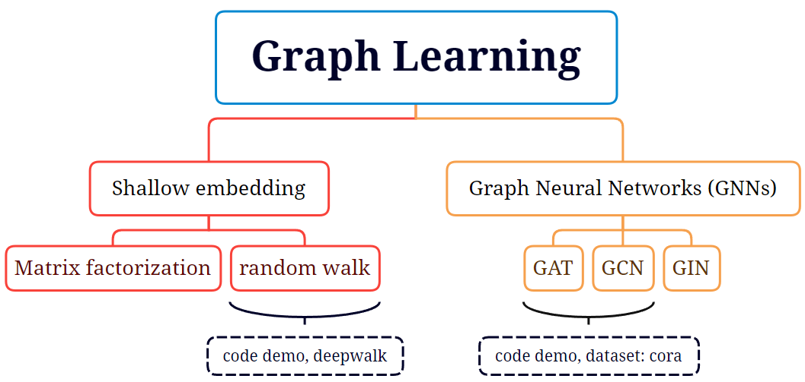
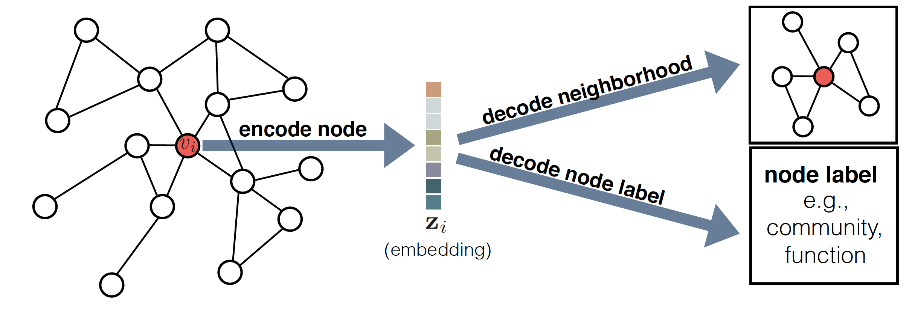
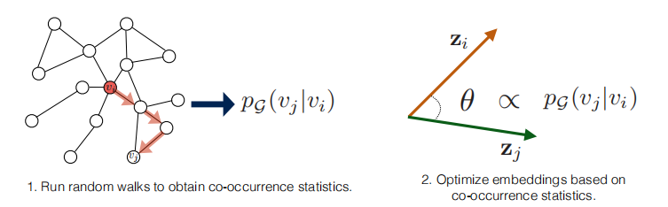
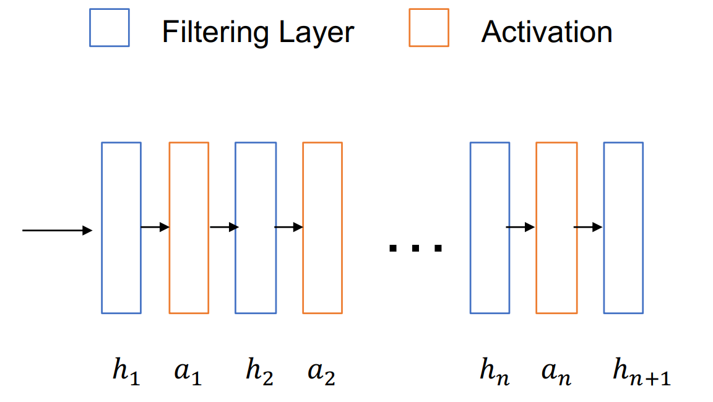
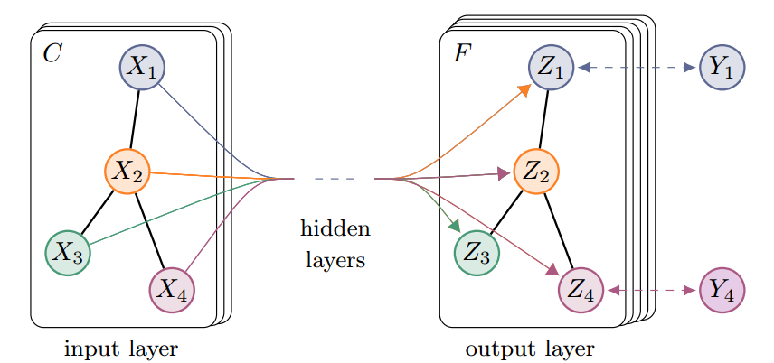
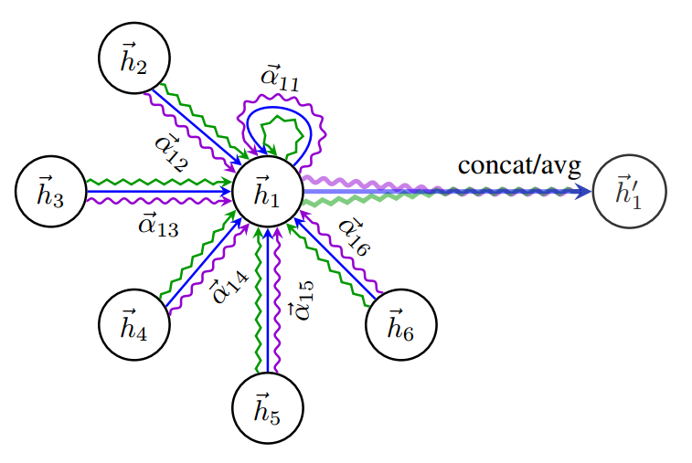
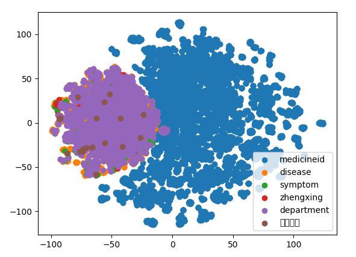
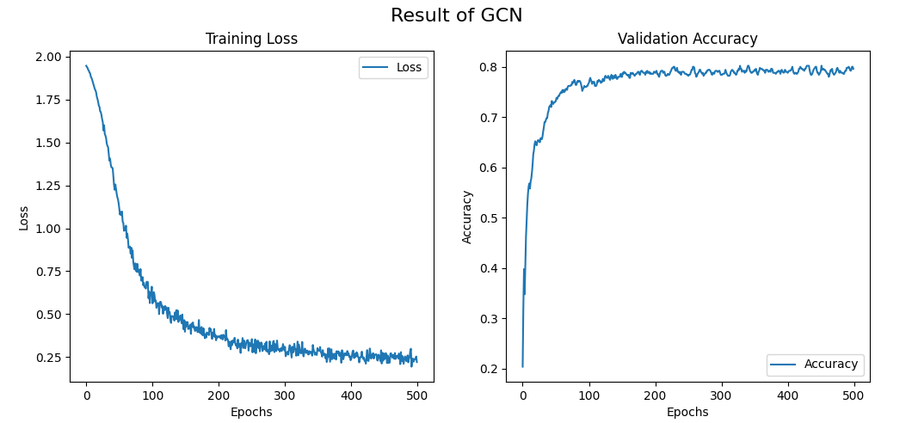
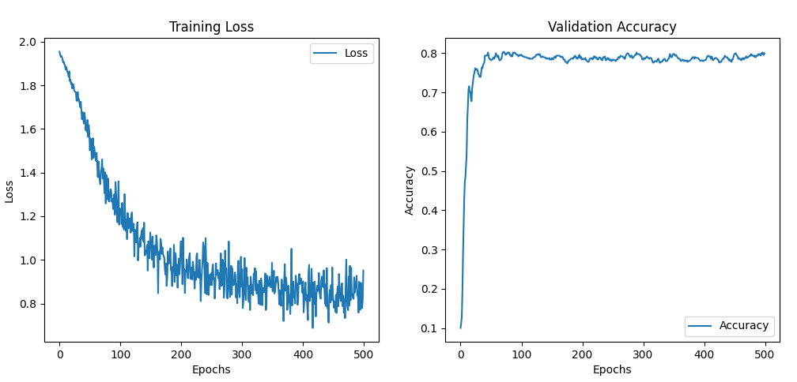
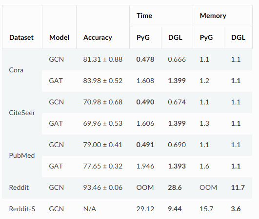

# Graph Representation Learning

## Overview

This tutorial aims to provide a comprehensive overview of graph learning. We want to bridge the gap between machine learning and graph learning, offering insights and practical guidance for researchers and practitioners. Here comes our learning goals.  

### Learning Goals


1. **Graph Representation Learning Methods**

   + **Shallow Embeddings**

     Shallow embedding in graph learning can be achieved through various techniques, and two common methods are matrix factorization and random walk-based approaches.

     + **Matrix Factorization**: A mathematical technique used to decompose a matrix into a product of matrices.
     + **Random Walk**: A method for sampling nodes in a graph. It starts at a node and randomly selects a neighboring node to move to, repeating this process for a set number of steps.

   + **Graph Neural Networks (GNNs)**

     GNNs are a type of deep learning model specifically designed for handling graph data. They are capable of capturing the local and global structures between nodes, thus enabling effective feature learning and tasks such as classification, regression, etc.

     + **Graph Convolutional Network (GCN)**: GCN is an extension of traditional convolutional neural networks, suitable for processing graph data with node labels.
     + **Graph Attention Network (GAT)**: GAT is a GNN based on the attention mechanism, allowing the model to focus on specific node pairs when processing graph data.
     + **Graph Isomorphism Network (GIN)**: GIN proposes a new message passing strategy that can learn node features without considering the order of nodes.

2. **Code Demo**

   We provide three code demos to provide examples for different parts of graph learning.

   + **deepwalk**: A deepwalk model is trained to realize the classification statistics of samples and the distance calculation of entity vectors.
   + **GAT**: Use the Cora dataset to train the GAT model and get the following result.
   + **GCN**: Use the Cora dataset to train the GCN model and get the following result.

3. **Discussion**

   We will help you understand the connections between graph representation learning and popular methods like VAE and attention, give some practical GNN techniques, and provide an overview of subsequent work and applications

<!--  -->

<figure>
    <div style="text-align: center;">
        
    </div>
    </figcaption>
</figure>

Throughout the tutorial, we will provide practical examples and code snippets in Python to help you understand the concepts better and apply them to real-world problems.


## Background

#### Mathematical Backgrounds

+ Linear Algebra: 
  Linear algebra is crucial for understanding graph representation learning and the understanding of matrix multiplication is the basis for learning. Additionally, **eigenvalues** and **eigenvectors** play an important role in spectral analysis of graphs, while **singular value decomposition (SVD)** is a common matrix factorization method used in data reduction and noise filtering. More details can be seen in the link.(https://en.wikipedia.org/wiki/Linear_algebra) 
+ Graph theory: 
  Graph theory provides the foundational knowledge for studying graph structures. The basic concepts of **nodes** and **edges**, **representation of graphs using adjacency matrices** and the role of **Laplacian matrices** in spectral graph analysis. More details can be seen in the link. (https://en.wikipedia.org/wiki/Graph_theory)
+ Probability and statistics: 
  Understanding basic probability distributions, expectation, and variance is essential. Moreover, **Bayesian inference** (https://en.wikipedia.org/wiki/Bayesian_inference), **Markov chains** (https://en.wikipedia.org/wiki/Markov_chain), and **random walks** (https://en.wikipedia.org/wiki/Random_walk) are very useful in modeling and analyzing graph data.

#### Machine Learning Backgrounds

+ Supervised learning and unsupervised learning: 
  The supervised learning involves training models on labeled data for classification and regression tasks. Unsupervised learning is used to discover patterns and structures in unlabeled data. 
+ Deep learning: 
  The deep learning in graph uses neural networks to automatically extract features and make predictions. The prior basic knowledge include the structure of **neural networks**, how the **backpropagation** algorithm and **feedforward neural networks** work. Furthermore, understanding the **convolutional neural networks (CNNs)**[[1]](#1) for tasks like image classification, and the applications of **recurrent neural networks (RNNs)**[[2]](#2) , **autoencoders** and **attention mechanism**[[3]](#3) in sequence data processing and dimensionality reduction can help us understand the following method.

#### Prior Important Works

Traditional machine approaches include graph statistics, kernel functions or carefully engineered features to extract structural information from graphs. 

+ Graph statistics:
  Graph statistics method obtains the structure information and node characteristics of a graph by calculating some global and local attributes of the graph, e.g., degree, clustering coefficient, connectivity and so on[[4]](#4).
+ Graph kernel function: 
  It is a set of methods that use a kernel function between graphs and map graph data to a high-dimensional feature space to use traditional machine learning algorithms[[5]](#5). It includes Shortest-Path Kernel, Subgraph Kernel, Laplacian Spectrum Kernel, Random Forest Graph Kernel and so on.
+ Human engineered features:
  Well-designed human engineered features are also used in graph representation learning, e.g., the measure of local neighborhood structures[[6]](#6), . However, designing these features is time-consuming and expensive.  


## Problem Formulation & Method Explanation

### Problem Formulation

​Graph representation learning aims to learn a set of node features or entire graph features to embed the graph's information for downstream tasks. In this subsection, we will formulate the problem of graph representation learning and provide the explanation of methods from shallow models to GNN methods.

#### Notation

​First, we will state the notations of our graph representation task. The primary input for this task is an undirected graph $\mathcal{G}=\{\mathcal{V},\mathcal{E}\}$, where $\mathcal{V}$ represents $N$ nodes, $\mathcal{E}$ represents the edges. The graph associated with an adjacency matrix $\mathbf{A}\in\mathbb{R}^{N\times N}$, along with a real-valued input node feature matrix  $\mathbf{F}^{\mathrm{(if)}}\in\mathbb{R}^{N\times d_{\mathrm{if}}}$, where $d_{\mathrm{if}}$ is input feature dimension.

#### Goal

​Therefore,  the goal of our graph learning problem is to use $\mathbf{A}$ and $\mathbf{F}^{\mathrm{(if)}}$ to **encode the graph nodes** into a vector $\mathbf{F}^{\mathrm{(of)}}\in\mathbb{R}^{N\times d_{\mathrm{of}}}$ , which summarizes both the graph structure and feature information, here  $d_{\mathrm{of}}$ denotes the output feature dimension. 

​And in unsupervised task, these embeddings are optimized so that their similarities in the latent space can approximate their relational similarities in the original graph.


#### Method Explanation

​In graph representation learning task, the shallow embedding approaches and GNN-based approaches are two main widely adopted methods. And in this subsection, we will give detailed explanations to these two methods.

#### Shallow Embedding Approach

​The shallow embedding approach is a straightforward encoding approach just like a simple embedding look-up. It optimizes a unique embedding vector for each node under the Encoder-Decoder framework, and using predefined similarity/distance metrics to establish relation between node embeddings.

​The **Encoder-Decoder** framework[[7]](#7) of shallow embedding can be described as the following figure:

<!--  -->
<figure>
    <div style="text-align: center;">
        
    </div>
    </figcaption>
</figure>

​Where the **Encoder** is a function to map each node $v\in \mathcal{V}$ to a low-dimensional vector $\mathbf{F}_{\mathrm{(v)}}\in\mathbb{R}^{d_{\mathrm{of}}}$, which also described as the related column of the embedding matrix $\mathbf{F}\in\mathbb{R}^{N\times d_{\mathrm{of}}}$ for all nodes:


$$
ENC(v) =\mathbf{F}[v]
$$
And the **Decoder** is a function that maps pair of node embeddings$(\mathbf{F}_{\mathrm{(v)}},\mathbf{F}_{\mathrm{(u)}})$ to a real-valued similarity measure, which can be described as following formula:
$$
DEC:\mathbb{R}^{d} \times \mathbb{R}^{d}\rightarrow \mathbb{R}^{+}
$$
Therefore, the objective of optimization is to make the similarity between embeddings closely reflects the neighbor relationships in the graph:
$$
DEC(ENC(v),ENC(u))=DEC(\mathbf{F}_{\mathrm{(v)}},\mathbf{F}_{\mathrm{(u)}})\approx\mathbf{S}[u,v]
$$
Where $\mathbf{S}[u,v]$ is the original graph similarity measure, and this approximation can be formulated as a problem of **minimizing the similarity error**:
$$
min\ L = \sum_{(v,u)\in \mathcal{V}} l(DEC(\mathbf{F}_{\mathrm{(v)}},\mathbf{F}_{\mathrm{(u)}}),\mathbf{S}[u,v])
$$
In the shallow embedding approach, there are two main types of methods: one based on **Matrix factorization** and the other based on **Random walk**, and we will separately give a description.

#### Factorization-Base Approach

Because the shallow embedding approach uses graph similarity matrices $\mathbf{S}$ to encode structural information, matrix factorization naturally emerges as a method to learn representations because of the new form of similarity error function:
$$
L = ||\mathbf{F}^T\mathbf{F}-\mathbf{S}||
$$

Based on this form, some recent work employs the inner product to construct the decoder for embedding similarity measure. 

#### Graph Factorization

**Graph Factorization**[[8]](#8) is an early method for factorization-base approach, which constructs the loss function as:
$$
L = \frac{1}{2}\sum_{(v,u)\in \mathcal{D}} (y_{ij}-\mathbf{F}_{\mathrm{(v)}}^T\mathbf{F}_{\mathrm{(u)}})^2+\frac{\lambda}{2}\sum_u||\mathbf{F}_{\mathrm{(v)}}||^2
$$
Where $y_{ij}$ is the edge weight between node $v$ and $u$, $\lambda$ is regularization coefficient, $\mathcal{D}$ is the training set. Thus the objective of the function is to reconstruct $y_{ij}$, also equivalent to reconstructing the adjacency matrix $\mathbf{A}$, using the inner product of the pairwise node representations. Then the loss optimization can be achieved using Stochastic Gradient Descent (SGD).

#### GraRep

However, Graph Factorization only considers first-order neighbor relationships. Therefore, **GraRep**[[9]](#9) improves by constructing K-th order similarity measures to  incorporate multi-order neighbor relationships. It defines loss function in different order, and the k-th order loss can be described as:
$$
J_k(u) = \sum_{u\in\mathcal{D}}(\sum_{v\in\mathcal{D}}p_k(v|u)log\sigma(\mathbf{F}_u^T\mathbf{F}_v))+\lambda\mathbb{E}_{v'\sim p_k(\mathcal{V})}[log\sigma(-\mathbf{F}_u^T\mathbf{F}_v))]
$$
Where $p_k(v|u)=A_{u,v}^k$ denotes the transition probability from node $u$ to node $v$ in $k$ steps, reflecting k-th order connectivity between node pairs. $v'$ is negative sampling based on $p_k(\mathcal{V})$. 

Therefore, if there exist paths between nodes pairs $(u,v)$ in the graph, the optimization process will increase their probability. Also can be represented as the approximation of k-th order adjacency matrix. After using gradient descent, the inner-dot product of embeddings can be represented as:
$$
\mathbf{F}_u^T\mathbf{F}_v = log(\frac{A_{u,v}^k}{\sum_{u'}A_{u',v}^k})-log(\frac{\lambda}{N})
$$
Using low-rank SVD decomposition can get the optimal representations


#### Random Walk-Based Approach

The random walk approach is another class of shallow embedding that uses random walk statistics. Instead of using deterministic node similarity like polynomial function of adjacency matrix $\mathbf{A}$ , this method refer similar node embeddings based on their co-occurrence  on short random walks over the graph shown as the following graph.

<!--  -->
<!--  -->
<figure>
    <div style="text-align: center;">
        
    </div>
    </figcaption>
</figure>


Therefore, the optimization goal of random walk approach **DeepWalk**[[10]](#10) is to maximize the predicted probability of pairwise nodes on random walk co-occurrences. The decoder form can be written as:
$$
DEC(\mathbf{F}_{\mathrm{(u)}},\mathbf{F}_{\mathrm{(v)}})=\frac{e^{\mathbf{F}_{\mathrm{(u)}}^T\mathbf{F}_{\mathrm{(v)}}}}{\sum_{k\in\mathcal{V}}e^{\mathbf{F}_{\mathrm{(u)}}^T\mathbf{F}_{\mathrm{(k)}}}}\approx p_{\mathcal{G},T}(v|u)
$$
Where $p_{\mathcal{G},T}(v|u)$ denotes the probability of visiting node $v$ on a random walk of length $T$ starting at node $u$. And training process can be described as the minimization of this cross-entropy loss:
$$
L=\sum_{(u,v)\in \mathcal{D}}-log(DEC(\mathbf{F}_{\mathrm{(u)}},\mathbf{F}_{\mathrm{(v)}}))=\sum_{(u,v)\in \mathcal{V}}-log(p_{\mathcal{G},T}(v|u))
$$
The training set $\mathcal{D}$ is generated from uniform sampling from each node. While the paths generated by ordinary random walk are overly random and fail to consider the strength of connections between nodes in the graph. Thus accounting for the structural equivalence and homogeneity of nodes, **Node2Vec**[[11]](#11) modifies the strategy of random walk, introducing the balance between BFS and DFS, and the transition probability can be written as:
$$
\begin{equation}
	\alpha_{pq}(u,v)
	\begin{cases}
		\frac{1}{p} \ if\ d_{uv}=0\\
		\ 1 \ \ if\ d_{uv}=1\\
        \frac{1}{q} \ if\ d_{uv}=2
	\end{cases}
\end{equation}
$$
Where the additional parameters $p$ and $q$ control the tendency of the random walk:  $p$ encourages DFS, which captures structral equivalence of nodes, and $q$ encourages BFS, which captures the homogeneity of node pairs. Thus the weighted random walk provides a significant trade-off between two key features of the graph.

Random walk approach uses more stochastic and asymmetric similarity measures, making it more expressive and efficient, and have superior performance compared to matrix factorization methods.


### Graph Neural Networks

Shallow embedding approaches are similar with simple embedding look-ups, employing an Encoder-Decoder framework to generate graph representations. On the other hand, with the success of neural network models in representation learning, Graph Neural Networks (GNN) can also be reviewed as a more complex encoder models to graph representation learning. 

The key idea of GNN for representation learning is to utilize node features and graph structure through iterative neural message passing, and each node will experiences two processes: message exchange and updating. More specifically, this process can be summarized as follows:
$$
\begin{equation}\mathbf{F}^{(\mathrm{of})}=h(\mathbf{A},\mathbf{F}^{(\mathrm{if})})\end{equation}
$$
A general framework for GNN can be regarded as a composition of graph filtering and non-linear activation layers. A GNN framework with $L$ graph filtering layers and $L-1$ activation layers is shown in following figure

<!--  -->
<figure>
    <div style="text-align: center;">
        
    </div>
    </figcaption>
</figure>

where $h_{i}$ and $a_{i}$ denote the $i$-th graph filtering layer and activation layer, respectively. We use $\mathbf{F}(i)$ to denote the output of the $i$-th graph filtering layer. Specifically, $\mathbf{F}(0)$ is initialized to be the associated features $\mathbf{F}$. Furthermore, we use $d_{i}$ to indicate the dimension of the output of the $i$-th graph filtering layer. Since the graph structure is unchanged, we have $\mathbf{F}^{(i)}\in\mathbb{R}^{N\times d_{i}}$ . The $i$-th graph filtering layer can be described as:
$$
\mathbf{F}^{(i)}=h_i\left(\mathbf{A},\alpha_{i-1}\left(\mathbf{F}^{(i-1)}\right)\right)
$$
where $a_{i-1}$ is the element-wise activation function following the $(i-1)$-th graph filtering layer. And the final output $\mathbf{F}(L)$ is leveraged as the input to some specific layers according to the downstream node-focused tasks.

The distinguishing among various GNN methods lies in the construction of their filtering layers $\mathbf{F}$, also called as different message passing and aggregation. And the above equation can also be written as:
$$
\mathbf{F}^{(i)}_u=\text{update}^{(i)}(\mathbf{F}_u^{(i-1)},\text{aggregate}^{(i)}({\mathbf{F}_{v\in N(u)}^{(i-1)}}))
$$
In this subsection, we will detailed introduce three popular GNN methods: Graph Convolutional Network(GCN), Graph attention network(GAT) and  Graph Isomorphism network(GIN).

#### Graph Convolutional Networks

Graph Convolutional Network (GCN)[[12]](#12) is a semi-supervised learning method for graph data. Its core idea is to update the representation of a node by combining the features of the node and its neighbors through graph convolution operations. For each layer of convolution operations, the feature vector of a node is updated to the weighted sum of the features of its neighboring nodes.The graph convolution layer of GCN can be expressed as:

$$
H^{(l+1)}=\sigma\Big(\tilde{D}^{-\frac12}\tilde{A}\tilde{D}^{-\frac12}H^{(l)}W^{(l)}\Big).
$$

Here, $\tilde{A}=A+I_N$ is the adjacency matrix of the undirected graph G with added self-connections. $I_{N}$ is the identity matrix, $\tilde{D_{ii}}=\dot{\sum_{j}}\tilde{A}_{ij}$ and $W(l)$ is a layer-specific trainable weight matrix. $\sigma(\cdot)$ denotes an activation function, such as the $\operatorname{ReLU}(\cdot)=\max(0,\cdot).H^{(l)}\in\mathbb{R}^{N\times D}$  is the matrix of activations in the $l^{\mathrm{th}}$ layer. The following figure is a schematic diagram of a GCN for semi-supervised learning

<!--  -->
<figure>
    <div style="text-align: center;">
        
    </div>
    </figcaption>
</figure>


In this model, the expression of the forward model is
$$
Z=f(X,A)=\mathrm{softmax}\Big(\hat{A}\mathrm{ReLU}\Big(\hat{A}XW^{(0)}\Big)W^{(1)}\Big).
$$
Here, $W^{(0)}\in\mathbb{R}^{C\times H}$ is an input-to-hidden weight matrix for a hidden layer with $H$ feature maps.$W^{(1)}\in\mathbb{R}^{H\times F}$ is a hidden-to-output weight matrix. The softmax activation function, defined as ,$\mathrm{softmax}(x_i)=\frac1{\mathcal{Z}}\exp(x_i)$ with $\mathcal{Z}=\sum_{i}\operatorname{exp}(x_{i})$​  is applied row-wise. For semi-supervised multiclass classification, we then evaluate the cross-entropy error over all labeled examples:
$$
\mathcal{L}=-\sum_{l\in\mathcal{Y}_L}\sum_{f=1}^FY_{lf}\ln Z_{lf},
$$
where $\mathcal{Y}_{L}$ is the set of node indices that have labels.


#### Graph Attention Networks

Graph Attention Network (GAT)[[13]](#13) is a graph neural network model based on the attention mechanism. GAT introduces a self-attention mechanism to aggregate node features by assigning different attention weights to each node and its neighboring nodes, thereby improving the expressiveness of the model. For node $i$ and its neighbor node $j$ , the expression of attention coefficient $e_{ij}$ is
$$
e_{ij}=a(\mathbf{W}\vec{h}_i,\mathbf{W}\vec{h}_j)
$$
By normalizing it, we can get the attention weight
$$
\alpha_{ij}=\mathrm{softmax}_j(e_{ij})=\frac{\exp(e_{ij})}{\sum_{k\in\mathcal{N}_i}\exp(e_{ik})}.
$$
After obtaining the normalized attention coefficient, the linear combination of the corresponding features is calculated using the normalized attention coefficient as the final output feature of each node
$$
\vec{h}_i^{\prime}=\sigma\left(\sum_{j\in\mathcal{N}_i}\alpha_{ij}\mathbf{W}\vec{h}_j\right).
$$
In order to stabilize the learning process of self-attention, it is beneficial to adopt multi-head attention. Specifically, K independent attention mechanisms perform the transformation above, and then concatenate their features to obtain the following output feature representation:
$$
\vec{h}_i^{\prime}=\prod_{k=1}^K\sigma\left(\sum_{j\in\mathcal{N}_i}\alpha_{ij}^k\mathbf{W}^k\vec{h}_j\right)
$$
where $||$ represents concatenation, $\alpha_{ij}^k$ are normalized attention coefficients computed by the $k$-th attention mechanism ,$(a^{k})$ and $\mathbf{W}^{k}$ is the corresponding input linear transformation’s weight matrix. Note that, in this setting, the final returned output, $\text{h'}$ , will consist of $KF^{\prime}$​ features for each node.

Specially, if we perform multi-head attention on the final (prediction) layer of the network, concatenation is no longer sensible—instead, we employ averaging, and delay applying the final nonlinearity (usually a softmax or logistic sigmoid for classification problems) until then:
$$
\vec{h}_{i}^{\prime}=\sigma\left(\frac{1}{K}\sum_{k=1}^{K}\sum_{j\in\mathcal{N}_{i}}\alpha_{ij}^{k}\mathbf{W}^{k}\vec{h}_{j}\right)
$$
The aggregation process of a multi-head graph attentional layer is illustrated by following figure

<!--  -->
<figure>
    <div style="text-align: center;">
        
    </div>
    </figcaption>
</figure>


#### Graph Isomorphism Networks

Graph Isomorphism Network (GIN)[[14]](#14) is a model designed specifically to enhance the expressive power of graph neural networks. GIN designs a powerful aggregation function that can theoretically achieve the same discriminative power as the graph isomorphism test. The node update formula in GIN is:
$$
h_v^{(k)}=\mathrm{MLP}^{(k)}\left(\left(1+\epsilon^{(k)}\right)\cdot h_v^{(k-1)}+\sum_{u\in\mathcal{N}(v)}h_u^{(k-1)}\right).
$$
where, $\mathbf{h}_i^{(k}$ is the representation of node $i$ in the $k$ th layer. $\mathrm{MLP}^{(k)}$ is the multi-layer perceptron in the $k$ th layer. $\epsilon^{(k)}$ is a learnable or fixed parameter. $\mathcal{N}(i)$ represents the set of neighbor nodes of node $i$.Through multiple layers of aggregation operations, GIN updates the representation of each node layer by layer:
$$
\mathbf{h}_i^{(k)}=\mathrm{MLP}^{(k)}\left((1+\epsilon^{(k)})\mathbf{h}_i^{(k-1)}+\sum_{j\in\mathcal{N}(i)}\mathbf{h}_j^{(k-1)}\right)
$$
Each layer of GIN uses an independent MLP, and the aggregation function of each layer contains a linear combination of the node's own features. For graph-level tasks, it is necessary to aggregate the representations of all nodes into a global graph representation. GIN usually uses a global pooling operation to achieve this:
$$
\mathbf{h}_G=\mathrm{SUM}\left(\{\mathbf{h}_i^{(K)}|i\in V\}\right)
$$
Where $\mathbf{h}_i^{(K)}$ is the node representation of the $K$ th layer, and $\mathbf{h}_{G}$ is the representation of the entire graph.

GNN have a powerful ability to learn representations of graphs that capture both local and global structures, and are more generalized to different graph attributes, making them suitable for various downstream tasks such as node classification, relation prediction, and more. 


## Code Example

### Shallow Embedding

+ **Deepwalk**

  First we define classes in models that implement different graph embedding algorithms, such as DeepWalk, LINE, Node2Vec, SDNE, and Struc2Vec. Each class has an initialization method, a training method, an evaluation method, and a method for getting an embedded vector.

  ```python
  class DeepWalk(object):
      def __init__(self, graph,config):
      """
      This function is used to initialize the deepwalk object
      :param graph: indicates the input graph model
      """
  
      def train(self, **kwargs):
      """
      Training word vector model
      :param kwargs:
      :return: trained word vector model
      """
      return model
  
      def get_embeddings(self,):
      """
      :return: The return value is a dictionary with the entity name as the key, and the corresponding key value is the vector of the key just trained
      """
      return self._embeddings
  ```

  Then we then define the evaluate class, which is used to evaluate entity vectors based on entity class tags. It includes methods for reading node labels, evaluating embedded vectors, and plotting the distribution of embedded vectors in a two-dimensional space.

  ```python
  class Evaluate(object):
     # Entity vector is evaluated based on entity category label
     def __init__(self,embeddings,node_classify_path):
         self.embeddings = embeddings
         self.node_classify_path = node_classify_path
  
     def read_node_label(self,filename, skip_head=False):
         return X, Y
  
     def evaluate_embeddings(self):
         """
         A classifier function, used to evaluate the quality of vectors, because each entity has a corresponding label, 
         through the vector to achieve multiple classification
         :param embeddings:
         :return:
         """
  
     def plot_embeddings(self):
         """
         Reduce the vector dimension of the entity to 2 dimensions and then display it
         :param embeddings:
         :return:
         """
  
     def calculate_distance(self,vector1, vector2):
             return cosine_distance
  ```

   Finally we do the training and evaluation process in the main function: in the main file, we define how to build the graph structure, select the model, train the model, evaluate the model, and visualize the embedded vector. And we get the feature distribution of the data set.

  <!--  -->
<figure>
    <div style="text-align: center;">
        
    </div>
    </figcaption>
</figure>

     And through deepwalk, the function of finding adjacent nodes according to classification is realized

  

### GNN

+ **GCN**
  First we define the GCN class, which inherits from nn.Module. Then we build it with by following steps. (1) Adds an input layer, hidden layers, and an output layer to the list of layers. 
  (2) Adds dropout to the network to prevent overfitting. 
  (3) we define the forward pass method as follow. 
  The default model has 1 GCN layer with 16 hidden units.

  ```python
  class GCN(nn.Module):
    def __init__(self, g, in_feats, n_hidden, n_classes, n_layers, activation, dropout):
       super(GCN, self).__init__()
       self.g = g
       self.layers = nn.ModuleList()
       
       # Input layer
       self.layers.append(GraphConv(in_feats, n_hidden, activation=activation))
       
       # Hidden layers
       for i in range(n_layers - 1):
             self.layers.append(GraphConv(n_hidden, n_hidden, activation=activation))
       
       # Output layer
       self.layers.append(GraphConv(n_hidden, n_classes))
       
       self.dropout = nn.Dropout(p=dropout)
    def forward(self, features):
       h = features  # Initial input features
       for i, layer in enumerate(self.layers):
             if i != 0:
                h = self.dropout(h)  # Apply dropout to hidden layers
             h = layer(self.g, h)  # Apply graph convolution
       return h
  ```

  Then we use the Cora dataset to train the model and get the following result. We can see that the validation accuracy is about 80%. And the test accuracy is 80.4%.
  <!--  -->
  <figure>
    <div style="text-align: center;">
        
    </div>
    </figcaption>
</figure>

  

+ **GAT**
  First we define the GAT class, which inherits from nn.Module. Then we build it with by following steps. 
  (1) Adds an input layer, GAT layers with several hidden units and attention heads in each layer, and an output layer to the list of layers. 
  (2) Adds dropout to the network to prevent overfitting. 
  (3) We define the forward pass method as follow. 
  The default model has 1 GAT layer with 16 hidden units and 3 attention heads in each layer.

  ```python
  class GAT(nn.Module):
    def __init__(self, g, n_layers, in_feats, n_hidden, n_classes, heads, activation, in_drop, at_drop, negative_slope):
       super(GAT, self).__init__()
       self.g = g
       self.num_layers = n_layers
       self.activation = activation
       self.gat_layers = nn.ModuleList()
  
       # Input layer
       self.gat_layers.append(GATConv(in_feats, n_hidden, heads[0], in_drop, at_drop, negative_slope, activation=self.activation))
       
       # Hidden layers
       for l in range(1, n_layers):
             self.gat_layers.append(GATConv(n_hidden * heads[l-1], n_hidden, heads[l], in_drop, at_drop, negative_slope, activation=self.activation))
       
       # Output layer
       self.gat_layers.append(GATConv(n_hidden * heads[-2], n_classes, heads[-1], in_drop, at_drop, negative_slope, activation=None))
  
    def forward(self, inputs):
       h = inputs  # Initial input features
       for l in range(self.num_layers):
             h = self.gat_layers[l](self.g, h).flatten(1)  # Forward pass through GAT layers
       logits = self.gat_layers[-1](self.g, h).mean(1)  # Compute logits
       return logits
  ```

  Then we use the Cora dataset to train the model and get the following result. We can see that the validation accuracy is about 80%. And the test accuracy is 81.0%.

<!--  -->
<figure>
    <div style="text-align: center;">
        
    </div>
    </figcaption>
</figure>


## Discussion

### Advantages and Limitations

#### Shallow Embedding Approach

The shallow embedding approach is the simplest method, which maps the node using graph similarity measures. Once we obtain the embedding matrix $\mathbf{F}$, we can quickly acquire the embeddings of each nodes. Additionally, the shallow embedding can effectively capture the spatial relationships among nodes in the graph.

While shallow embedding approach also has some limitations. Firstly, it does not utilize node features, leading to a decrease in performance. Secondly, it is transductive, which can be problematic for unseen nodes in evolving graphs. Lastly, the shallow embedding has lots of parameter, which is difficulty to scale up to large graphs.


#### GNN Approach

The GNN approach can capture both the topology of the network and the attributes of nodes, well extracting the non-linear and complex relation between nodes from stacked layers. Also it satisfies the permutation invariance, which is robustness when structure of graph varying. Otherwise, the message passing process in the GNN can well interpreted how feature propagating in a graph, and adaptively adjust the network's weights based on training data,  

While GNN has some limitations. Firstly, it can't be stacked as deeply as DNNs, as this may lead to oversmoothing, causing the features of all nodes in the graph converging to the same values. Secondly, some GNN types like spectral GNN also suffered from transductive problem. Lastly, GNN have some difficulty in applying dynamic model and large-scale network because the complexing of modeling and the large computational cost.


### Practical Tips in Implementation and Usage

(1) When utilizing node relationships for graph representation learning, multiple scales of different orders relationships can be employed for performance improvement.

(2) For GCN, the optimal number of layers is 2-3. Avoid stacking too many layers, and consider incorporating techniques such as residual/dense connections and dilated convolutions to mitigate oversmoothing.

(3) Sometimes, introducing a virtual node that connects with all nodes in the graph can enhance information exchange. Through this virtual node, any node on the graph can obtain information from all other nodes quickly.

(4) Label can also participates in the information propagation process

(5) The adjacency matrix and Laplacian matrix are crucial. Remember to utilize their sparsity and real-valued, limited-range eigenvalues.


### Relationship to Other Methods

Graph representation learning is a special case of representation learning which applied in the non-Euclidean data, thus some methods in normal representation can also be applied in graph representation. 

#### Sparse Representation and Graph

The graph naturally has the sparse features on adjacency/Laplacian matrix, thus some methods of dictionary learning in sparse representation can be used in graph representation  eg. Graph Lasso[[15]](#15).

#### VAE and Graph

VAE can applied to graphs as GVAE[[16]](#16), it follows the same idea as VAE to use the latent variables for learning the distribution of graph data. While in GVAE, the encoder is substituted with GCN to determine the mean and variance of the Gaussian distribution

#### GAN/Diffusion and Graph

GAN and Diffusion models can both be applied to graph generation. However, due to the unique characteristics of graph, research of these two methods still in its early stages.

 GAN focus on the graph connectivity distribution rather than the data distribution[[17]](#17), and Diffusion do noising and denoising on adjacency matrix/latent space[[18]](#18) rather than directly to the graph itself. 

#### Attention/Transformer and Graph

Attention and Transformer have widely used in graph representation learning. Attention mechanism has become a  fundamental approach for measuring relationships between different nodes, which can be used for weighting message passing like GAT.

Moreover, because in Transformer, each token is attention with all other tokens, Thus in graph it can be represented as fully connected, which approximates GAT with all nodes attention computation[[19]](#19). Similar with positional encoding in Transformer, graph transformer also use adjacency matrix/random walk to introduce position, relation and structural encoding of nodes and edges. 	


### Important Subsequent Algorithms 

Accounting for the diverse limitations of GNN, subsequent algorithms have improved upon GNN in various fields. 

#### Different Graph Types

The original GCN/GAT can only be used with common graphs. While subsequent works like **HGAT**[[20]](#20) and **HyperGCN**[[21]](#21) extend the applicability of GNN to hypergraphs and heterogeneous graphs. And **EvolveGCN**[[22]](#22) applies GCN to dynamic graphs.

#### Oversmoothing

To address the oversmoothing problem of GCN, **PPNP** [[23]](#23)views graph convolution as a random walk process and addresses the spider traps problem in pagerank through teleports to alleviate oversmoothing. And **GraphTransforme**r features with a global receptive field and use the powerful global attention mechanism to capture long-range dependencies to mitigate oversmoothing.


### Impactful Application Works

#### Recommender Systems

The common application of graph representation learning is recommender systems, where shallow embeddings and random walk methods have become foundational strategies used for item feature engineering and collaborative filtering in recommender system.  

Moreover, GNN has become increasingly popular in recommender system. **LightGCN** [[24]](#24) is a algorithm based on GCN, which achieves efficient recommendation performance through lightweight graph layers and adaptive parameter adjustments. **GraphRec** [[25]](#25) using GNN frameworks specifically tailored for social recommender systems, which successful handle varying social relationships, thereby enhancing the precision of recommendations.

#### Biochemistry

Because of the natural structure of molecules and chemical compounds, graph representation learning has a widely usage in biochemistry and healthcare.

**DDK-Linker**[[26]](#26) is a network-based strategy using different shallow embedding methods to reconstruct PPI network for disease signal identifying.  GNN also be used in **AlphaFold2**[[27]](#27)  for effective protein model refinement.

#### Urban Data Mining

Because of the graph relation between traffic/climate/pandemic information, GNN can advance urban data mining tasks. 

**STGCN**[[28]](#28) use graph temporal and spatial convolution blocks to acquire superior performance on traffic prediction. **GraphCast**[[29]](#29) use GNN for long weather prediction, surpassing state-of-the-art human systems on 90% of metrics."


## References
<a id="1">[1]</a> He, Kaiming, et al. "Deep residual learning for image recognition." Proceedings of the IEEE conference on computer vision and pattern recognition. 2016.

<a id="2">[2]</a> Hochreiter, Sepp, and Jürgen Schmidhuber. "Long short-term memory." Neural computation 9.8 (1997): 1735-1780.

<a id="3">[3]</a> Vaswani, Ashish, et al. "Attention is all you need." Advances in neural information processing systems 30 (2017)

<a id="4">[4]</a> Bhagat, Smriti, Graham Cormode, and S. Muthukrishnan. "Node classification in social networks." Social network data analytics (2011): 115-148.

<a id="5">[5]</a> Vishwanathan, S. Vichy N., et al. "Graph kernels." The Journal of Machine Learning Research 11 (2010): 1201-1242.

<a id="6">[6]</a> Liben-Nowell, David, and Jon Kleinberg. "The link prediction problem for social networks." Proceedings of the twelfth international conference on Information and knowledge management. 2003.

<a id="7">[7]</a> Hamilton, William L. et al. “Representation Learning on Graphs: Methods and Applications.” *IEEE Data Eng. Bull.* 40 (2017): 52-74.

<a id="8">[8]</a> A. Ahmed, N. Shervashidze, S. Narayanamurthy, V. Josifovski, and A.J. Smola. Distributed large-scale natural graph factorization. In *WWW*, 2013.

<a id="9">[9]</a> S. Cao, W. Lu, and Q. Xu. Grarep: Learning graph representations with global structural information. In *KDD*, 2015.

<a id="10">[10]</a> B. Perozzi, R. Al-Rfou, and S. Skiena. Deepwalk: Online learning of social representations. In *KDD*, 2014

<a id="11">[11] </a> A. Grover and J. Leskovec. node2vec: Scalable feature learning for networks. In *KDD*, 2016

<a id="12">[12]</a> Kipf T N, Welling M. Semi-supervised classification with graph convolutional networks[J]. arXiv preprint arXiv:1609.02907, 2016.

<a id="13">[13]</a> Veličković P, Cucurull G, Casanova A, et al. Graph attention networks[J]. arXiv preprint arXiv:1710. 10903, 2017.

<a id="14">[14]</a> Xu K, Hu W, Leskovec J, et al. How powerful are graph neural networks?[J]. arXiv preprint arXiv: 1810.00826, 2018.

<a id="15">[15]</a> Mazumder, Rahul and Trevor J. Hastie. “The Graphical Lasso: New Insights and Alternatives.” *Electronic journal of statistics* 6 (2011): 2125-2149 .

<a id="16">[16]</a> Simonovsky, Martin and Nikos Komodakis. “GraphVAE: Towards Generation of Small Graphs Using Variational Autoencoders.” *International Conference on Artificial Neural Networks* (2018).

<a id="17">[17]</a> Wang, Hongwei et al. “GraphGAN: Graph Representation Learning with Generative Adversarial Nets.” *ArXiv* abs/1711.08267 (2017): n. pag.

<a id="18">[18]</a> Niu, Chenhao et al. “Permutation Invariant Graph Generation via Score-Based Generative Modeling.” *International Conference on Artificial Intelligence and Statistics* (2020).

<a id="19">[19]</a> Chen, Dexiong et al. “Structure-Aware Transformer for Graph Representation Learning.” *International Conference on Machine Learning* (2022).

<a id="20">[20]</a> Wang, Xiao et al. “Heterogeneous Graph Attention Network.” *The World Wide Web Conference* (2019): n. pag.

<a id="21">[21]</a> Yadati, Naganand et al. “HyperGCN: A New Method of Training Graph Convolutional Networks on Hypergraphs.” *arXiv: Learning* (2018): n. pag.

<a id="22">[22]</a> Pareja, Aldo et al. “EvolveGCN: Evolving Graph Convolutional Networks for Dynamic Graphs.” *ArXiv* abs/1902.10191 (2019): n. pag.

<a id="23">[23]</a>Klicpera, Johannes et al. “Predict then Propagate: Graph Neural Networks meet Personalized PageRank.” *International Conference on Learning Representations* (2018).

<a id="24">[24]</a> He, Xiangnan et al. “LightGCN: Simplifying and Powering Graph Convolution Network for Recommendation.” *Proceedings of the 43rd International ACM SIGIR Conference on Research and Development in Information Retrieval* (2020): n. pag.

<a id="25">[25]</a> Fan, Wenqi et al. “Graph Neural Networks for Social Recommendation.” *The World Wide Web Conference* (2019): n. pag.

<a id="26">[26]</a> Kong, Xiangren et al. “DDK-Linker: a network-based strategy identifies disease signals by linking high-throughput omics datasets to disease knowledge.” *Briefings in Bioinformatics* 25 (2024): n. pag.

<a id="27">[27]</a> Jing, Xiaoyang and Jinbo Xu. “Fast and effective protein model refinement using deep graph neural networks.” *Nature Computational Science* 1 (2021): 462 - 469.

<a id="28">[28]</a> Yu, Ting et al. “Spatio-temporal Graph Convolutional Neural Network: A Deep Learning Framework for Traffic Forecasting.” *ArXiv* abs/1709.04875 (2017): n. pag.

<a id="29">[29]</a>Lam, Rémi R. et al. “GraphCast: Learning skillful medium-range global weather forecasting.” *ArXiv* abs/2212.12794 (2022): n. pag.


## External Resources

### Graph Library for Coding

#### NetworkX

NetworkX is a python package mainly used for creating, analyzing and manipulating graph structural data. It offers extensive and flexible capabilities for generating and storing graph data, where nodes and edges in a graph can take from different sources with diverse forms, such as text and images in addition to tensors.

Otherwise, NetworkX also supports some complex graph classes like MultiGraph, and it includes various standard graph theory algorithms, which can greatly facilitates complex network data analysis and simulation.


#### PyTorch Geometric Library(PyG)

Pytorch Geometric(PyG) is a graph library based on pytorch, which contains implementations of various popular GNN methods and supports large amounts of commonly used datasets in graph related reserach. PyG provides an easy-to-use interface for processing graph/irregular data, making it convenient for coding and training graph neural networks, which simplifies the reproduction of essays and supports various graph related downstream applications.

The most of PyG's usage is very similar to PyTorch, making it user-friendly for those already familiar with PyTorch. And it has the following five main functions:

| Functions               | Import                     | Main contents                                                |
| ----------------------- | -------------------------- | ------------------------------------------------------------ |
| Data handling of Graphs | torch_geometric.data       | Model graph instance using edges and nodes attributes between objects |
| Data Transforms         | torch_geometric.transforms | Transformation between different types of irregular data     |
| Benchmark Datasets      | torch_geometric.datasets   | Download and process commonly used graph datasets eg. Cora for initializing |
| Mini-batches            | torch_geometric.loader     | Parallelization training over mini-batch using sparse block diagonal adjacency matrix |
| Grpah learning methods  | torch_geometric.nn         | Encapsulate commonly used layers of GNN                      |

Therefore, by simply importing PyG functions, the entire process of coding and training GNNs can be significant simplified.


#### Deep Graph Library(DGL)

Deep Graph Library(DGL) is also a graph coding resource developed by Amazon Web Services AI Shanghai Lablet. Compared to PyG, DGL supports multiple tensor-based frameworks beyond PyTorch, such as MXNet and TensorFlow, while it supports fewer GNN models than PyG. 

		Table: Training time and memory consumption comparison between PyG and DGL 

<!--  -->
<figure>
    <div style="text-align: center;">
        
    </div>
    </figcaption>
</figure>

The key advantage of DGL is its ability to accelerate the training speed and reduce the computational costs of graph neural networks. It ultilizes a message-passing interface, employing message function and reduce function to do fuse message passing in various GNN operations. Also it provides interfaces for graph sampling and batch processing. 

In the future, DGL will continue to be updated, not only supporting more compilers(eg. TVM, ONNX) but also enabling GPU acceleration or other platforms(eg. FPGA, Arm) for graph data. 


### Courses and GNN Papers of Graphs

#### Courses 

[1] Stanford CS224W: Machine Learning with graphs(Instructor: Jure Leskovec)

[CS224W]: https://web.stanford.edu/class/cs224w/

[2] Penn ESE 5140: Graph Neural Networks (Instructor: Alejandro RIbeiro)

[ESE 5140]: https://gnn.seas.upenn.edu/

[3] A Gentle Introduction to Graph Neural Networks(Instructor: Mu Li)

[Intro of GNN]: https://distill.pub/2021/gnn-intro/#table


#### GNN Paper Repositories

[1] Must-read papers on GNN contributed by THUNLP

[2] Awesome-DynamicGraphLearning by BUAA

[3] GNN Theory Papers by sh-qiangchen

**Links:**

[1\]: https://github.com/thunlp/GNNPapers

[2\]: https://github.com/SpaceLearner/Awesome-DynamicGraphLearning

[3\]: https://github.com/sh-qiangchen/GNN-Theory-Papers


## Author Team
**Gu Ruiwen**: Problem and method: shallow embedding approach, Discussion, External resources

**Zhou Zile**: Background, Code example: GCN and GAT

**Jiang kun**: Overview, Code example: DeepWalk

**Dong Yunan**: Problem and method: GNN approach

 